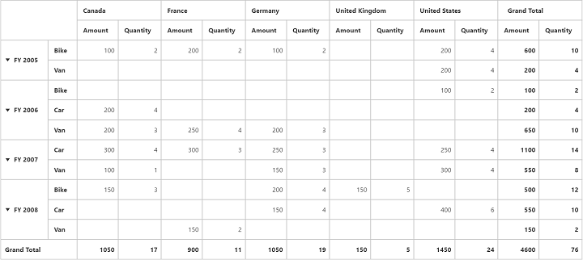

# Sub Total Hiding

N> This feature is applicable only for Relational data source.

You can hide the **Sub Total** for respective fields in rows and columns by setting the property `showSubTotal` to `false`




<ej-pivotgrid [dataSource.rows]="rows">
    </ej-pivotgrid>





export class PivotGridComponent {
    
    public  rows;

    constructor()
    {
        this.rows = [{ fieldName: "Country", fieldCaption: "Country", showSubTotal: false },{ fieldName: "State", fieldCaption: "State" }]; 
        //..
    }
 }





