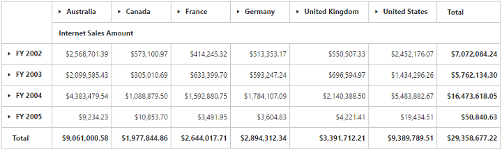

# Getting Started

This section explains briefly about how to create a **PivotGrid** control in your application with **Angular**. This section covers only the minimal features that you need to know to get started with the PivotGrid.

## Getting started with SystemJS

To quick start with Syncfusion JavaScript Angular components run the below commands to clone the repository for [SystemJS starter](https://github.com/syncfusion/angular2-seeds/tree/systemjs) and installing required dependency packages.


 > git clone https://github.com/syncfusion/angular2-seeds/ -b systemjs

 > cd angular2-seeds

 > npm install


The below steps describes to add component with above cloned seed application.

## Syncfusion JavaScript components source configuration and sample creation

* Copy required Syncfusion Angular source component(s) from the below build location and add it in `src/ej` folder (For ex., consider the `pivotgrid` component).


(Installed Location)\Syncfusion\Essential Studio\{{ site.releaseversion }}\JavaScript\assets-src\angular2\


N> `core.ts` file is mandatory for all Syncfusion JavaScript Angular components. The repository having the source file from Essential Studio for JavaScript v{{ site.releaseversion }}.

* Create `pivotgrid` folder inside `src` folder.

* Create `pivotgrid.component.html` view file inside `src/pivotgrid` folder and render ejPivotGrid Angular component using the below code example.



<ej-pivotgrid></ej-pivotgrid>



* Create `pivotgrid.component.ts` model file inside the folder `src/pivotgrid` and create sample component using the below code example.



import { Component } from '@angular/core';

@Component({
  selector: 'ej-app',
  templateUrl: 'app/components/pivotgrid/pivotgrid.component.html',
  styleUrls: ['app/components/pivotgrid/pivotgrid.component.css'],
})

export class PivotGridComponent {
    //..
}



## Configure the routes for the Router

Before adding router configuration for above created ejPivotGrid component, we recommend you to go through the [Angular Routing](https://angular.io/docs/ts/latest/guide/router.html) configuration to get the deeper knowledge about Angular routing.

* Now, we are going to configure the route navigation link for created PivotGrid sample in `src/app.component.html` file.



	<ul class="nav navbar-nav">
		. . . .
		<li><a data-toggle="collapse" data-target="#skeleton-navigation-navbar-collapse.in" href="#pivotgrid" [routerLink]="['/pivotgrid']">PivotGrid </a></li>
	</ul>

<main>
	<router-outlet></router-outlet>
</main>


* Import the ejPivotGrid sample component and define the route in `src/app.routes.ts` file.


import { Routes } from '@angular/router';
. . . .
import { PivotGridComponent } from './pivotgrid/pivotgrid.component';

export const rootRouterConfig: Routes = [
    { path: '', redirectTo: 'home', pathMatch: 'full' },
    . . . .
    { path: 'pivotgrid', component: PivotGridComponent }
];


* Import and declare the Syncfusion source component and ejPivotGrid sample component into `app.module.ts` like the below code snippet.



import { NgModule, enableProdMode, ErrorHandler } from '@angular/core';
. . . . .
import { EJ_PIVOTGRID_COMPONENTS } from './ej/pivotgrid.component';
import { PivotGridComponent } from './pivotgrid/pivotgrid.component';

import { rootRouterConfig } from './app.routes';
. . . .
@NgModule({
  imports: [BrowserModule, FormsModule, HttpModule, RouterModule.forRoot(rootRouterConfig, { useHash: true })],
  declarations: [. . . . , EJ_PIVOTGRID_COMPONENTS,PivotGridComponent],
  bootstrap: [AppComponent]
})
export class AppModule { }


## Relational

This section covers the information that you need to know to populate a simple PivotGrid with Relational data source.

### Control Initialization

Add necessary HTML elements in `pivotgrid.component.html` to render PivotGrid



<ej-pivotgrid [enableToolTip]="false" [dataSource.data]="data" [dataSource.rows]="rows" [dataSource.columns]="columns" [dataSource.values]="values">
 </ej-pivotgrid>



Create a **CSS** page and add necessary CSS elements for PivotGrid



    ej-pivotgrid {
        display: block;
        height: 450px;
        width: 100%;
        overflow: auto;
    }

    .e-pivotgrid {
        position: inherit !important;
}



### Populate PivotGrid with data

Let us now see how to populate the PivotGrid control using a sample JSON data as shown below.





    <ej-pivotgrid [enableToolTip]="false" [dataSource.data]="data" [dataSource.rows]="rows" [dataSource.columns]="columns" [dataSource.values]="values" [dataSource.filters]="filters">
    </ej-pivotgrid>





    //..

    export class PivotGridComponent {
        public data; rows; columns;values;filters;
        constructor() {
          this.data = [
              { Amount: 100, Country: "Canada", Date: "FY 2005", Product: "Bike", Quantity: 2, State: "Alberta" },
              { Amount: 200, Country: "Canada", Date: "FY 2006", Product: "Van", Quantity: 3, State: "British Columbia" },
              { Amount: 300, Country: "Canada", Date: "FY 2007", Product: "Car", Quantity: 4, State: "Brunswick" },
              { Amount: 150, Country: "Canada", Date: "FY 2008", Product: "Bike", Quantity: 3, State: "Manitoba" },
              { Amount: 200, Country: "Canada", Date: "FY 2006", Product: "Car", Quantity: 4, State: "Ontario" },
              { Amount: 100, Country: "Canada", Date: "FY 2007", Product: "Van", Quantity: 1, State: "Quebec" },
              { Amount: 200, Country: "France", Date: "FY 2005", Product: "Bike", Quantity: 2, State: "Charente-Maritime" },
              { Amount: 250, Country: "France", Date: "FY 2006", Product: "Van", Quantity: 4, State: "Essonne" },
              { Amount: 300, Country: "France", Date: "FY 2007", Product: "Car", Quantity: 3, State: "Garonne (Haute)" },
              { Amount: 150, Country: "France", Date: "FY 2008", Product: "Van", Quantity: 2, State: "Gers" },
              { Amount: 200, Country: "Germany", Date: "FY 2006", Product: "Van", Quantity: 3, State: "Bayern" },
              { Amount: 250, Country: "Germany", Date: "FY 2007", Product: "Car", Quantity: 3, State: "Brandenburg" },
              { Amount: 150, Country: "Germany", Date: "FY 2008", Product: "Car", Quantity: 4, State: "Hamburg" },
              { Amount: 200, Country: "Germany", Date: "FY 2008", Product: "Bike", Quantity: 4, State: "Hessen" },
              { Amount: 150, Country: "Germany", Date: "FY 2007", Product: "Van", Quantity: 3, State: "Nordrhein-Westfalen" },
              { Amount: 100, Country: "Germany", Date: "FY 2005", Product: "Bike", Quantity: 2, State: "Saarland" },
              { Amount: 150, Country: "United Kingdom", Date: "FY 2008", Product: "Bike", Quantity: 5, State: "England" },
              { Amount: 250, Country: "United States", Date: "FY 2007", Product: "Car", Quantity: 4, State: "Alabama" },
              { Amount: 200, Country: "United States", Date: "FY 2005", Product: "Van", Quantity: 4, State: "California" },
              { Amount: 100, Country: "United States", Date: "FY 2006", Product: "Bike", Quantity: 2, State: "Colorado" },
              { Amount: 150, Country: "United States", Date: "FY 2008", Product: "Car", Quantity: 3, State: "New Mexico" },
              { Amount: 200, Country: "United States", Date: "FY 2005", Product: "Bike", Quantity: 4, State: "New York" },
              { Amount: 250, Country: "United States", Date: "FY 2008", Product: "Car", Quantity: 3, State: "North Carolina" },
              { Amount: 300, Country: "United States", Date: "FY 2007", Product: "Van", Quantity: 4, State: "South Carolina" }
            ];
            this.rows= [{ fieldName: "Country", fieldCaption: "Country" }],
            this.columns= [{ fieldName: "Product", fieldCaption: "Product" }],
            this.values= [{ fieldName: "Amount", fieldCaption: "Amount" }],
            this.filters= []
        }
    }





The above code will generate a simple PivotGrid with “Country” field in Row, “Product” field in Column and “Amount” field in Value section.

### Apply Sorting

You can sort a field either to ascending or descending order using the **"sortOrder"** property. Sorting is applicable only for Row and Column fields. By default, fields are arranged in ascending order.



//..

export class PivotGridComponent {
    public data; rows; columns;values;filters;
    constructor() {
        this.data = []; // data source
        this.rows= [{ fieldName: "Country", fieldCaption: "Country", sortOrder: ej.PivotAnalysis.SortOrder.Descending }],
        this.columns= [{ fieldName: "Product", fieldCaption: "Product" }],
        this.values= [{ fieldName: "Amount", fieldCaption: "Amount" }],
        this.filters= []
    }
}



### Apply Filtering

Filtering option allows you to specify a set of values that either need to be displayed or hidden. Also filtering option is applicable only for Row, Column and Filter areas.

**"filterItems"** object allow us to apply filtering to the fields using the following properties:

* filterType -  indicates whether the values should be included or excluded.
* values -  specify an array of values that needs to be included or excluded within the particular field.



//..

export class PivotGridComponent {
    public data; rows; columns;values;filters;
    constructor() {
        this.data = []; // data source
        this.rows= [{ fieldName: "Country",
                    fieldCaption: "Country",
                    filterItems: {
                        filterType: ej.PivotAnalysis.FilterType.Exclude,
                        values: ["United Kingdom"]
                    }
                }],
        this.columns= [{ fieldName: "Product",
                    fieldCaption: "Product",
                    filterItems: {
                        filterType: ej.PivotAnalysis.FilterType.Include,
                        values: ["Bike", "Car"]
                    }
                 }],
        this.values= [{ fieldName: "Amount", fieldCaption: "Amount" }],
        this.filters= []
    }
}



### Apply Summary Types

Allow us to specify the required summary type that PivotGrid should use in its summary cells. **"sum"** is the default summary type. Following are the summary types that are supported:

* sum
* average
* count
* min
* max


//..
export class PivotGridComponent {
    public data; rows; columns;values;filters;
    constructor() {
        //..
        this.values= [{ fieldName: "Amount", fieldCaption: "Amount", summaryType: ej.PivotAnalysis.SummaryType.Average },
                    { fieldName: "Quantity", fieldCaption: "Quantity", summaryType: ej.PivotAnalysis.SummaryType.Sum }],
        this.filters= []
    }
}



## OLAP

This section covers the information that you need to know to populate a simple PivotGrid with OLAP data source.

### Control Initialization

Add necessary HTML elements in `pivotgrid.component.html` to render PivotGrid



<ej-pivotgrid dataSource.data="http://bi.syncfusion.com/olap/msmdpump.dll" dataSource.catalog="Adventure Works DW 2008 SE" dataSource.cube="Adventure Works" [dataSource.rows]="rows" [dataSource.columns]="columns" [dataSource.values]="values" [dataSource.filters]="filters">
</ej-pivotgrid>



Create a **CSS** page and add necessary CSS elements for PivotGrid



    ej-pivotgrid {
        display: block;
        height: 450px;
        width: 100%;
        overflow: auto;
    }

    .e-pivotgrid{
        position: inherit !important;
    }



### Populate PivotGrid with data

Let us now see how to populate the PivotGrid control using a sample JSON data as shown below.





<ej-pivotgrid [enableToolTip]="false" dataSource.data="http://bi.syncfusion.com/olap/msmdpump.dll" dataSource.catalog="Adventure Works DW 2008 SE" dataSource.cube="Adventure Works" [dataSource.rows]="rows" [dataSource.columns]="columns" [dataSource.values]="values" [dataSource.filters]="filters">
</ej-pivotgrid>




    //..
    export class PivotGridComponent {
        public rows; columns; values; filters;
        constructor() {
          this.rows = [{ fieldName: "[Date].[Fiscal]" }];
          this.columns = [{ fieldName: "[Customer].[Customer Geography]" }];
          this.values = [{ measures: [{ fieldName: "[Measures].[Internet Sales Amount]" }], axis: "columns" }];
          this.filters = [];
        }
    }





The above code will generate a simple PivotGrid with “Fiscal” field in Row, “Customer Geography” field in Column and “Internet Sales Amount” field in Value section.

