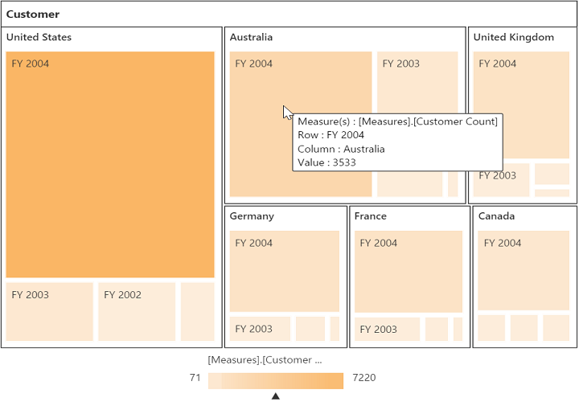

# Legend

## Legend Visibility

The legend shows the value range differences and color occurrence in the respective leaf node while you hover it with the cursor.

N> By default, the legend is visible in PivotTreeMap.

You can disable the legend by setting the property **showLegend** as **false**. The following code example shows how to disable the legend.





<ej-pivottreemap (renderSuccess)="showLegend($event)">
</ej-pivottreemap>




    //..
export class PivotTreeMapComponent {
    showLegend(args){
        let treemapTarget = $('#PivotTreeMap1TreeMapContainer').data('ejTreeMap');
        pivotTreeMap.model.showLegend = false;
        treemapTarget.refresh();
    }
}





