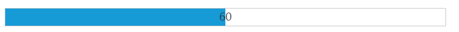
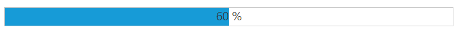

# Define value

## Value

The value for the ProgressBar is set by using [value](https://help.syncfusion.com/api/js/ejprogressbar#members:value) property. The value should be between the minimum (min) and the maximum (max) values (number) of the ProgressBar. By default, the **minValue** is **0** and the **maxValue** is **100** in ProgressBar, and the ‘**value**’ is set to **0**(number).

The following code helps you that how to set the **value** for the ProgressBar widget.



    <ej-progressbar id="progressBar" [minValue]="minvalue" [maxValue]="maxvalue" [value]="val" [height]="height" [width]="width" (create)="onCreate($event)"></ej-progressbar>  





import {Component} from '@angular/core';
@Component({
selector: 'sd-home',
templateUrl: 'app/components/progressbar/progressbar.component.html'
})
export class ProgressBarComponent {  
    minvalue: number;
    maxvalue: number;
    val: number;
    height: number;
    width: number;
    constructor() {
        this.minvalue = 40;
        this.maxvalue = 80;
        this.val = 60;
        this.height = 20;
        this.width = 500;
    }
    onCreate($event) {
        var progress = $("#progressBar").data("ejProgressBar");
        progress.setModel({ text: progress.getValue() });
    }
}



The following screenshot displays the output for the above code.

 

##  Percentage

The ProgressBar value is set in ProgressBar by using the **‘percentage’** property. The value range should be between the min and max values (number) of the ProgressBar. By default, the **minValue** is **0** and the **maxValue** is **100** in ProgressBar, and **percentage** is set to **0** (number).

The following helps that how to set the value in **percentage** for the ProgressBar widget. 



    <ej-progressbar id="progressBar" [minValue]="minvalue" [maxValue]="maxvalue" [value]="val" [height]="height" [width]="width" (create)="onCreate($event)"></ej-progressbar>  





import {Component} from '@angular/core';
@Component({
selector: 'sd-home',
templateUrl: 'app/components/progressbar/progressbar.component.html'
})
export class ProgressBarComponent {  
    minvalue: number;
    maxvalue: number;
    val: number;
    height: number;
    width: number;
    constructor() {
        this.minvalue = 40;
        this.maxvalue = 80;
        this.val = 60;
        this.height = 20;
        this.width = 500;
    }
    onCreate($event) {
        var progress = $("#progressBar").data("ejProgressBar");
        progress.setModel({ text: progress.getValue() + " %" });
    }
}



The following screenshot displays the output.

