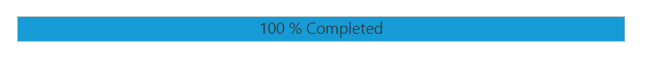

# Setting Range

The **range** of the ProgressBar is set by using minimum and maximum values. The Minimum value specifies the value where the ProgressBar shows the process to have started. The Maximum value specifies the value where the process is completed. You can set the range by using the [minValue](https://help.syncfusion.com/api/js/ejprogressbar#members:minvalue) and [maxValue](https://help.syncfusion.com/api/js/ejprogressbar#members:maxvalue) property. You can refer to the below code.



    <ej-progressbar id="progressBar" [minValue]="minvalue" [maxValue]="maxvalue" [value]="val" [height]="height" [width]="width" (create)="onCreate($event)"></ej-progressbar>  





import {Component} from '@angular/core';
@Component({
selector: 'sd-home',
templateUrl: 'app/components/progressbar/progressbar.component.html'
})
export class ProgressBarComponent {  
    minvalue: number;
    maxvalue: number;
    val: number;
    height: number;
    width: number;
    constructor() {
        this.minvalue = 40;
        this.maxvalue = 80;
        this.val = 80;
        this.height = 20;
        this.width = 500;
    }
    onCreate($event) {
        var progress = $("#progressBar").data("ejProgressBar");
        progress.setModel({ text: progress.getValue() });
    }
}



The following screenshot displays the output.

