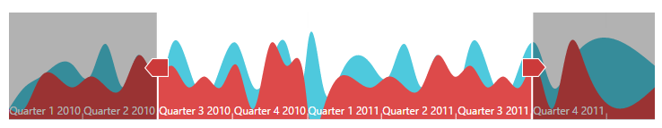

### Appearance and Styling

**Angular RangeNavigator** is enriched with lots of customization options for labels, gridlines and slider to develop high quality graphic rich control.

#### Customize labels

The labels are found along the range, displaying the value of the data it correspond, both on (higher level label) and below (lower level label) the **RangeNavigator**. **RangeNavigator** labels are further customized using "**font**" property in label Settings. 

The higher level labels font `Color`, `FontFamily`, `FontStyle`, `FontWeight`, `Opacity` and `Size` can be customized using `HigherLevel` property.

The lower level labels font `Color`, `FontFamily`, `FontStyle`, `FontWeight`, `Opacity` and `Size` can be customized using `LowerLevel` property. 


      
this.labelSettings = {
    // customizing higher level labels.
    higherLevel: {
        style: {
            font: {
                color: '#ff0000',
                style: 'Normal',
                size: '12px',
                opacity: 1,
                weight: 'regular'
            },

        },
    },
    // customizing lower level labels.
    lowerLevel: {
        style: {
            font: {
                color: '#ff0000',
                style: 'Normal',
                size: '12px',
                opacity: 1,
                weight: 'regular'
            },
        },
    }
};





<ej-rangenavigator [labelSettings]="labelSettings">
</ej-rangenavigator>



 

##### Label Placement

Labels in **RangeNavigator** are placed inside or outside of the control. You can customize both the higher and lower level labels using **labelPlacement** property in label setting of **RangeNavigator**. By default **labelPlacement** is "outside" for the both higher and lower level labels.

The following screen shot illustrates both the lower and higher level labels that are placed outside the control with **labelPlacement** specified as outside.



// change Placement of higher and lower level label             
this.labelSettings = {
    higherLevel: {
        labelPlacement: "inside",
    },
    lowerLevel: {
        labelPlacement: "inside"
    }
};





<ej-rangenavigator [labelSettings]="labelSettings">
</ej-rangenavigator>



The following screenshot illustrates a **RangeNavigator** with labels inside the control after specifying the **labelPlacement** as inside.

 

#### Customize RangeNavigator

### Customize NavigatorStyleSettings

RangeNavigator is customized using `NavigatorStyleSettings` properties. You can customize the selected and unselected region color using `SelectedRegionColor` and `UnselectedRegionColor`, `SelectedRegionOpacity` and `UnselectedRegionOpacity` in **NavigatorStyleSettings** and the thumb of the slider using `ThumbColor`, `ThumbRadius` and `ThumbStroke` in NavigatorStyleSettings.  `MajorGridLineStyle` and `MinorGridLineStyle` are used to customize the major grid line `Color`, `Visible` property and minor gridline `Color` and `Visible`. You can customize the `Background`, `Opacity` and `Border` `Color`, `DashArray` and `Width` of navigatorStyleSettings.

### Customize Labels

The visibility of labels are enabled by setting `Visible` in higher level and `Visible` in lower level. The labels can be aligned by specifying `HorizontalAlignment` of higher level style and `HorizontalAlignment` of lower level style.

You can customize the `Border` `Color` and `Width`, `Fill`, `GridLineStyle` `Color`, `DashArray` and `Width`, `Position` property of higher level labels in labelSettings.

You can also customize the `Border` `Color` and `Width`, `Fill`, `GridLineStyle` `Color`, `DashArray` and `Width`, `Position` property for lower level labels of labelSettings.


   
//  To customize the navigator element     
this.navigatorStyleSettings = {

    unselectedRegionColor: "white",
    selectedRegionColor: "#5EABDE",
    thumbColor: "white",
    thumbRadius: 10,
    thumbStroke: "#303030",
    background: "transparent",
    border: {
        color: "black",
        width: 3
    },
    majorGridLineStyle: {
        color: "transparent"
    },
    minorGridLineStyle: {
        color: "transparent"
    }
};
//  To customize the labels
this.labelSettings = {

    higherLevel: {
        style: {
            font: {
                color: 'black',
                size: '13px',
                opacity: 1
            },
            horizontalAlignment: "left"
        },
        intervalType: 'years',
        labelPlacement: "inside"
    },
    lowerLevel: {
        style: {
            font: {
                color: 'black',
                size: '12px',
                opacity: 1
            },
            horizontalAlignment: "center"
        },
        intervalType: 'quarters',
        labelPlacement: "inside"
    }
};





<ej-rangenavigator [labelSettings]="labelSettings" [navigatorStyleSettings]="navigatorStyleSettings">
</ej-rangenavigator>



 

#### Themes

**RangeNavigator** theme is a set of pre-defined options that are applied to the control before each **RangeNavigator** is instantiated. Following predefined themes are available in **Angular** **RangeNavigator**.

1. FlatLight
2. FlatDark
3. GradientLight 
4. GradientDark 
5. Azure                      
6. AzureDark               
7. Lime 
8. LimeDark
9. Saffron
10. SaffronDark
11. GradientAzure
12. GradientAzureDark
13. GradientLime
14. GradientLimeDark
15. GradientSaffron
16. GradientSaffronDark



<ej-rangenavigator theme="azuredark">
</ej-rangenavigator>



 
