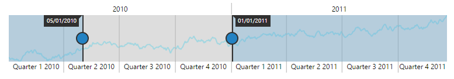
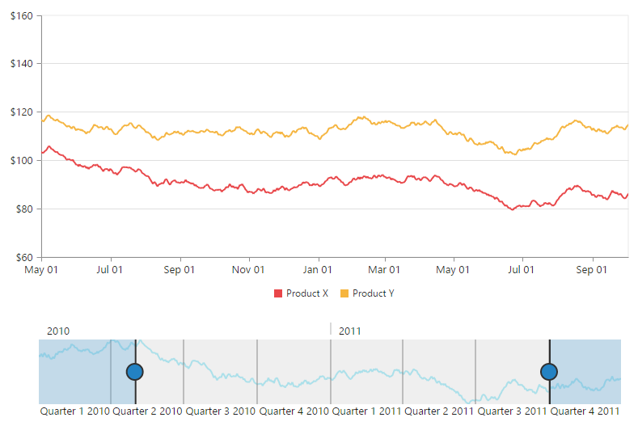
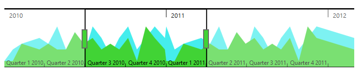

### Behavior Customization

**RangeNavigator** allows you to customize the control using events. You can change the range for selected data of the **RangeNavigator** using events.

#### Deferred update

If you set **enableDeferredUpdate**to true, the **rangeChanged** event gets fired after dragging and dropping the slider. By default the **enableDeferredUpdate**is true. If **enableDeferredUpdate**is false then the **rangeChanged** event gets fired while dragging the slider.



<ej-rangenavigator id="rangecontainer" [enableDeferredUpdate]="true">
</ej-rangenavigator>



 

#### Handle Events

**loaded:** function

This event is handled when the **RangeNavigator** gets loaded. A parameter **sender** is passed to the handler. Using **sender.model**, you can access the RangeNavigator properties. 



<ej-rangenavigator id="rangecontainer" (loaded)="rangeLoaded($event)">
</ej-rangenavigator>

  



**rangeChanged**: function

This event gets fired whenever the selected range changes in **RangeNavigator**. A parameter **sender** is passed to the handler. Using sender.selectedRangeSettings, you can access the start and end value of range for the selected region. 



<ej-rangenavigator id="rangecontainer" (rangeChanged)="rangeChanged($event)">
</ej-rangenavigator>

  



#### Use of ZoomCoordinates

**RangeNavigator** is used along with the controls like chart and grid to view the selected data. To update chart/grid, whenever the selected range changes in **RangeNavigator**, you can use **rangeChanged** event of **RangeNavigator** and then update the chart/grid with the selected data in this event. 

You can easily update the data for chart by assigning the **zoomFactor** and **zoomPosition** of the **RangeNavigator** to the chart axis.



<ej-rangenavigator id="rangecontainer" (rangeChanged)="onChartLoaded($event)">
</ej-rangenavigator>
  
  



 

#### Thumb Template

You can customize Thumb template by using **leftThumbTemplate** and **rightThumbTemplate** property. You can add the required template as a "div" element with an "id" to the web page and assign the id or assign the HTML string to this property under **navigatorStyleSettings**.



 

<ej-rangenavigator id="rangecontainer" [navigatorStyleSettings]="navigatorStyleSettings">
</ej-rangenavigator>



The following screenshot displays the **RangeNavigator** using thumb template.

 

## Value Axis Settings

You can customize the line, `Font` `Size`, gridline, tickline, range, `RangePadding` and visibility of **RangeNavigator** axis.

To enable the visibility of axis line, you need to set `Visible` property of `AxisLine` in `ValueAxisSettings`. 

You can customize the axis range by specifying `Min`, `Max` and `Interval` for `Range` property.

The `MajorGridLines` can be enabled by specifying `Visible` property. The `Size`, `Width` and `Visible` property of `MajorTickLines` is used to customize the axis tick lines.

The visibility of `ValueAxisSettings` is enabled by setting `Visible` property as true. 



<ej-rangenavigator id="rangecontainer" [valueAxisSettings]="this.valueAxisSettings">
</ej-rangenavigator>



## Selected Range Settings

The start and end range values of selected range can be customized using `Start` and `End` property of `SelectedRangeSettings`.



<ej:RangeNavigator ID="Range1" [selectedRangeSettings]="this.selectedRangeSettings" >               
</ej:RangeNavigator>  



