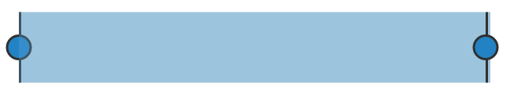
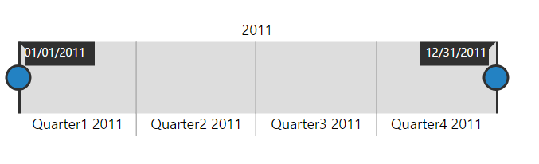
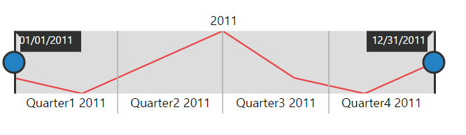
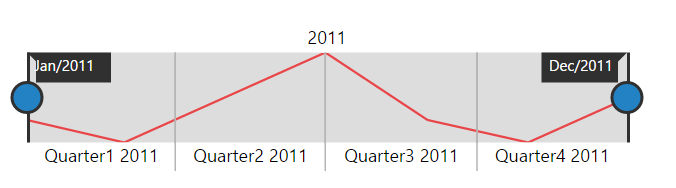

#Getting Started

Before we start with the RangeNavigator, please refer [this page](https://help.syncfusion.com/angular-2/overview) for general information regarding integrating Syncfusion widget’s.

## Adding JavaScript and CSS Reference

To render the RangeNavigator control, the following list of external dependencies are needed, 

* [jQuery](http://jquery.com) - 1.7.1 and later versions
* [Angular](https://angular.io/) - Angular latest versions

The other required internal dependencies are tabulated below,

<table>
   <tr>
      <th>
         <b>Files</b>
      </th>
      <th>
         <b>Description/Usage </b>
      </th>
   </tr>
   <tr>
      <td>
         ej.core.min.js
      </td>
      <td>
        It is referred always before using all the JS controls.
      </td>
   </tr>
   <tr>
      <td>
         ej.data.min.js
      </td>
      <td>
         Used to handle data operation and is used while binding data to the JS controls.
      </td>
   </tr>
   <tr>
      <td>
        ej.rangenavigator.min.js
      </td>
      <td>
        RangeNavigator core script file which includes RangeNavigator related scripts files.
      </td>
   </tr>   
   <tr>
      <td>
        ej.globalize.min.js
      </td>
      <td>
       It is referred when using localization in RangeNavigator.
      </td>
   </tr>
   <tr>
      <td>
         ej.scroller.min.js
      </td>
      <td>
         It is referred when scrolling is used in the RangeNavigator.
      </td>
   </tr>
</table>

N> RangeNavigator uses one or more script files, therefore refer the `ej.web.all.min.js` (which encapsulates all the `ej` controls and frameworks in a single file) in the application instead of referring all the above specified internal dependencies. 

To get the real appearance of the RangeNavigator, the dependent CSS file `ej.web.all.min.css` (which includes styles of all the widgets) should also needs to be referred.

## Preparing HTML document

Create an HTML page and add the scripts references in the order mentioned in the following code example.



    <html>
    <head>
    <title>Angular RangeNavigator</title>

    <!-- Essential Studio for JavaScript  theme reference -->
    <link rel="stylesheet" href="http://cdn.syncfusion.com/{{ site.releaseversion }}/js/web/flat-azure/ej.web.all.min.css" />

    <!-- Angular related script references -->
    <!-- 1. Load libraries -->
         <!-- Polyfill(s) for older browsers -->
       
    
    
    

    <!-- Essential Studio for JavaScript  script references -->
    
     
    
    
    <!-- 2. Configure SystemJS -->
    
    

    </head>
    <!-- 3. Display the application -->
    <body>
    <ej-app>  
		    

			      
Angular Syncfusion Components App

			      

		    

	  </ej-app>
    </body>
    </html>



N> Uncompressed version of library files are also available which is used for development or debugging purpose and can be generated from the custom script [here](http://csg.syncfusion.com).

## Control Initialization

* Copy RangeNavigator Syncfusion Angular source component(s) from the below build location and add it in `src/ej` folder (For ex., consider the `rangenavigator` component).


(Installed Location)\Syncfusion\Essential Studio\14.3.0.49\JavaScript\assets-src\angular2\ 


N> `core.ts` file is mandatory for all Syncfusion JavaScript Angular components. The repository having the source file from Essential Studio for JavaScript v14.3.0.49.

* Create `rangenavigator` folder inside `src` folder.

* Create `rangenavigator.component.html` view file inside `src/rangenavigator` folder and render ejRangeNavigator Angular component using the below code example. 


<ej-rangenavigator id="rangenavigator" [sizeSettings.height]="100" [sizeSettings.width]="400">           
</ej-rangenavigator>


* Create `rangenavigator.component.ts` model file inside the folder `src/rangenavigator` and create sample component using the below code example.



import { Component, ViewEncapsulation } from '@angular/core';

@Component({
  selector: 'ej-app',
  templateUrl: 'src/rangenavigator/rangenavigator.component.html'
})
export class RangeNavigatorComponent {

}


## Configure the routes for the Router

Before adding router configuration for above created ejRangeNavigator component, we recommend you to go through the [Angular Routing](https://angular.io/docs/ts/latest/guide/router.html) configuration to get the deeper knowledge about Angular routing. 

* Now, we are going to configure the route navigation link for created rangenavigator sample in `src/app.component.html` file.



	<ul class="nav navbar-nav">
		<li><a data-toggle="collapse" data-target="#skeleton-navigation-navbar-collapse.in"
     href="#rangenavigator" [routerLink]="['/rangenavigator']">rangenavigator </a></li>
	</ul>

<main>
	<router-outlet></router-outlet>
</main>


* Import the ejRangeNavigator sample component and define the route in `src/app.routes.ts` file.


import { Routes } from '@angular/router';
. . . . 
import { RangeNavigatorComponent } from './rangenavigator/rangenavigator.component';

export const rootRouterConfig: Routes = [
    { path: '', redirectTo: 'home', pathMatch: 'full' },
    . . . . 
    { path: 'rangenavigator', component: RangeNavigatorComponent }
];


* Import and declare the Syncfusion source component and ejRangeNavigator sample component into `app.module.ts` like the below code snippet.


import { NgModule, enableProdMode, ErrorHandler } from '@angular/core';
. . . . . 
import { EJ_RANGENAVIGATOR_COMPONENTS } from './ej/rangenavigator.component';
import { RangeNavigatorComponent } from './rangenavigator/rangenavigator.component';

import { rootRouterConfig } from './app.routes';
. . . . 
@NgModule({
  imports: [BrowserModule, FormsModule, HttpModule, RouterModule.forRoot(rootRouterConfig, { useHash: true })],
  declarations: [. . . . , EJ_RANGENAVIGATOR_COMPONENTS, RangeNavigatorComponent],
  bootstrap: [AppComponent]
})
export class AppModule { }


## Running the application

* To run the application, execute below command.


npm start


* Browse to [http://localhost:3000](http://localhost:3000) to see the application. And navigate to rangenavigator tab. The component is rendered as like the below screenshot. You can make changes in the code found under src folder and the browser should auto-refresh itself while you save files. 

 

**Configure RangeNavigator**

Getting started with your **ej-rangenavigator** is simple. You can initialize the **ej-rangenavigator** by setting its range values.

You can create an **HTML** file as shown in the following code example.

1. Create a &lt;div&gt; tag with an id.
2. Set `ej-rangenavigator` attribute to render RangeNavigator control and add `e-rangeSettings` for customize the rangeSettings.



<ej-rangenavigator rangeSettings.start="2011/1/1" rangeSettings.end="2011/12/31">           
</ej-rangenavigator>



The following screen shot displays the **RangeNavigator** with a range from 2010, January 1st to December 31st.

 

**Add series**

To add series to **ej-rangenavigator,** you need to set **dataSource** property of **ej-rangenavigator** as shown in the following code example. 

You can create a folder `service` and add data.service.ts file to give data source for **RangeNavigator** as follows.


export class DataService{
rangeData():Array<any>{
        return[
            { "xDate": new Date(2011, 0, 1), "yValue": 10 },
            { "xDate": new Date(2011, 2, 1), "yValue": 5 },
            { "xDate": new Date(2011, 4, 1), "yValue": 15 },
            { "xDate": new Date(2011, 6, 1), "yValue": 25 },
            { "xDate": new Date(2011, 8, 1), "yValue": 10 },
            { "xDate": new Date(2011, 10, 1), "yValue": 5 },
            { "xDate": new Date(2011, 12, 1), "yValue": 15 }
            ];
    }
}


Now, add the **dataSource** to the **RangeNavigator** and provide the field name to get the values from the **dataSource** in **xName** and **yName** options.



<ej-rangenavigator [dataSource]="dataRange" xName="xDate" yName="yValue">           
</ej-rangenavigator>




import { Component, ViewEncapsulation} from '@angular/core';
import { DataService} from '../service/data.service';

@Component({
selector:"ej-app",
templateUrl:"src/rangenavigator/rangenavigator.component.html",
providers:[DataService]
})
export class RangenavigatorComponent{
dataRange:any;
    constructor(dataService:DataService){
        this.dataRange=dataService.rangeData();
    }    
}


The following screenshot displays a RangeNavigator with the default **"Line"** series type.

 

**Enable tooltip**

You can customize **Tooltip** for RangeNavigator using **tooltip** option. You can use **tooltipDisplayMode** option in **tooltip**,to display the tooltip "always" or "ondemand" (displays tooltip only while dragging the sliders). You can also specify label format for tooltip using **labelFormat**.

The following code sample shows how to enable a Tooltip.



<ej-rangenavigator [tooltipSettings.visible]="true" tooltipSettings.labelFormat="MMM/yyyy"
                            tooltipSettings.tooltipDisplayMode="always">           
</ej-rangenavigator>



The following screenshot displays the label format **Tooltip** in RangeNavigator:

 
