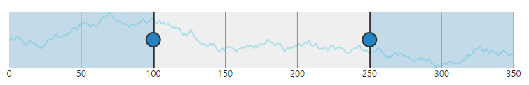
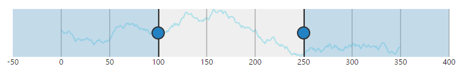
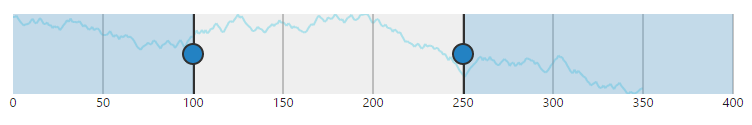
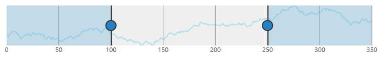
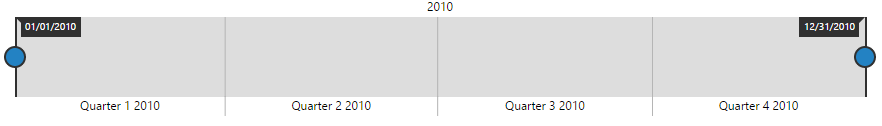

### Range Padding

**Range Padding** adds padding for range in **RangeNavigator**. It allows you to space the grid lines in the **RangeNavigator**.  By default, this property is set to **none**.

#### Numeric

The **rangePadding** property allows you to customize the automatic range calculation using the default auto range calculation for **RangeNavigator**.



<ej-rangenavigator id="rangecontainer" valueType= "numeric" rangePadding="none">
</ej-rangenavigator>



##### None

By default, the **rangePadding** for numerical range is none. The range is calculated from the minimum value to the maximum value of data in the RangeNavigator.

The following screenshot illustrates a **RangeNavigator** with **rangePadding** set to none.

 

##### Additional

When you set the **rangePadding** for numerical range to **Additional**, range is padded with an interval.

The following screenshot illustrates a **RangeNavigator** with **rangePadding** set to additional.

 

##### Normal

In normal **rangePadding**, automatic range calculation differs based on the data. 

The following screenshot illustrates **RangeNavigator** with **rangePadding** set to normal

 

##### Round

Round **rangePadding** for a numerical range rounds the range of the control to the nearest possible value that is divisible by the interval.

The following screenshot illustrates a **RangeNavigator** with **rangePadding** set to **Round**.

 

## Padding

The gap between the container and the **RangeNavigator** can be specified using `padding` property.



<ej:RangeNavigator ID="RangeNavigator1" [padding]="15"> 
</ej:RangeNavigator>



## AllowSnapping

An `allowSnapping` property toggles the placement of slider exactly on the place it left or on the nearest interval.



<ej:RangeNavigator ID="RangeNavigator1"  [allowSnapping]="true"> 
</ej:RangeNavigator>



## Responsive

Set `isResponsive` value to make the **RangeNavigator** responsive on resize.



<ej:RangeNavigator ID="RangeNavigator1"  isResponsive="true"> 
</ej:RangeNavigator>



## Auto Resizing

Enable `enableAutoResizing` option to resize the **RangeNavigator**.



<ej:RangeNavigator ID="RangeNavigator1"  enableAutoResizing="true"> 
</ej:RangeNavigator>



## Customize range Navigator border

**RangeNavigator** provides options to customize the `color`, `opacity` and `width` of range navigator `border`.



<ej:RangeNavigator ID="RangeNavigator1" border.color="green" [border.opacity]="0.5" [border.width]="2">     
</ej:RangeNavigator>



## Customize size of range navigator

The `height` and `width` of **RangeNavigator** can be customized using `sizeSettings` property.



<ej:RangeNavigator ID="RangeNavigator1" [height]="" [width]="">     
</ej:RangeNavigator>



#### DateTime

Using the default range calculation for **RangeNavigator**, the **rangePadding** property allows you to customize the range.



<ej-rangenavigator id="rangecontainer" valueType= "datetime" rangePadding="none">
</ej-rangenavigator>



##### None

By default, the **rangePadding** for **DateTime** range is none. The range is calculated from the minimum value to the maximum value of data in the RangeNavigator

The following screenshot illustrates a **RangeNavigator** with **rangePadding** set to none.

 

##### Round

Round **rangePadding** for a **DateTime** range rounds the range of the control to the nearest possible value.

The following screenshot illustrates a **RangeNavigator** with **rangePadding** set to Round.

 

### Customize axis range of navigator

**RangeNavigator** calculates the range automatically based on the values of series data points. However you can explicitly specify the range using the **start**, **end** properties in **rangeSettings** that is not possible when data is provided.

The following code example renders a RangeNavigator with a range from 2010 January 1st to 2013 January 1st.



<ej-rangenavigator id="rangecontainer" selectedRangeSettings.start="2010/5/1"
                                       selectedRangeSettings.end="2011/10/1">
</ej-rangenavigator>



 
