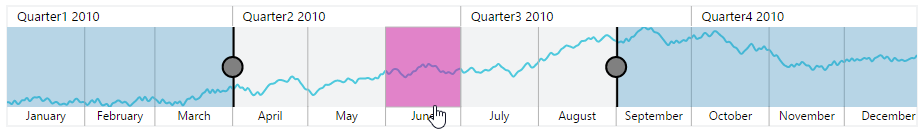
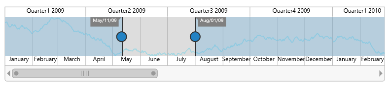

# User Interactions

## Highlight

EjRangeNavigator provides highlighting supports to the intervals on mouse hover. To enable the highlighting option, set the [`enable`] property to true in the [`highlightSettings`] of [`navigatorStyleSettings`].



this.navigatorStyle = {
    //...        
    highlightSettings: {
        // enable the highlight settings
        enable: true
    }
    //...
};





<ej-rangenavigator id="rangecontainer" [navigatorStyleSettings]= "navigatorStyle">
</ej-rangenavigator>



 

### Customize the highlight style

To customize the highlighted intervals, use color, border and opacity options in the [`highlightSettings`].


  
this.navigatorStyle = {
    //...        
    highlightSettings: {
        // enable the highlight settings
        enable: true,
        // customizing style
        color: '#006fa0',
        border: {
            color: 'red', width: 2
        }
    }
    //...
};





<ej-rangenavigator id="rangecontainer" [navigatorStyleSettings]= "navigatorStyle">
</ej-rangenavigator>



## Selection

EjRangeNavigator provides selection supports to the intervals by, clicking and dragging the highlighted intervals. To enable the selection option, set the [`enable`] property to true in the [`selectionSettings`].


   
this.navigatorStyle = {
    //...        
    selectionSettings: {
        // enable the selection settings
        enable: true
    }
    //...
};





<ej-rangenavigator id="rangecontainer" [navigatorStyleSettings]= "navigatorStyle">
</ej-rangenavigator>



 

### Customize the selection style

To customize the selected intervals, use color, border and opacity options in the selectionSettings.


  
this.navigatorStyle = {
    //...        
    selectionSettings: {
        // enable the selection settings
        enable: true,
        // customizing style
        color: '#27e8e5',
        border: {
            color: 'red', width: 2
        }
        //...
    }
};





<ej-rangenavigator id="rangecontainer" [navigatorStyleSettings]= "navigatorStyle">
</ej-rangenavigator>



## Scrollbar

* To render the Scrollbar in RangeNavigator, you need to enable [`enableScrollbar`] option.
 
* [`scrollRangeSettings`] of  range navigator [`start`] and [`end`] value is used to set the minimum and maximum datasource value to be added in the range navigator.
 
* Based on the scrollRangeSettings *start, end* value and dataSource *start, end* value scrollbar will be adjust.

* When you change the scrollbar position, [`scrollEnd`] event returns the current position of start and end range value.



<ej-rangenavigator id="rangecontainer" [enableScrollbar]= "true" 
               (scrollEnd)="onScrollbarChange($event)"  scrollRangeSettings.start="2010/0/1"
               scrollRangeSettings.end="2011/10/31">
</ej-rangenavigator>





      function onScrollbarChange(sender) {
            var start  = sender.data.newRange.start;
            var end  = sender.data.newRange.end;
      }



