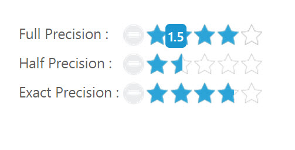

# Getting started

This section explains briefly about how to create a **Rating** control in your application with **JavaScript**. **Essential JavaScript** **Rating** helps to select the number of stars that represent Rating. Here, you can learn how to create **Rating** control in a real-time movie download application and also learn how to rate the application.

The following screenshot illustrates the functionality of a Rating widget with a Rating range of 0 to 5. 

 

## Adding Script Reference

Create an HTML page and add the scripts references in the order mentioned in the following code example.



<!DOCTYPE html>
<html>
   <head> 
    <link href="//cdn.syncfusion.com/{{ site.releaseversion }}/js/web/flat-azure/ej.web.all.min.css" rel="stylesheet" />
    
    
    
    
      
    
    
    
  </head>
  <body>
   <ej-app>Loading...</ej-app>
  </body>
</html>



## Initialize Rating

In the `rating` component HTML file.



<ej-rating id="rating" [value]="rate"></ej-rating>

 
 


import {Component} from '@angular/core';

@Component({
  selector: 'sd-home',
  templateUrl: 'app/components/rating/rating.component.html'
})
export class RatingComponent { 
    rate:int;
    constructor() {
        this.rate=3;
    }
}



Now, the Rating is rendered.

##Set the Min and Max Value

In a real-time scenario, you can extend the range by using the properties **minValue** and **maxValue** in the **Rating** widget. 



<ej-rating id="rating" [value]="rate" [minValue]="minvalue" [maxValue]="maxvalue"></ej-rating>





import {Component} from '@angular/core';

@Component({
  selector: 'sd-home',
  templateUrl: 'app/components/rating/rating.component.html'
})
export class RatingComponent {
    rate:int;
    minvalue: int;
    maxvalue: int;
    constructor() {
        this.rate=4;
        this.minvalue=2;
        this.maxvalue=10;
    }
}



The above code example displays the following output.

##Set Precision

In a real-time movie **Rating** scenario, you can set precision in between two whole numbers, such as 2.5 or 3.7 and it is done using the property **precision** by changing the value to **ej.Rating.Precision.Half** or **ej.Rating.Precision.Exact.**



 <table>
     <tr>
    <td valign="top">Full Precision :
    </td>
    <td>
    <ej-rating id="ratingDefault1" [value]="rate1">
  </ej-rating>
  </td>
  </tr>
  <tr>
    <td valign="top">Half Precision :
    </td>
    <td>
    <ej-rating id="ratingDefault2" [value]="rate2" precision="half">
  </ej-rating>
  </td>
  </tr>
  <tr>
    <td valign="top">Exact Precision :
    </td>
    <td>
    <ej-rating id="ratingDefault3" [value]="rate3" precision="exact">
  </ej-rating>
  </td>
  </tr>
  </table>





import {Component} from '@angular/core';

@Component({
  selector: 'sd-home',
  templateUrl: 'app/components/rating/rating.component.html'
})
export class RatingComponent {
    rate1: number;
    rate2: number;
    rate3: number;
    constructor() {
        this.rate1 = 3;
        this.rate2 = 3.5;
        this.rate3 = 3.7;
    }
}



The above code example displays the following output.

You can also add additional functionalities such as orientation, event tracer and API’s to the **Rating**. 

