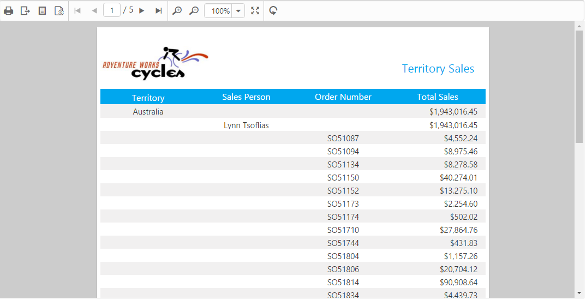

# Getting Started

This section explains briefly about how to create a ReportViewer in your web application with Angular.

## Create your first ReportViewer in Angular-2

In this tutorial, you can learn how to create a simple ReportViewer control, Load RDLC Report and Load SSRS Report in your web application with Angular.

## Add Scripts, Styles and Control in HTML Page

Create a **HTML** page and add the scripts and CSS references in the order mentioned in the following code example.



    <!DOCTYPE html>
    <html>
    <head> 
        <link href="https://cdn.syncfusion.com/14.3.0.52/js/web/flat-azure/ej.web.all.min.css" rel="stylesheet" />
        
        
        
        
        
        
        
        
        
        
    </head>
    <body>
    <ej-app>Loading...</ej-app>
    </body>
    </html>



In the above code, the `ej.web.all.min.js` script reference has been added for demonstration purpose. It is not recommended to use during deployment as it contains all the widgets, which result in deploying large script file. Instead, you can use the [CSG](https://csg.syncfusion.com/# "") utility to generate a custom script file with required widgets for deployment purpose.

## Initialize and configure the control

Add necessary HTML elements and CSS style to render the ReportViewer and set the desired `reportPath` and `reportServiceUrl` properties to the ReportViewer.

<table>
<tr>
<th>
API</th><th>
Description</th></tr>
<tr>
<td>
reportServiceUrl</td><td>
Specifies the report Web API service URL.</td></tr>
<tr>
<td>
reportPath</td><td>
Gets or sets the path of a report file.</td></tr>
</table>

The following code snippet defines the ReportViewer control in Angular.



<ej-reportviewer id="reportViewer_Control" [reportServiceUrl] = "serviceUrl" [processingMode] = "Remote" [reportPath] = "reportPath" >
</ej-reportviewer>





ej-reportviewer {
    display: block;
    height: 550px;
}



You can load the RDL/RDLC report in Angular by using the following options: 
* Online Web API service.
* Local Web API service.

### Load report using online Web API service

 The ReportViewer uses online Web API services to process the report file, process the request from the control, and return the processed data from the control to client side.



import { Component } from '@angular/core';

@Component({
    selector: 'ej-app',
    templateUrl: 'src/reportviewer/reportviewer.component.html',
	styleUrls: ['src/reportviewer/reportviewer.component.css']
})

export class ReportViewerComponent {
    public serviceUrl: string;  
    public reportPath: string;

    constructor() {
        this.serviceUrl = 'http://js.syncfusion.com/ejservices/api/ReportViewer';        
        this.reportPath = 'GroupingAgg.rdl';
    }
}



### Load report using local Web API service

You can load the RDL/RDLC report with the help of local web service for .NET Platform and .NET core Platform.

 1 Local web service for .NET Platform

   [How to load report using local Web API service for .NET Platform](/angular/reportviewer/report-service-for-dotnet)
   Describes how to configure the local Web API service URL for .NET platform in Angular ReportViewer.

 2 Local web service for .NET core Platform

   [How to load report using local Web API service for .NET Core Platform](/angular/reportviewer/report-service-for-dotnet-core)
   Describes how to configure the local Web API service URL for .NET Core platform in Angular ReportViewer.



import { Component } from '@angular/core';

@Component({
    selector: 'ej-app',
    templateUrl: 'src/reportviewer/reportviewer.component.html',
	styleUrls: ['src/reportviewer/reportviewer.component.css']
})

export class ReportViewerComponent {
    public serviceUrl: string;  
    public reportPath: string;

    constructor() {
        this.serviceUrl = 'http://localhost/api/ReportApi/';        
        this.reportPath = 'GroupingAgg.rdl';
    }
}



N> Default RDL Report will be rendered, which is used in the online service. You can obtain the sample RDL/RDLC files from Syncfusion installed location (%userprofile%\AppData\Local\Syncfusion\EssentialStudio\{{ site.releaseversion }}\Common\Data\ejReportTemplate).

## Run the Application

Execute the below command in the command prompt.

* npm start

The application gets opened in the browser automatically and now, navigate to the **ReportViewer** tab to view the ReportViewer output on the page as displayed in the following screenshot.

 

ReportViewer with Grouping Aggregate Report
{:.caption}.

## Load SSRS Server Reports

Add necessary HTML elements and CSS style to render ReportViewer and Set the desired `reportPath`, `reportServerUrl` and `reportServiceUrl` to ReportViewer. The code example for defining ReportViewer control in Angular is as follows,



<ej-reportviewer id="reportViewer_Control" [reportServiceUrl] = "serviceUrl" [processingMode] = "Remote" [reportServerUrl] = "serverUrl" [reportPath] = "reportPath" >
</ej-reportviewer>





ej-reportviewer {
    display: block;
    height: 550px;
}





import { Component } from '@angular/core';

@Component({
    selector: 'ej-app',
    templateUrl: 'src/reportviewer/reportviewer.component.html',
	styleUrls: ['src/reportviewer/reportviewer.component.css']
})

export class ReportViewerComponent {
    public serviceUrl: string; 
    public serverUrl: string;	
    public reportPath: string;

    constructor() {
        this.serviceUrl = 'http://js.syncfusion.com/ejservices/api/ReportViewer';
        this.serverUrl = 'http://mvc.syncfusion.com/reportserver';
        this.reportPath = '/SSRSSamples2/Territory Sales new';
    }
}



N> The credential information for Report Server is provided in online service. 

### Run the Application

Execute the below command in the command prompt.

* npm start

The application gets opened in the browser automatically and now, navigate to the **ReportViewer** tab to view the ReportViewer output on the page as displayed in the following screenshot.

 
   
Report from SSRS
{:.caption}

## Load RDLC Reports

The ReportViewer has data binding support to visualize the RDLC reports and Set the desired `reportPath`, `reportServerUrl`, `processingMode` and `reportServiceUrl` to ReportViewer. The following code example helps you to bind data to ReportViewer.

<table>
<tr>
<th>
API</th><th>
Description</th></tr>
<tr>
<td>
reportServerUrl</td><td>
Specifies the URL for the Report Server.</td></tr>
<tr>
<td>
reportServiceUrl</td><td>
Specifies the report Web API service URL.</td></tr>
<tr>
<td>
processingMode</td><td>
Specifies the processing mode of the report.</td></tr>
<tr>
<td>
reportPath</td><td>
Gets or sets the path of the report file.</td></tr>
</table>



<ej-reportviewer id="reportViewer_Control" [reportServiceUrl] = "serviceUrl" [processingMode] = "Local"	 [reportServerUrl] = "serverUrl" [reportPath] = "reportPath" [dataSources]="reportData" >
</ej-reportviewer>





ej-reportviewer {
    display: block;
    height: 550px;
}



### Pass data source from client side

 

 import { Component } from '@angular/core';

 @Component({
     selector: 'ej-app',
     templateUrl: 'src/reportviewer/reportviewer.component.html',
 	 styleUrls: ['src/reportviewer/reportviewer.component.css']
 })

 export class ReportViewerComponent {
     public serviceUrl: string;    
     public reportPath: string;
	 public reportData: any;

     constructor() {
         this.serviceUrl = 'http://js.syncfusion.com/ejservices/api/ReportViewer';        
         this.reportPath = 'AreaCharts.rdlc"';
	     this.reportData = [{
       value: [
         { SalesPersonID: 281, FullName: 'Ito', Title: 'Sales Representative', SalesTerritory: 'South West', Y2002: 0, Y2003: 28000, Y2004: 3018725 },
         { SalesPersonID: 282, FullName: 'Saraiva', Title: 'Sales Representative', SalesTerritory: 'Canada', Y2002: 25000, Y2003: 14000, Y2004: 3189356 },
         { SalesPersonID: 283, FullName: 'Cambell', Title: 'Sales Representative', SalesTerritory: 'North West', Y2002: 12000, Y2003: 13000, Y2004: 1930885 },
         { SalesPersonID: 275, FullName: 'Blythe', Title: 'Sales Representative', SalesTerritory: 'North East', Y2002: 19000, Y2003: 47000, Y2004: 4557045 },
         { SalesPersonID: 276, FullName: 'Mitchell', Title: 'Sales Representative', SalesTerritory: 'South West',Y2002: 28000, Y2003: 46000, Y2004: 5240075 },
         { SalesPersonID: 277, FullName: 'Carson', Title: 'Sales Representative', SalesTerritory: 'Central', Y2002: 33000, Y2003: 49000, Y2004: 3857163 },
         { SalesPersonID: 278, FullName: 'Vargas', Title: 'Sales Representative', SalesTerritory: 'Canada', Y2002: 11000, Y2003: 14000, Y2004: 1764938 },
         { SalesPersonID: 279, FullName: 'Reiter', Title: 'Sales Representative', SalesTerritory: 'South East', Y2002: 32000, Y2003: 26000, Y2004: 2811012 }
       ],
       name: 'AdventureWorksXMLDataSet'
     }];
     }
 }

 

 N> Default RDLC Report will be rendered, which is used in the online service.

### Pass data source from server side

 The ReportViewer has a data binding support from server side to visualize the RDLC reports. You can pass the data source from the WebAPI controller.

   ~~~ csharp

    using Syncfusion.EJ.ReportViewer;
    using System;
    using System.Collections.Generic;
    using System.Linq;
    using System.Net;
    using System.Net.Http;
    using System.Web.Http;

    namespace ReportViewerDemo.Api 
    {
        public class ReportApiController: ApiController,IReportController 
        {
            //Post action for processing the rdl/rdlc report 
            public object PostReportAction(Dictionary < string, object > jsonResult 
            {
                return ReportHelper.ProcessReport(jsonResult, this);
            }
        
            //Get action for getting resources from the report
            [System.Web.Http.ActionName("GetResource")]
            [AcceptVerbs("GET")]
            public object GetResource(string key, string resourceType, bool isPrint) 
            {
                return ReportHelper.GetResource(key, resourceType, isPrint);
            }
            
            //Method will be called when initialize the report options before start processing the report        
            public void OnInitReportOptions(ReportViewerOptions reportOption)
            {
                //You can update report options here
            }
        
            //Method will be called when reported is loaded
            public void OnReportLoaded(ReportViewerOptions reportOption) 
            {
                reportOption.ReportModel.DataSources.Clear();
                reportOption.ReportModel.DataSources.Add(new ReportDataSource { Name = "AdventureWorksXMLDataSet", Value = AdventureWorksXMLDataSet.GetData() });
            }
        }

        public class AdventureWorksXMLDataSet
        {
            public int SalesPersonID { get; set; }
            public string FullName { get; set; }
            public string Title { get; set; }
            public string SalesTerritory { get; set; }
            public double Y2002 { get; set; }
            public double Y2003 { get; set; }
            public double Y2004 { get; set; }
            public DateTime LastModifiedOn { get; set; }

            internal static IList GetData()
            {
                List<AdventureWorksXMLDataSet> AdventureWorksCollection = new List<AdventureWorksXMLDataSet>();
                AdventureWorksXMLDataSet AdventureWork = null;

                AdventureWork = new AdventureWorksXMLDataSet()
                {
                    SalesPersonID= 281, FullName= "Ito", Title= "Sales Representative", SalesTerritory= "South West", Y2002= 0, Y2003= 28000, Y2004= 3018725, LastModifiedOn = DateTime.Today,
                };
                AdventureWorksCollection.Add(AdventureWork);
                AdventureWork = new AdventureWorksXMLDataSet()
                {
                    SalesPersonID= 282, FullName= "Saraiva", Title= "Sales Representative", SalesTerritory= "Canada", Y2002= 25000, Y2003= 14000, Y2004= 3189356,
                    LastModifiedOn = DateTime.Today,
                };
                AdventureWorksCollection.Add(AdventureWork);
                AdventureWork = new AdventureWorksXMLDataSet()
                {
                        SalesPersonID= 283, FullName= "Cambell", Title= "Sales Representative", SalesTerritory= "North West", Y2002= 12000, Y2003= 13000, Y2004= 1930885,
                    LastModifiedOn = DateTime.Today,
                };
                AdventureWorksCollection.Add(AdventureWork);
                AdventureWork = new AdventureWorksXMLDataSet()
                {
                    SalesPersonID= 275, FullName= "Blythe", Title= "Sales Representative", SalesTerritory= "North East", Y2002= 19000, Y2003= 47000, Y2004= 4557045,
                    LastModifiedOn = DateTime.Today,
                };
                AdventureWorksCollection.Add(AdventureWork);
                AdventureWork = new AdventureWorksXMLDataSet()
                {
                    SalesPersonID= 276, FullName= "Mitchell", Title= "Sales Representative", SalesTerritory= "South West", Y2002= 28000, Y2003= 46000, Y2004= 5240075,
                    LastModifiedOn = DateTime.Today,
                };
                AdventureWorksCollection.Add(AdventureWork);
                AdventureWork = new AdventureWorksXMLDataSet()
                {
                    SalesPersonID= 277, FullName= "Carson", Title= "Sales Representative", SalesTerritory= "Central", Y2002= 33000, Y2003= 49000, Y2004= 3857163,
                    LastModifiedOn = DateTime.Today,
                };
                AdventureWorksCollection.Add(AdventureWork);

                return AdventureWorksCollection;
            }
        }
    }

   ~~~

### Run the Application

Execute the below command in the command prompt.

* npm start

The application gets opened in the browser automatically and now, navigate to the **ReportViewer** tab to view the ReportViewer output on the page as displayed in the following screenshot.

 

Area Chart RDLC Report
{:.caption}
