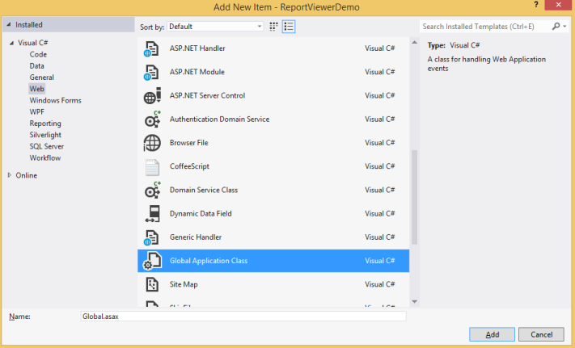

# Report Controller

The ReportViewer uses Web API services to process the report file, process the request from the control, and return the processed data from the control to client side.

## Create a Web API Controller for .NET platform

Right-click the **Project**, select **Add**, and then choose **Web API Controller Class file** from the listed templates.

 

Adding WebApi Controller
{:.caption}

### References
You should add the following assembly for the ReportViewer WebAPI controller in .NET platform:

   * Syncfusion.Linq.Base
   * Syncfusion.Compression.Base
   * Syncfusion.EJ.ReportViewer
   * Syncfusion.Pdf.Base
   * Syncfusion.XlsIO.Base
   * Syncfusion.DocIO.Base
   * Syncfusion.Shared.Wpf
   * Syncfusion.Chart.Wpf
   * Syncfusion.Gauge.Wpf
   * Syncfusion.SfMaps.Wpf 
   * Syncfusion.Licensing
   * Syncfusion.OfficeChart.Base
   * Syncfusion.Presentation.Base

   N> Refer to the above assemblies from the installed location, C:\Program Files (x86)\Syncfusion\Essential Studio\{platform}\{{ site.releaseversion }}\Assemblies
   N>
   N> Refer to the System.Web.Http, System. Web.Http.WebHost, System.Net.Http.WebRequest and System.Net.Http.Formatting assemblies from the ASP.NET WebApi NuGet package.

### Inherit IReportController

The ApiController inherits the `IReportController`, and you can add the following code example to its methods definition to process the report file. The `IReportController` interface contains the required actions and helper methods declaration to process the report. The `ReportHelper` class contains helper methods that helps to process Post/Get request from control and return the response to the control.

~~~ csharp

using Syncfusion.EJ.ReportViewer;
using System;
using System.Collections.Generic;
using System.Linq;
using System.Net;
using System.Net.Http;
using System.Web.Http;

namespace ReportViewerDemo.Api 
{
    public class ReportApiController: ApiController,IReportController 
    {
        //Post action for processing the rdl/rdlc report 
        public object PostReportAction(Dictionary < string, object > jsonResult 
        {
            return ReportHelper.ProcessReport(jsonResult, this);
        }
        
        //Get action for getting resources from the report
        [System.Web.Http.ActionName("GetResource")]
        [AcceptVerbs("GET")]
        public object GetResource(string key, string resourceType, bool isPrint) 
        {
            return ReportHelper.GetResource(key, resourceType, isPrint);
        }
        
        //Method will be called when initialize the report options before start processing the report        
        public void OnInitReportOptions(ReportViewerOptions reportOption)
        {
            //You can update report options here
        }
        
        //Method will be called when reported is loaded
        public void OnReportLoaded(ReportViewerOptions reportOption) 
        {
            //You can update report options here
        }
    }
}

~~~

### IReportController

The `IReportController` interface has declaration of action methods that is defined in the WebAPI Controller for processing the RDL/RDLC files and request from the ReportViewer control. The `IReportController` has the following action methods declaration. 

<table>
<tr>
<th>
Methods</th><th>
Description</th></tr>
<tr>
<td>
GetResource</td><td>
Action (HttpGet) method for getting a resource for report. </td></tr>
<tr>
<td>
PostReportAction</td><td>
Action (HttpPost) method for posting the request for report process. </td></tr>
<tr>
<td>
PostFormReportAction</td><td>
Action (HttpPost) method for posting the request to export the report. It requires only in ASP.NET Core platform.</td></tr>
<tr>
<td>
OnInitReportOptions</td><td>
Triggers the report initialization method when the report has to be processed.</td></tr>
<tr>
<td>
OnReportLoaded</td><td>
Triggers the report loaded method when loading the report and subreport.</td></tr>
</table>

### ReportHelper

The class `ReportHelper` contains helper methods that helps process Post/Get request from the ReportViewer control and returns the response to the ReportViewer control. The `ReportHelper` has the following methods. 

<table>
<tr>
<th>
Methods</th><th>
Description</th></tr>
<tr>
<td>
GetResource</td><td>
Returns the report resource for the requested key.</td></tr>
<tr>
<td>
ProcessReport</td><td>
Processes the report request and returns the result.</td></tr>
</table>

### WebAPI Routing

1. Right-click the **Project**, select **Add**, and then choose **Global.asax file** from the listed templates.

    
   
   Adding Global.asax
   {:.caption}

2. You can route the WebAPI in Application_Start event into the Global.asax file as follows.

   ~~~ csharp
   
	   using System;
	   using System.Collections.Generic;
	   using System.Linq;
	   using System.Web;
	   using System.Web.Security;
	   using System.Web.SessionState;
	   using System.Web.Http;
	   
	   namespace ReportViewerDemo 
	   {
		   public class Global: System.Web.HttpApplication 
		   {
			   protected void Application_Start(object sender, EventArgs e) 
			   {
				   System.Web.Http.GlobalConfiguration.Configuration.Routes.MapHttpRoute(
				   name: "DefaultApi",
				   routeTemplate: "api/{controller}/{action}/{id}",
				   defaults: new { id = RouteParameter.Optional });
			   }
		   }
	   }
   ~~~

### Enable CORS

1 Add the CORS NuGet package. In Visual Studio, goto the Tools menu, select **NuGet Package Manager**, and then choose **Package Manager Console**. In the Package Manager Console window, type the following command.



    Install-Package Microsoft.AspNet.WebApi.Cors


    
2 You can call the enable cors method in the Application_Start event into Global.asax file as follows.

~~~ csharp

    using System;
    using System.Collections.Generic;
    using System.Linq;
    using System.Web;
    using System.Web.Security;
    using System.Web.SessionState;
    using System.Web.Http;

    namespace ReportViewerDemo 
    {
        public class Global: System.Web.HttpApplication 
        {
            protected void Application_Start(object sender, EventArgs e) 
            {
                System.Web.Http.GlobalConfiguration.Configuration.EnableCors();
                System.Web.Http.GlobalConfiguration.Configuration.Routes.MapHttpRoute(
                name: "DefaultApi",
                routeTemplate: "api/{controller}/{action}/{id}",
                defaults: new { id = RouteParameter.Optional });
            }
        }
    }

~~~
 
3 Add the [EnableCors] attribute to the ApiController class as follows.

~~~ csharp

    using Syncfusion.EJ.ReportViewer;
    using System;
    using System.Collections.Generic;
    using System.Linq;
    using System.Net;
    using System.Net.Http;
    using System.Web.Http;
    using System.Web.Http.Cors;

    namespace ReportViewerDemo.Api 
    {
        [EnableCors(origins: "*", headers: "*", methods: "*")]
        public class ReportApiController: ApiController,IReportController 
        {
            //Post action for processing the rdl/rdlc report 
            public object PostReportAction(Dictionary < string, object > jsonResult 
            {
                return ReportHelper.ProcessReport(jsonResult, this);
            }
        
            //Get action for getting resources from the report
            [System.Web.Http.ActionName("GetResource")]
            [AcceptVerbs("GET")]
            public object GetResource(string key, string resourceType, bool isPrint) 
            {
                return ReportHelper.GetResource(key, resourceType, isPrint);
            }
            
            //Method will be called when initialize the report options before start processing the report        
            public void OnInitReportOptions(ReportViewerOptions reportOption)
            {
                //You can update report options here
            }
            
            //Method will be called when reported is loaded
            public void OnReportLoaded(ReportViewerOptions reportOption) 
            {
                //You can update report options here
            }
        }
    }

~~~