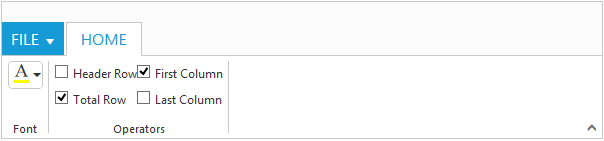

# Controls Support

Button, Split Button, DropdownList, Toggle button, Gallery and Custom controls can be added to each groups. You can set [`type`](http://help.syncfusion.com/api/js/ejribbon#members:tabs-groups-content-groups-type) property in group to define the controls. Default `type` is `button`. 

## Built in Controls

The following table describes about the built in controls [`type`](http://help.syncfusion.com/api/js/ejribbon#members:tabs-groups-content-groups-type) and their corresponding control settings.

<table class="params">
<thead>
<tr>
<th>Type</th>
<th>Control Settings</th>
<th class="last">Example</th>
</tr>
</thead>                     
<tbody>
<tr>
<td class="type">Button</td>
<td class="control settings"><a href="http://help.syncfusion.com/api/js/ejbutton">ejButton</a> -  <a href="http://help.syncfusion.com/api/js/ejribbon#members:tabs-groups-content-groups-buttonsettings">buttonSettings</a></td><td class="example last">
    buttonSettings: {
					width: 70,
					contentType: ej.ContentType.ImageOnly,
					prefixIcon: "e-ribbon e-new"
				    }                           
 </td>
</tr>
<tr>
<td class="type">SplitButton</td>
<td class="control settings"> <a href="http://help.syncfusion.com/api/js/ejsplitbutton">ejSplitButton</a> - <a href="http://help.syncfusion.com/api/js/ejribbon#members:tabs-groups-content-groups-splitbuttonsettings">splitButtonSettings</a></td>
<td class="example last">
	splitButtonSettings: {
                          contentType: ej.ContentType.ImageOnly,
                          targetID: "pasteSplit",
                          buttonMode: "dropdown",
                          arrowPosition: ej.ArrowPosition.Bottom
                          }
 </td>
</tr>
<tr>
<td class="type">ToggleButton</td>
<td class="control settings"><a href="http://help.syncfusion.com/api/js/ejtogglebutton">ejToggleButton</a> - <a href="http://help.syncfusion.com/api/js/ejribbon#members:tabs-groups-content-groups-togglebuttonsettings">toggleButtonSettings</a></td>
<td class="example last">
	toggleButtonSettings: {
                           contentType: ej.ContentType.ImageOnly,
                           defaultText: "Italic",
                           activeText: "Italic",
                           }
 </td>
</tr>
<tr>
<td class="type">DropDownList</td>
<td class="control settings"><a href="http://help.syncfusion.com/api/js/ejdropdownlist">ejDropDownList</a> - <a href="http://help.syncfusion.com/api/js/ejribbon#members:tabs-groups-content-groups-dropdownsettings">dropdownSettings</a></td>
<td class="example last">
	dropdownSettings: {
                      dataSource: size,
                      text: "1pt",
                      width: 65
                      }
 </td>
</tr>
</tbody>
</table>

N> 1. You can specify type either to [`group’s collection`](http://help.syncfusion.com/api/js/ejribbon#members:tabs-groups-content-defaults) or to each [`group`](http://help.syncfusion.com/api/js/ejribbon#members:tabs-groups-content-groups-type).
N> 2. For [`type`](http://help.syncfusion.com/api/js/ejribbon#members:tabs-groups-content-groups-type) property you can assign either string value (“splitbutton”) or enum value (ej.Ribbon.type.splitButton).



<ej-ribbon id="Default" width="100%" applicationTab.type="menu" 
applicationTab.menuItemID="menu" applicationTab.menuSettings.openOnClick="false">
    <e-tabs>
        <e-tab id="home" text="HOME" [groups]="groups1">
        </e-tab>
    </e-tabs>
</ej-ribbon>
<ul id="menu">
    <li>
        <a>FILE</a>
        <ul>
            <li><a>New</a></li>
        </ul>
    </li>
</ul>
<ul id="pasteSplit">
    <li><a>Paste</a></li>
</ul>
   




import {Component} from '@angular/core';
import {NorthwindService} from '../../services/northwind.service';

@Component({
  selector: 'ej-app',
  templateUrl: 'app/components/ribbon/ribbon.component.html',
  providers: [NorthwindService]
})
export class RibbonComponent {
    constructor(public northwindService: NorthwindService) {}
    
    groups1= [
        {
            text: "New",
            alignType: "rows",
            content: [
                {
                    groups: [
                        {
                            id: "new",
                            text: "New",
                            toolTip: "New",
                            buttonSettings: {
                                contentType: ej.ContentType.ImageOnly,
                                imagePosition: ej.ImagePosition.ImageTop,
                                prefixIcon: "e-ribbon e-icon e-new"
                            }
                        }
                    ],
                    defaults: {
                        type: "button",
                        width: 60,
                        height: 70
                    }
                }
            ]
        },
        {
            text: "Clipboard",
            alignType: ej.Ribbon.alignType.columns,
            content: [
                {
                    groups: [
                        {
                            id: "paste",
                            text: "paste",
                            toolTip: "Paste",
                            splitButtonSettings: {
                                contentType: ej.ContentType.ImageOnly,
                                prefixIcon: "e-ribbon e-icon e-ribbonpaste",
                                targetID: "pasteSplit",
                                buttonMode: "dropdown",
                                arrowPosition: ej.ArrowPosition.Bottom
                            }
                        }
                    ],
                    defaults: {
                        type: ej.Ribbon.type.splitButton,
                        width: 50,
                        height: 70
                    }
                }
            ]
        },
        {
            text: "Font",
            alignType: "rows",
            content: [
                {
                    groups: [
                        {
                            id: "font",
                            toolTip: "Font",
                            dropdownSettings: {
                                dataSource: font,
                                text: "Segoe UI",
                                width: 150
                            }
                        },
                        {
                            id: "size",
                            toolTip: "FontSize",
                            dropdownSettings: {
                                dataSource: size,
                                text: "1pt",
                                width: 65
                            }
                        }
                    ],
                    defaults: {
                        type: ej.Ribbon.type.dropDownList,
                        height: 28
                    }
                }, {
                    groups: [
                        {
                            id: "bold",
                            toolTip: "Bold",
                            type: ej.Ribbon.type.toggleButton,
                            toggleButtonSettings: {
                                contentType: ej.ContentType.ImageOnly,
                                defaultText: "Bold",
                                activeText: "Bold",
                                defaultPrefixIcon: "e-ribbon e-icon bold",
                                activePrefixIcon: "e-ribbon e-icon bold"
                            }
                        },
                        {
                            id: "italic",
                            toolTip: "Italic",
                            type: ej.Ribbon.type.toggleButton,
                            toggleButtonSettings: {
                                contentType: ej.ContentType.ImageOnly,
                                defaultText: "Italic",
                                activeText: "Italic",
                                defaultPrefixIcon: "e-ribbon e-icon e-ribbonitalic",
                                activePrefixIcon: "e-ribbon e-icon e-ribbonitalic"
                            }
                        }
                    ],
                    defaults: {
                        isBig: false,
                    }
              }]
        }]    
     var font = ["Segoe UI", "Arial", "Times New Roman", "Tahoma", "Helvetica"], 
     var size = ["1pt", "2pt", "3pt", "4pt", "5pt"], action1 = ["New", "Clear"], 
     action2 = ["Bold", "Italic", "Underline", "strikethrough", "superscript", 
     "subscript", "JustifyLeft", "JustifyCenter", "JustifyRight", "JustifyFull", 
     "Undo", "Redo"]
  }
  


## Custom

You can set [`type`](http://help.syncfusion.com/api/js/ejribbon#members:tabs-groups-content-groups-type) as `custom` to render custom controls and Custom element id has to be specified as [`contentID`](http://help.syncfusion.com/api/js/ejribbon#members:tabs-groups-content-groups-contentid).You can change the element defined in the custom template to appropriate Syncfusion control in the event of Ribbon [`create`](http://help.syncfusion.com/api/js/ejribbon#events:create).



<ej-ribbon id="Default" width="600" applicationTab.type="menu" 
applicationTab.menuItemID="menu" (create)="createControl($event)">
   <e-tabs>
        <e-tab id="home" text="HOME" [groups]="groups1">
        </e-tab>
   </e-tabs>
</ej-ribbon>

<ul id="menu">
    <li>
        <a>FILE </a>
        <ul>
            <li><a>New</a></li>
            <li><a>Print</a></li>
        </ul>
    </li>
</ul>
<input id="color" />
<table id="design" class="e-designtablestyle">
    <tr>
        <td>
            <input type="checkbox" id="check1" /><label for="check1">Header Row</label>
        </td>
        <td>
            <input type="checkbox" id="Check2" checked="checked" />
            <label for="Check2">First Column</label>
        </td>
    </tr>
    <tr>
        <td>
            <input type="checkbox" id="check4" checked="checked" />
            <label for="check4">Total Row</label>
        </td>
        <td>
            <input type="checkbox" id="Check5" /><label for="Check5">Last Column</label>
        </td>
    </tr>
</table>





import {Component} from '@angular/core';
import {NorthwindService} from '../../services/northwind.service';

@Component({
  selector: 'ej-app',
  templateUrl: 'app/components/ribbon/ribbon.component.html',
  providers: [NorthwindService]
})
export class RibbonComponent {
    constructor(public northwindService: NorthwindService) {}
    
     groups1 = [{
        text: "Font",
        content: [{
            groups: [{
                id: "color",
                toolTip: "Font Color",
                contentID: "color"
            }],
            defaults: {
                height: 30,
                type: ej.Ribbon.type.custom
            }
        }]
    }, {
            text: "Operators",
            content: [{
                groups: [{
                    id: "design",
                    type: ej.Ribbon.type.custom,
                    contentID: "design"
                }]
            }]
        }]
     createControl(args) {
         var ribbon = $("#Ribbon").data("ejRibbon");
         $("#color").ejColorPicker({ value: "#FFFF00", modelType: "palette", 
         cssClass: "e-ribbon", toolIcon: "e-fontcoloricon" });
     }
 }
  


