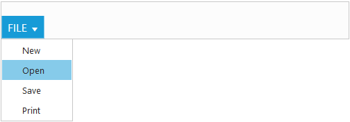

# Getting Started

Before we start with the Ribbon, please refer [this page](https://help.syncfusion.com/angular-2/overview) page for general information regarding integrating Syncfusion widget’s.

## Adding JavaScript and CSS references

To render the Ribbon control, the following list of external dependencies are needed, 

* [jQuery](http://jquery.com) - 1.7.1 and later versions
* [Angular](https://angular.io/) - Angular latest versions

The other required internal dependencies are tabulated below,

 <table>
        <tr>
            <th>
                <b>Files</b>
            </th>
            <th>
                <b>Description/Usage </b>
            </th>
        </tr>
        <tr>
            <td>ej.core.min.js
            </td>
            <td>Must always be referred to before using all the <i><b>JS</b></i> controls.
            </td>
        </tr>
        <tr>
            <td>ej.data.min.js
            </td>
            <td>Used to handle data manger operation and should be used while binding data to <i><b>JS</b></i> controls.
            </td>
        </tr>
        <tr>
            <td>ej.globalize.min.js
            </td>
            <td>Must be referred to localize any of the JS control's text and content.
            </td>
        </tr>
        <tr>
            <td>ej.ribbon.min.js
            </td>
            <td>Should be referred when using <i><b>Ribbon</b></i><b> </b>control.
            </td>
        </tr>
		<tr>
            <td>ej.waitingpopup.min.js
            </td>
            <td>This file is used to render waiting popup when on-demand functionality is enabled in <i><b>Ribbon</b></i><b> </b>control.
            </td>
        </tr>
        <tr>
            <td>ej.menu.min.js
            </td>
            <td>This file is used to render menu in the application tab.
            </td>
        </tr>
        <tr>
            <td>ej.scroller.min.js
            </td>
            <td>This file is used to render scroller in the Ribbon control.
            </td>
        </tr>
        <tr>
            <td>ej.checkbox.min.js
            </td>
            <td>This file is used to render checkboxes in the Ribbon control.
            </td>
        </tr>
        <tr>
            <td>ej.tab.min.js
            </td>
            <td>This file is used to render tabs into the Ribbon control.
            </td>
        </tr>
        <tr>
            <td>ej.dropdownlist.min.js
            </td>
            <td rowspan="4">These files are used to render button,split button,toggle button, and dropdown list controls in the ribbon groups.
            </td>
        </tr>
        <tr>
            <td>ej.splitbutton.min.js
            </td>
        </tr>
        <tr>
            <td>ej.button.min.js
            </td>
        </tr>
        <tr>
            <td>ej.togglebutton.min.js
            </td>
        </tr>
    </table>

N> Ribbon uses one or more sub-controls, therefore refer the `ej.web.all.min.js` (which encapsulates all the `ej` controls and frameworks in a single file) in the application instead of referring all the above specified internal dependencies. 

To get the real appearance of the Ribbon, the dependent CSS file `ej.web.all.min.css` (which includes styles of all the widgets) should also needs to be referred.

## Script/CSS Reference

Create a new HTML file and include the below initial code.



    <html>
    <head>
    <meta name="viewport" content="width=device-width, initial-scale=1.0">
    <meta name="description" content="Essential Studio for JavaScript">
    <meta name="author" content="Syncfusion">
    <title></title>

    <!-- Essential Studio for JavaScript  theme reference -->
    <link rel="stylesheet" href="http://cdn.syncfusion.com/{{ site.releaseversion }}/js/web/flat-azure/
    ej.web.all.min.css" />

    <!-- Angular related script references -->
    <!-- 1. Load libraries -->
         <!-- Polyfill(s) for older browsers -->
       
    
    
    

    <!-- Essential Studio for JavaScript  script references -->
    
    
    
     
    
    
    <!-- 2. Configure SystemJS -->
    
    

    </head>
    <!-- 3. Display the application -->
    <body>
    <my-app>Loading...</my-app>
    </body>
    </html>



N> Uncompressed version of library files are also available which is used for development or debugging purpose and can be generated from the custom script [here](http://csg.syncfusion.com).

## Control Initialization

Ribbon can be initialized with 'Application Tab' and UL list is needed for binding menu to application menu which can be specified through 'applicationTab.menuItemID' which denotes 'id' of UL.

Define the Application Tab with 'applicationTab-type' as 'menu' to render simple Ribbon control.



<ej-ribbon id="Default" width="100%" applicationTab.type="menu" 
applicationTab.menuItemID="menu">
</ej-ribbon>

	  
     <ul id="menu">
        <li><a>FILE</a>
            <ul>
                <li><a>New</a></li>
                <li><a>Open</a></li>
                <li><a>Save</a></li>
                <li><a>Print</a></li>
            </ul>
        </li>
   </ul> 


    



import {Component} from '@angular/core';
import {NorthwindService} from '../../services/northwind.service';

@Component({
  selector: 'ej-app',
  templateUrl: 'app/components/ribbon/ribbon.component.html',
  providers: [NorthwindService]
})
export class RibbonComponent {
   constructor(public northwindService: NorthwindService) {}     
}



## Adding Tabs

Tab is a set of related groups which are combined into single item. For creating Tab, 'id' and 'text' properties should be specified.



<ej-ribbon id="Default" width="100%" applicationTab.type="menu" 
applicationTab.menuItemID="menu">
    <e-tabs>
        <e-tab id="home1" text="HOME">
        </e-tab>
    </e-tabs>
</ej-ribbon>
	  
     <ul id="menu">
        <li><a>FILE</a>
            <ul>
                <li><a>New</a></li>
                <li><a>Open</a></li>
                <li><a>Save</a></li>
                <li><a>Print</a></li>
            </ul>
        </li>
   </ul> 





import {Component} from '@angular/core';
import {NorthwindService} from '../../services/northwind.service';

@Component({
  selector: 'ej-app',
  templateUrl: 'app/components/ribbon/ribbon.component.html',
  providers: [NorthwindService]
})
export class RibbonComponent {
    constructor(public northwindService: NorthwindService) {}
}



## Configuring Groups

List of controls are combined as logical 'groups' into Tab. Group alignment type as 'row/column', Default is 'row'.

Create group item with 'text' specified and add content group to Groups collection with ejButton control settings.



<ej-ribbon id="Default" width="100%" applicationTab.type="menu" 
applicationTab.menuItemID="menu">
   <e-tabs>
        <e-tab id="home1" text="HOME" [groups]="groups1">
        </e-tab>
    </e-tabs>
</ej-ribbon>
	  
     <ul id="menu">
        <li><a>FILE</a>
            <ul>
                <li><a>New</a></li>
                <li><a>Open</a></li>
                <li><a>Save</a></li>
                <li><a>Print</a></li>
            </ul>
        </li>
   </ul> 




import {Component} from '@angular/core';
import {NorthwindService} from '../../services/northwind.service';

@Component({
  selector: 'ej-app',
  templateUrl: 'app/components/ribbon/ribbon.component.html',
  providers: [NorthwindService]
})
export class RibbonComponent {
    constructor(public northwindService: NorthwindService) {}
     defaults={type:"button",width:"60",height:"70"};
     buttonSettings={ contentType:"imageonly",imagePosition:"imagetop",
     prefixIcon:"e-ribbon e-icon e-new"};
       var font = [{value: 1,text: "Segoe UI" }, {value: 2, text: "Arial"}];
     groups1 = [{ text: "New", alignType: "rows", content: [{ groups: [{id:"new",text:"New",
     toolTip: "New",buttonSettings:{contentType:"imageonly",imagePosition:"imagetop",
     prefixIcon:"e-ribbon e-icon e-new"}}], defaults: { type: "button", width: "50",height:"70",
      isBig: "true" }} ] },{ text: "Clipboard", alignType: "columns",enableGroupExpander:"true",
       content: [{ 
         groups: [{id:"paste",text:"Paste",toolTip: "Paste",buttonSettings:{contentType:"imageonly",
         imagePosition:"imagetop",prefixIcon:"e-ribbon e-icon e-ribbonpaste"}}], 
         defaults: { type: "button", width: "50",height:"70", isBig: "true" }}, { groups: [{ id: "font", 
         dropdownSettings: { dataSource: "font", text: "Segoe UI", width: "150"}}]}  ] }, 
     ];
     
}


## User Interface

Ribbon component able to integrate any custom components and customized their functionality in application end. Our Ribbon component is similar to Microsoft products(Word). The Ribbon UI consists of several sections like Application Tab, Quick Access Toolbar, Tab, Contextual Tab, Gallery and etc.The following screenshot shows the diagrammatic detail of Ribbon UI:

From above screenshot, you can see Ribbon has several subcomponents for different functionalities. The upcoming sections explains the brief details of each functionalities and their customizations.
