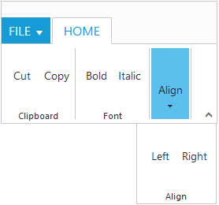
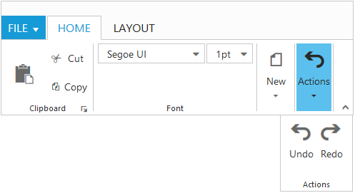

# Resize 

Ribbon control dynamically resizes to display possible number of controls in the optimal layout as the application window size changes.

As the window is narrowed, controls in the Ribbon will be combined as group button with dropdown arrow, in which controls can be expanded with dropdown arrow.

## Tablet Layout 

Set [`isResponsive`](http://help.syncfusion.com/api/js/ejribbon#members:isresponsive) as true to enable responsive layout in Ribbon.If client width is above  420px or control content exceeds the page then, the ribbon will render in Tablet mode.



<ej-ribbon id="Default" width="20%" applicationTab.type="menu" 
applicationTab.menuItemID="menu" isResponsive="true">
     <e-tabs>
        <e-tab id="home" text="HOME" [groups]="groups1">
        </e-tab>
     </e-tabs>
</ej-ribbon>
<ul id="menu">
    <li>
        <a>FILE </a>
        <ul>
            <li><a>New</a></li>
            <li><a>Open</a></li>
        </ul>
    </li>
</ul>





import {Component} from '@angular/core';
import {NorthwindService} from '../../services/northwind.service';

@Component({
  selector: 'ej-app',
  templateUrl: 'app/components/ribbon/ribbon.component.html',
  providers: [NorthwindService]
})
export class RibbonComponent {
    constructor(public northwindService: NorthwindService) {}
     groups1 = [{
        text: "Clipboard",
        content: [{
            groups: [{
                id: "cut",
                text: "Cut"
            }, {
                    id: "copy",
                    text: "Copy"
                }],
            defaults: {
                height: 70,
                width: 40
            }
        }]
    }, {
            text: "Font",
            content: [{
                groups: [{
                    id: "bold",
                    text: "Bold"
                }, {
                        id: "italic",
                        text: "Italic"
                    }],
                defaults: {
                    height: 70,
                    width: 40
                }
            }]
        }, {
            text: "Align",
            content: [{
                groups: [{
                    id: "left",
                    text: " Left"
                }, {
                        id: "right",
                        text: "Right"
                    }],
                defaults: {
                    height: 70,
                    width: 40
                }
            }]
        }]
   }
     


## Group Button Customization

Based on window size, detailed group is shrined into single button and you can expand group items with group button click.

For each group shirked for resizing, Custom Class will be added based on group text.For example, `e-action` whereas `action` is group text. Using this custom class, group button can be customized such as to set icons etc.



<ej-ribbon id="Default" width="40%" applicationTab.type="menu" allowResizing="true" 
applicationTab.menuItemID="menu">
    <e-tabs>
        <e-tab id="home" text="HOME" [groups]="groups1">
        </e-tab>
        <e-tab id="layout" text="LAYOUT" [groups]="groups2">
        </e-tab>
    </e-tabs>
</ej-ribbon>
<ul id="menu">
    <li>
        <a>FILE</a>
        <ul>
            <li><a>New</a></li>
            <li><a>Open</a></li>
        </ul>
    </li>
</ul>





import {Component} from '@angular/core';
import {NorthwindService} from '../../services/northwind.service';

@Component({
  selector: 'ej-app',
  templateUrl: 'app/components/ribbon/ribbon.component.html',
  styleUrls: ['app/components/ribbon/ribbon.component.css'],
  providers: [NorthwindService]
})
export class RibbonComponent {
    constructor(public northwindService: NorthwindService) {}
      groups1 = [{
        text: "Clipboard",
        alignType: ej.Ribbon.alignType.columns,
        enableGroupExpander: true,
        content: [{
            groups: [{
                id: "paste",
                text: "paste",
                toolTip: "Paste",
                buttonSettings: {
                    contentType: ej.ContentType.ImageOnly,
                    prefixIcon: "e-ribbon e-icon e-ribbonpaste"
                }
            }],
            defaults: {
                isBig: true,
                width: 50,
                height: 70
            }
        }, {
                groups: [{
                    id: "cut",
                    text: "Cut",
                    toolTip: "Cut",
                    buttonSettings: {
                        contentType: ej.ContentType.TextAndImage,
                        prefixIcon: "e-ribbon e-icon e-ribboncut"
                    }
                }, {
                        id: "copy",
                        text: "Copy",
                        toolTip: "Copy",
                        buttonSettings: {
                            contentType: ej.ContentType.TextAndImage,
                            prefixIcon: "e-ribbon e-icon e-ribboncopy"
                        }
                    }],
                defaults: {
                    width: 60,
                    height: 40,
                    isBig: false
                }
            }]
    }, {
            text: "Font",
            alignType: "rows",
            content: [{
                groups: [{
                    id: "font",
                    toolTip: "Font",
                    dropdownSettings: {
                        dataSource: font,
                        text: "Segoe UI",
                        width: 150
                    }
                }, {
                        id: "size",
                        toolTip: "FontSize",
                        dropdownSettings: {
                            dataSource: size,
                            text: "1pt",
                            width: 65
                        }
                    }],
                defaults: {
                    type: ej.Ribbon.type.dropDownList,
                    height: 28,
                    isBig: false,
                }
            }]
        }, {
            text: "New",
            alignType: ej.Ribbon.alignType.rows,
            content: [{
                groups: [{
                    id: "new",
                    text: "New",
                    toolTip: "New",
                    buttonSettings: {
                        contentType: ej.ContentType.ImageOnly,
                        imagePosition: ej.ImagePosition.ImageTop,
                        prefixIcon: "e-ribbon e-icon e-new"
                    }
                }],
                defaults: {
                    width: 60,
                    height: 40
                }
            }]
        }, {
            text: "Actions",
            alignType: ej.Ribbon.alignType.rows,
            content: [{
                groups: [{
                    id: "undo",
                    text: "Undo",
                    toolTip: "Undo",
                    buttonSettings: {
                        contentType: ej.ContentType.TextAndImage,
                        imagePosition: ej.ImagePosition.ImageTop,
                        prefixIcon: "e-ribbon e-icon e-undo"
                    }
                }, {
                        id: "redo",
                        text: "Redo",
                        toolTip: "Redo",
                        buttonSettings: {
                            contentType: ej.ContentType.TextAndImage,
                            imagePosition: ej.ImagePosition.ImageTop,
                            prefixIcon: "e-ribbon e-icon e-redo"
                        }
                    }],
                defaults: {
                    width: 40,
                    height: 70
                }
            }]
        }];
    groups2 = [{
        text: "Print Layout",
        alignType: ej.Ribbon.alignType.rows,
        content: [{
            groups: [{
                id: "printlayout",
                text: "Print Layout",
                toolTip: "Print Layout",
                buttonSettings: {
                    contentType: ej.ContentType.TextAndImage,
                    imagePosition: ej.ImagePosition.ImageTop,
                    prefixIcon: "e-ribbon e-icon e-printlayout"
                }
            }],
            defaults: {
                width: 80,
                height: 70
            }
        }]
    }]
       var font = ["Segoe UI", "Arial"],
        var size = ["1pt", "2pt"];
  }
     




       .e-ribbon .e-New:before, .e-ribbon .e-Actions:before {
            font-family: "ej-ribbonfont";
            font-size: 28px;
            line-height: 35px;
        }
        .e-ribbon .e-New:before {
            content: "\e167";            
            text-indent: -1.5px;
        }
        .e-ribbon .e-Actions:before {
            content: "\e184;
            text-indent: 7px;
        }
                 


