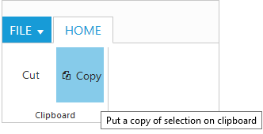
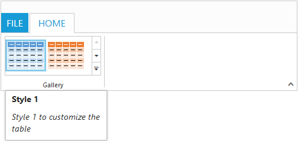

# Screen Tips

ScreenTip/Tooltip is used to reduce the controls related Help that are needed to the end user to do control related actions.

## HTML Tooltip

Standard `html tooltip` can be set using [`tooltip`](http://help.syncfusion.com/api/js/ejribbon#members:tabs-groups-content-groups-tooltip) property of each group item.



   <ej-ribbon id="resize" width="20%" applicationTab.type="menu" applicationTab.menuItemID="menu" allowResizing="true">
        <e-tabs>
            <e-tab id="home" text="HOME" [groups]="groups1">
            </e-tab>
        </e-tabs>
   </ej-ribbon>
<ul id="menu">
    <li>
        <a>FILE</a>
        <ul>
            <li><a>New</a></li>
            <li><a>Open</a></li>
        </ul>
    </li>
</ul>





import { Component } from '@angular/core';
import { NorthwindService } from '../../services/northwind.service';

@Component({
    selector: 'ej-app',
    templateUrl: 'app/components/ribbon/resize.component.html',
    styleUrls: ['app/components/ribbon/ribbon.component.css'],
    providers: [NorthwindService]
})
export class ResizeComponent {
   constructor(public northwindService: NorthwindService) { }
   groups1 = [{
        text: "Clipboard",
        content: [{
            groups: [{
                id: "cut",
                text: "Cut",
                toolTip: "Remove the selection and put it on clipboard"
            },
                {
                    id: "copy",
                    text: "Copy",
                    toolTip: "Put a copy of selection on clipboard",
                    buttonSettings: {
                        contentType: ej.ContentType.TextAndImage,
                        prefixIcon: "e-ribbon e-icon e-ribboncopy"
                    }
                }],
            defaults: {
                height: 70,
                width: 60
            }
        }]
     }]
}



### For Gallery

[`Custom tooltip`](http://help.syncfusion.com/api/js/ejribbon#members:tabs-groups-content-groups-galleryitems-customtooltip) for each [`gallery`](http://help.syncfusion.com/api/js/ejribbon#members:tabs-groups-content-groups-galleryitems) and [`custom gallery`](http://help.syncfusion.com/api/js/ejribbon#members:tabs-groups-content-groups-customgalleryitems) items button control can be specified. 

N> Custom gallery item `menu` is not supported to Custom tooltip.



     <ej-ribbon id="resize" width="500" applicationTab.type="menu" applicationTab.menuItemID="menu">
        <e-tabs>
            <e-tab id="home" text="HOME" [groups]="groups1">
            </e-tab>
       </e-tabs>
    </ej-ribbon>
<ul id="menu">
    <li><a>FILE</a> </li>
</ul>
<ul id="custom">
    <li>
        <a>New Quick Step</a>
        <ul>
            <li><a>Flag and Move</a></li>
        </ul>
    </li>
</ul>





import { Component } from '@angular/core';
import { NorthwindService } from '../../services/northwind.service';

@Component({
    selector: 'ej-app',
    templateUrl: 'app/components/ribbon/resize.component.html',
    styleUrls: ['app/components/ribbon/ribbon.component.css'],
    providers: [NorthwindService]
})
export class ResizeComponent {
    constructor(public northwindService: NorthwindService) { }
    groups1 = [{
        type: "gallery",
        text: "Gallery",
        content: [{
            groups: [{
                id: "Gallery",
                columns: 2,
                itemHeight: 54,
                itemWidth: 73,
                expandedColumns: 3,
                type: ej.Ribbon.type.gallery,
                galleryItems: [{
                    text: "Style 1",
                    customToolTip: {
                        title: "Style 1",
                        content: "<I>Style 1 to customize the table</I>"
                    },
                    buttonSettings: {
                        contentType: ej.ContentType.ImageOnly,
                        prefixIcon: "e-gallerycontent1 e-gbtnimg",
                        cssClass: "e-gbtnposition"
                    }
                }, {
                        text: "Style 2",
                        customToolTip: {
                            title: "Style 2",
                            content: "<I>Style 2 to customize the table</I>"
                        },
                        buttonSettings: {
                            contentType: ej.ContentType.ImageOnly,
                            prefixIcon: "e-gallerycontent2 e-gbtnimg",
                            cssClass: "e-gbtnposition"
                        }
                    }, {
                        text: "Style 3",
                        customToolTip: {
                            title: "Style 3",
                            content: "<I>Style 3 to customize the table</I>"
                        },
                        buttonSettings: {
                            contentType: ej.ContentType.ImageOnly,
                            prefixIcon: "e-gallerycontent3 e-gbtnimg",
                            cssClass: "e-gbtnposition"
                        }
                    }, {
                        text: "Style 4",
                        customToolTip: {
                            title: "Style 4",
                            content: "<I>Style 4 to customize the table</I>"
                        },
                        buttonSettings: {
                            contentType: ej.ContentType.ImageOnly,
                            prefixIcon: "e-gallerycontent4 e-gbtnimg",
                            cssClass: "e-gbtnposition"
                        }
                    }],
                customGalleryItems: [{
                    text: "Clear Formatting",
                    toolTip: "Clear Formatting",
                    customItemType: ej.Ribbon.customItemType.button,
                    customToolTip: {
                        title: "Clear Format",
                        content: "<I>To clear formatting</I>"
                    },
                    buttonSettings: {
                        cssClass: "e-extrabtnstyle"
                    }
                }, {
                        customItemType: ej.Ribbon.customItemType.menu,
                        menuId: "custom",
                        menuSettings: {
                            openOnClick: false
                        }
                    }]
            }]
        }]
    }]
}



### For Expand Pin

Specifies the [`custom tooltip`](http://help.syncfusion.com/api/js/ejribbon#members:expandpinsettings-customtooltip) for expand pin in the Ribbon. 



   <ej-ribbon id="resize" width="300" applicationTab.type="menu" applicationTab.menuItemID="menu" 
   [expandPinSettings.customToolTip]="tooltip" applicationTab.menuSettings.openOnClick="false">
        <e-tabs>
            <e-tab id="home" text="HOME" [groups]="groups1">
            </e-tab>
       </e-tabs>
   </ej-ribbon>
<ul id="menu">
   <li>
        <a>FILE</a>
        <ul>
            <li><a>New</a></li>
            <li><a>Open</a></li>
        </ul>
   </li>
</ul>





import { Component } from '@angular/core';
import { NorthwindService } from '../../services/northwind.service';

@Component({
    selector: 'ej-app',
    templateUrl: 'app/components/ribbon/resize.component.html',
    styleUrls: ['app/components/ribbon/ribbon.component.css'],
    providers: [NorthwindService]
})
export class ResizeComponent {
    constructor(public northwindService: NorthwindService) { }
    groups1 = [{
        text: "New",
        alignType: ej.Ribbon.alignType.rows,
        content: [{
            groups: [{
                id: "new",
                text: "New",
                toolTip: "New",
                buttonSettings: {
                    contentType: ej.ContentType.ImageOnly,
                    imagePosition: ej.ImagePosition.ImageTop,
                    prefixIcon: "e-ribbon e-icon e-new",
                    click: "executeAction"
                }
            }],
            defaults: {
                type: ej.Ribbon.type.button,
                width: 60,
                height: 70
            }
        }],
    }]
    tooltip = {
        title: "Collapse the Ribbon",
        content: "<h6>Click the icon to collapse the Ribbon.</h6>"
    }
}



### For Collapse Pin

Specifies the [`custom tooltip`](http://help.syncfusion.com/api/js/ejribbon#members:collapsepinsettings-customtooltip) for collapse pin in the Ribbon. 



       <ej-ribbon id="resize" width="300" applicationTab.type="menu" 
       applicationTab.menuItemID="menu" [collapsePinSettings.customToolTip]="tooltip" 
       applicationTab.menuSettings.openOnClick="false">
        <e-tabs>
            <e-tab id="home" text="HOME" [groups]="groups1">
            </e-tab>
       </e-tabs>
    </ej-ribbon>
<ul id="menu">
    <li>
        <a>FILE</a>
        <ul>
            <li><a>New</a></li>
            <li><a>Open</a></li>
        </ul>
    </li>
</ul>





import { Component } from '@angular/core';
import { NorthwindService } from '../../services/northwind.service';

@Component({
    selector: 'ej-app',
    templateUrl: 'app/components/ribbon/resize.component.html',
    styleUrls: ['app/components/ribbon/ribbon.component.css'],
    providers: [NorthwindService]
})
export class ResizeComponent {
    constructor(public northwindService: NorthwindService) { }
    groups1 = [{
        text: "New",
        alignType: ej.Ribbon.alignType.rows,
        content: [{
            groups: [{
                id: "new",
                text: "New",
                toolTip: "New",
                buttonSettings: {
                    contentType: ej.ContentType.ImageOnly,
                    imagePosition: ej.ImagePosition.ImageTop,
                    prefixIcon: "e-ribbon e-icon e-new",
                    click: "executeAction"
                }
            }],
            defaults: {
                type: ej.Ribbon.type.button,
                width: 60,
                height: 70
            }
        }],
    }]
    tooltip = {
        title: "Pin the Ribbon",
        content: "<h6>Keep it open while you work</h6>"
    }
}



### For GroupExpander

[`Custom tooltip`](http://help.syncfusion.com/api/js/ejribbon#members:tabs-groups-groupexpandersettings-customtooltip) for each group expander can be specified.



      <ej-ribbon id="resize" width="300" applicationTab.type="menu" 
       applicationTab.menuItemID="menu" [collapsePinSettings.customToolTip]="tooltip" 
       applicationTab.menuSettings.openOnClick="false">
        <e-tabs>
            <e-tab id="home" text="HOME" [groups]="groups1">
            </e-tab>
       </e-tabs>
    </ej-ribbon>
<ul id="menu">
    <li>
        <a>FILE</a>
        <ul>
            <li><a>New</a></li>
            <li><a>Open</a></li>
        </ul>
    </li>
</ul>





import { Component } from '@angular/core';
import { NorthwindService } from '../../services/northwind.service';

@Component({
    selector: 'ej-app',
    templateUrl: 'app/components/ribbon/resize.component.html',
    styleUrls: ['app/components/ribbon/ribbon.component.css'],
    providers: [NorthwindService]
})
export class ResizeComponent {
    constructor(public northwindService: NorthwindService) { }
    groups1 =  [{
        text: "New",
        alignType: ej.Ribbon.AlignType.Columns,
        enableGroupExpander: true,
        groupExpanderSettings: {
            customToolTip: {
                title: "Clipboard",
                content: "<h6>Show a popup for the Clipboard group.</h6>"
            }
        },
        alignType: ej.Ribbon.alignType.rows,
        content: [{
            groups: [{
                id: "new",
                text: "New",
                toolTip: "New",
                buttonSettings: {
                    contentType: ej.ContentType.ImageOnly,
                    imagePosition: ej.ImagePosition.ImageTop,
                    prefixIcon: "e-ribbon e-icon e-new",
                    click: "executeAction"
                }
            }],
            defaults: {
                type: ej.Ribbon.type.button,
                width: 60,
                height: 70
            }
        }],
    }]
}



