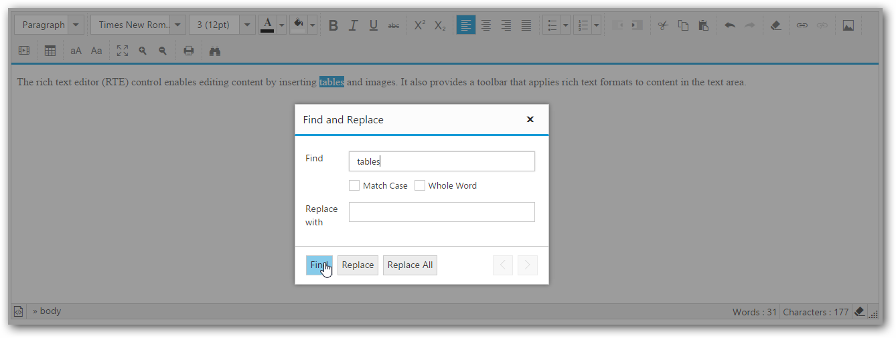

# Find and Replace

RTE provides find and replace support, which is used to search for a keyword in RTE content and replace the matched keyword with a specified text. In order to use it, we have to enable the find and replace item in the editor toolbar (or) Press CTRL+F key.  



<textarea id="texteditor" ej-rte [(tools)]="tools"></textarea>





import {Component} from '@angular/core';

@Component({
  selector: 'sd-home',
  templateUrl: 'app/components/rte/rte.component.html'
})
export class RTEComponent {
    tools: Object;
    constructor() {
        this.tools = { edit: ["findAndReplace"] };
    }     
}



* Find and Replace action should happen in a following sequence:

    Find => Replace (or) Replace All.
<table>
<tr>
<th>
Action
</th>
<th>
Descriptions 
</th>
</tr>
<tr>
<td>
Find
</td>
<td>
Finds a keyword matches with the editor content.it consist of following filters.
* Match Case.
* Whole Word.
</td>
</tr>
<tr>
<td>
Replace
</td>
<td>
Replaces the particular selected match with the specified text.
</td>
</tr>
<tr>
<td>
ReplaceAll
</td>
<td>
Replaces the entire matches with the specified text.
</td>
</tr>
</table>

N> Before performing the Replace/ReplaceAll action, we must do the find action to validate the match’s availability. 