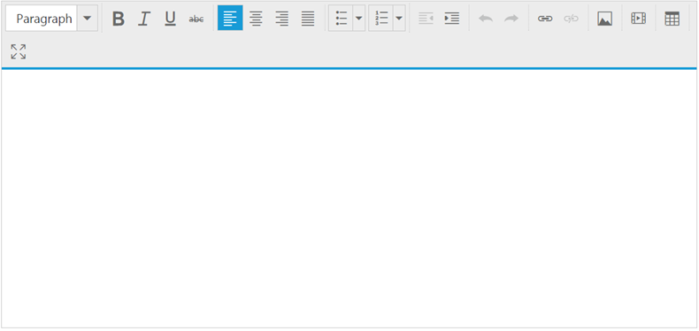
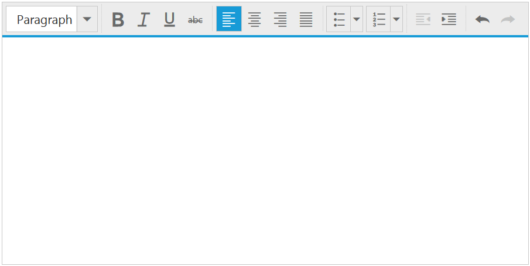
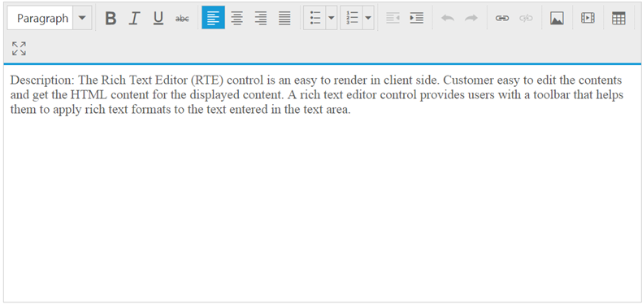

# Getting started

This section helps to understand the getting started of RTE control with the step-by-step instruction.

## Create RTE Control

Create an HTML page and add the scripts references in the order mentioned in the following code example.



<!DOCTYPE html>
<html>
   <head> 
    <link href="//cdn.syncfusion.com/{{ site.releaseversion }}/js/web/flat-azure/ej.web.all.min.css" rel="stylesheet" />
    
    
    
    
     
    
    
    
  </head>
  <body>
   <ej-app>Loading...</ej-app>
  </body>
</html>



## Initialize RTE

In the `rte` component HTML file.



<textarea ej-rte width="600px" height="300px"></textarea>

 
 


import {Component, ViewEncapsulation} from '@angular/core';

@Component({
  selector: 'ej-app',
  templateUrl: 'app/app.component.html',
})
export class AppComponent {  
}



Now, the RTE is rendered.

## Toolbar–Configuration

You can configure a toolbar with the tools as your application requires.


 
 <textarea ej-rte width="600px" height="300px" [(toolsList)]="tools"></textarea>





import {Component} from '@angular/core';

@Component({
  selector: 'my-app',
  templateUrl: 'app/components/rating/rating.component.html'
})
export class RatingComponent {
    tools: any; 
    constructor() {
        this.tools = ["formatStyle", "font", "style", "effects", "alignment", "lists", "indenting", "clipboard", "doAction", "clear", "casing", "customTools", "print"];  
    }
}



The above code example displays the following output.

You can set the content of the editor as follows.

 

 <textarea ej-rte width="600px" height="300px" [(value)]="content"></textarea>





import {Component, ViewEncapsulation} from '@angular/core';

@Component({
  selector: 'ej-app',
  templateUrl: 'app/app.component.html',
})
export class AppComponent {
	content:string;
	  constructor() {
		  this.content="Description: The Rich Text Editor (RTE) control is an easy to render in client side. Customer easy to edit the contents and get the HTML content from RTE";
	  }
}



The following screenshot displays a RTE widget.

