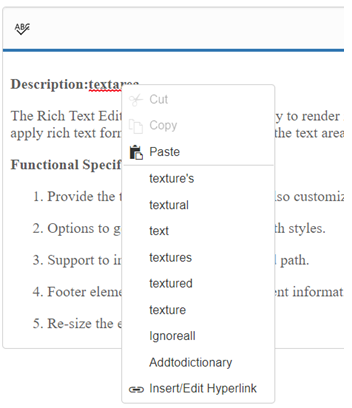

# How To

## Add Google web fonts to editor 

To use web fonts in EJ RTE, it is not needed for the web fonts to be present in local machine. To add the web fonts to EJ RTE, we need to append the web font link to the RTE Iframe <head> tag. We can achieve this in the “create” event of the RTE as shown below. 



   <textarea ej-rte id="rte" [(toolsList)]="list" [(tools)]="tools" [fontName]="fonts" (create)="create()"></textarea>
     




import {Component} from '@angular/core';

@Component({
  selector: 'ej-app',
  templateUrl: 'app/components/rte/rte.component.html'
})
export class RTEComponent {
    list: any;
    tools: Object;
    fonts: any;
    constructor() {
        this.fonts = [
                { text: "Segoe UI", value: "Segoe UI" },
                //Added from Google web fonts
                { text: "Sans", value: "Sans" },
                { text: "Roboto", value: "Roboto" },
                { text: "Great vibes", value: "Great Vibes,cursive" }
         ];
        this.list = ["links", "lists", "doAction", "style", "images"];
        this.tools = { style: ["bold", "italic"], lists: ["unorderedList", "orderedList"], doAction: ["undo", "redo"], links: ["createLink", "removeLink"], images: ["image"] };
    }
    create() {
                    var $head = this._rteIframe.contents().find("head");
                    var url = "Styles/styles.css";
                        //Added two Google web fonts (“Roboto” and “Great vibes”)
                    $head.append($("<link/>", { rel: "stylesheet", href: 'http://fonts.googleapis.com/css?family=Roboto', type: "text/css" }));
                    $head.append($("<link/>", { rel: "stylesheet", href: 'http://fonts.googleapis.com/css?family=Great+Vibes', type: "text/css" }));
                }
}



## Increase RTE max word count 

To increase the RTE content maximum word count, we suggest you to set the [maxLength](https://help.syncfusion.com/api/js/ejrte#members:maxlength) property for it. By default, maxLength value is 7000, assign it with a value based on your requirement. 

Refer the following API reference link: [Link](https://help.syncfusion.com/api/js/ejrte#members:maxlength) 

## Add multiple editor instances to a single page

This is in fact a common use case, especially when you may wish to break your content into sections (e.g. titles, paragraphs) that the user can edit individually. 

In the following example, the page is broken into two separate editable areas, each sharing the same RTE configuration. Each individual `textarea` is provided the same class of 'myEdit'. 



       <textarea ej-rte class="rte" [(toolsList)]="list" [(tools)]="tools" ></textarea>
       <textarea ej-rte class="rte" [(toolsList)]="list" [(tools)]="tools" ></textarea>
     




import {Component} from '@angular/core';

@Component({
  selector: 'ej-app',
  templateUrl: 'app/components/rte/rte.component.html'
})
export class RTEComponent {
    list: any;
    tools: Object;
    constructor() {
        this.list = ["links", "lists", "doAction", "style", "images"];
        this.tools = { style: ["bold", "italic"], lists: ["unorderedList", "orderedList"], doAction: ["undo", "redo"], links: ["createLink", "removeLink"], images: ["image"] };
    }
}



### Multiple editor instances sharing a unique RTE properties

In this next example each editable area will be loaded with an instance of RTE with a unique configuration. This is especially helpful when different content areas have different needs. For example, you may want to provide a very simple configuration for editing titles and a more complete configuration for editing body content. This is accomplished by defining a RTE property for each desired configuration.



       <textarea ej-rte class="rte" [(toolsList)]="list" [(tools)]="tools" (create)="create()" [fontName]="fonts" ></textarea>
       <textarea ej-rte class="rte" [(toolsList)]="list" [(tools)]="tools" ></textarea>
     




import {Component} from '@angular/core';

@Component({
  selector: 'ej-app',
  templateUrl: 'app/components/rte/rte.component.html'
})
export class RTEComponent {
    list: any;
    tools: Object;
    fonts:any;
    constructor() {
        this.fonts = [
                { text: "Segoe UI", value: "Segoe UI" },
                //Added from Google web fonts
                { text: " Sans", value: " Sans" },
                { text: "Roboto", value: "Roboto" },
                { text: "Great vibes", value: "Great Vibes,cursive" }
         ];
        this.list = ["links", "lists", "doAction", "style", "images"];
        this.tools = { style: ["bold", "italic"], lists: ["unorderedList", "orderedList"], doAction: ["undo", "redo"], links: ["createLink", "removeLink"], images: ["image"] };
    }
    create() {
                    var $head = this._rteIframe.contents().find("head");
                    var url = "Styles/styles.css";
                        //Added two Google web fonts (“Roboto” and “Great vibes”)
                    $head.append($("<link/>", { rel: "stylesheet", href: 'http://fonts.googleapis.com/css?family=Roboto', type: "text/css" }));
                    $head.append($("<link/>", { rel: "stylesheet", href: 'http://fonts.googleapis.com/css?family=Great+Vibes', type: "text/css" }));
                }
}



## Prevent the cut or copy of content in RTE

Bind the “keydown” event to the RTE’s Iframe, from which we can prevent the copy or cut action inside the RTE. Please refer the below code snippet.



<textarea ej-rte id="rteSample" rows="10" cols="30" [value]="val" style="width: 740px; height: 440px" (create)="create()">       
</textarea>





import {Component} from '@angular/core';

@Component({
  selector: 'ej-app',
  templateUrl: 'app/components/rte/rte.component.html'
})
export class RTEComponent {
    val:any;
    constructor() {
       this.val="The RichTextEditor (RTE) control enables you to edit the contents with insert table and images.It also provides a toolbar that helps to apply rich text formats to the content entered in the TextArea.";
    }
    create() {
            $("#rteSample_Iframe").contents().on("keydown", function (e) {
            //Capture the "ctrl + c or ctrl + x" inside RTE
            if ((e.ctrlKey && e.keyCode === 67) || (e.ctrlKey && e.keyCode === 88)) { // ctrl + c or ctrl + x
                //Prevent the default browser action
                e.stopPropagation();
                e.preventDefault();
                return false;
            }
        });
                }
}



## Capture ctrl+s keypress event inside the RichTextEditor 

Yes, we can capture the ctrl + s keypress inside Rich Text Editor. To achieve this, we need to bind the “keydown” event to the RTE content (which is an iframe) and capture the ctrl + s keypress using its keyCode. 

1.	Render the RTE control 



    <textarea id="rteSample" rows="10" [value]="val" cols="30" style="width: 740px; height: 440px" >
    </textarea>
    


2.	Bind the “keydown” event to the RTE and capture the “ctrl” + “s” keypress , if those keys has pressed, get the content of RTE.


@Component({
  selector: 'ej-app',
  templateUrl: 'app/components/rte/rte.component.html'
})
export class RTEComponent {
val:any;
constructor() {
       this.val="The RichTextEditor (RTE) control enables you to edit the contents with insert table and images.It also provides a toolbar that helps to apply rich text formats to the content entered in the TextArea.";
}
create() {
    var rteObj = $("#rteSample").data("ejRTE");
    $("#" + rteObj.element[0].id + "_Iframe").contents().on("keydown", function (e){

        //Capture the "ctrl + s" inside RTE
        if (e.ctrlKey && e.keyCode === 83) { 
            //Prevent the default browser action
            e.preventDefault();
            //Get the contents of RTE using getText method
            var content = rteObj.getText();
            //You can now save the content as per your requirement.
            setTimeout(function () {
                alert(content);
            }, 0);
        }

    });
    }
}



## Find the current cursor location in RTE?

You can find the cursor location by getting the offset value of desired text using the getRange method as shown below: 



<textarea ej-rte id="rteSample" rows="10" cols="30" [value]="val" style="width: 740px; height: 440px">       
</textarea>
<input type="button" ej-button id="button" value="Button" (click)="onClick()" />





import {Component} from '@angular/core';

@Component({
  selector: 'ej-app',
  templateUrl: 'app/components/rte/rte.component.html'
})
export class RTEComponent {
    val:any;
    constructor() {
       this.val="The RichTextEditor (RTE) control enables you to edit the contents with insert table and images.It also provides a toolbar that helps to apply rich text formats to the content entered in the TextArea.";
    }
    onClick() {
        var rte=$("#rteSample").data("ejRTE");
            if (!ej.isNullOrUndefined(rte)) {
                var loc = rte._getRange();
                alert(loc.startOffset); // get the cursor location
            }
                }
}



This “getRange” method will return the startContainer, endContainer, startOffset, endOffset parameters of the selected text or cursor location. By using this method, you can get the current cursor location.   

## Set the horizontal scroller rather than text wrapping in the RTE? 

This can be achieved by setting the CSS “whitespace” as nowrap in RTE body element in the create event of RTE as shown below code: 



<textarea ej-rte id="rteSample" [value]="val" width=100% minWidth="100px" (create)="create()">       
</textarea>





import {Component} from '@angular/core';

@Component({
  selector: 'ej-app',
  templateUrl: 'app/components/rte/rte.component.html'
})
export class RTEComponent {
    val:any;
    constructor() {
       this.val="The RichTextEditor (RTE) control enables you to edit the contents with insert table and images.It also provides a toolbar that helps to apply rich text formats to the content entered in the TextArea.";
    }
    create() {
            $('#rteSample_Iframe').contents().find('body').attr("style", "white-space: nowrap");
                }
}



## Set the cursor at the Specific Location? 

This can be achieved by using “selectRange” method in the RTE. In this below sample, we have passed the text node (specific location in RTE content) in setStart and setEnd method and passed the whole range in “selectRange” method of RTE.



<textarea ej-rte id="rteSample" rows="10" cols="30" [value]="val"  width=100% minWidth="100px" style="width: 740px; height: 440px">       
</textarea>
<input type="button" ej-button id="button" class="e-btn inputbtn" value="SpecificText" (click)="onClick()" />





import {Component} from '@angular/core';

@Component({
  selector: 'ej-app',
  templateUrl: 'app/components/rte/rte.component.html'
})
export class RTEComponent {
    val:any;
    constructor() {
       this.val="The RichTextEditor (RTE) control enables you to edit the contents with insert table and images.It also provides a toolbar that helps to apply rich text formats to the content entered in the TextArea.";
    }
    onClick() {
        var rte, txt, range;
	    rte=$("#rteSample").data("ejRTE");
		if (!ej.isNullOrUndefined(rte)) {
            range = rte.createRange();
            txt = $(rte.getDocument()).find("body")[0]; // get the first paragraph in RTE content 
            range.setStart(txt.firstChild, 20);
            range.setEnd(txt.firstChild, 20);
            rte.selectRange(range); //set the cursor in between the text 
        }
                }
}



## Set the cursor at the end of inserted text 

First insert the text to the RTE using “executeCommand” in the RTE. 



    editor = $("#rteSample").ejRTE("instance");
    editor.executeCommand("inserthtml", text);



Second manually set the cursor location using “_getRange” method. Please refer the following sample



<textarea ej-rte id="rteSample" rows="10" cols="30" [value]="val"  width=100% minWidth="100px" style="width: 740px; height: 440px">       
</textarea>
<input type="button" ej-button id="button" class="e-btn inputbtn" value="SpecificText" (click)="onClick()" />





import {Component} from '@angular/core';

@Component({
  selector: 'ej-app',
  templateUrl: 'app/components/rte/rte.component.html'
})
export class RTEComponent {
    val:any;
    constructor() {
       this.val="The RichTextEditor (RTE) control enables you to edit the contents with insert table and images.It also provides a toolbar that helps to apply rich text formats to the content entered in the TextArea.";
    }
    onClick() {
       if (!ej.isNullOrUndefined(rte)) {
            var text = " ";
            var Name = "New-Text"
            var editor, txt, loc, el;
            text = ' ' + Name + ' ';
            editor = $("#rteSample").ejRTE("instance");
            editor.executeCommand("inserthtml", text); //insert the content
            loc = editor._getRange();//manually set the cursor
            range = editor.createRange();
            txt = range.commonAncestorContainer.parentElement;
            range.setStart(txt.firstChild, loc.startOffset);
            range.setEnd(txt.firstChild, loc.startOffset);
            editor.selectRange(range);
        }
                }
}



## Set Toolbar Height

We do not have any property for adjusting the height of the RTE Toolbar. But it is possible to adjust the height by overriding the class of the RTE toolbar. Override the class as below,

Add the code snippet in stylesheet.

    
        .e-rte .e-js.e-toolbar{
                height: 100px;
            }
    


## Add Separator in the Toolbar

we can add separator in the RTE toolbar list. We have a property [“enableSeparator”](https://help.syncfusion.com/api/js/ejtoolbar#members:enableseparator) in the toolbar control. So we need to set this property as true by creating the object of toolbar in the “preRender” event of RTE as shown below code:



<textarea ej-rte id="rteSample" rows="10" cols="30" [value]="val" style="width: 740px; height: 440px" (preRender)="Render()">       
</textarea>





import {Component} from '@angular/core';

@Component({
  selector: 'ej-app',
  templateUrl: 'app/components/rte/rte.component.html'
})
export class RTEComponent {
    val:any;
    constructor() {
       this.val="The RichTextEditor (RTE) control enables you to edit the contents with insert table and images.It also provides a toolbar that helps to apply rich text formats to the content entered in the TextArea.";
    }
    Render() {
    var obj = $("#rteSample_toolbar").data("ejToolbar");
    obj.option("enableSeparator", true);
                }
}



## Custom image for the Tools

This requirement can have achieved by using [“cssClass”](https://help.syncfusion.com/api/js/ejrte#members:cssclass) API of RichTextEditor component. It is used to customize the default “CSS” styles of the control. Using this API to define our own custom “CSS” and images to overwrite the default “CSS” styles of the control. 



<textarea ej-rte id="rteSample" rows="10" cols="30" [value]="val" style="width: 740px; height: 440px" [cssClass]="dark">       
</textarea>





import {Component} from '@angular/core';

@Component({
  selector: 'ej-app',
  templateUrl: 'app/components/rte/rte.component.html'
})
export class RTEComponent {
    val:any;
    cssClass:any;
    constructor() {
        this.cssClass="dark";
       this.val="The RichTextEditor (RTE) control enables you to edit the contents with insert table and images.It also provides a toolbar that helps to apply rich text formats to the content entered in the TextArea.";
    }
   
}



Apply the following style and In the below sample, the sprite image has been used for the icons
Add the code snippet in stylesheet.



    
    


## RTE - SpellCheck Integration

We have integrated SpellCheck with RTE component. This SpellCheck will validate the text present in RTE and provide suggestion in both context menu and dialog mode. 

This can be achieved application side using RTE custom tools. We have rendered SpellCheck control in RTE iframe element and using custom tool SpellCheck dialog mode rendered. 

N> We have prevent the SpellCheck context menu using "contextBeforeOpen" event and get the SpellCheck suggestion list merge to RTE context menu. 



<textarea id="rteSample1" ej-rte width="100%" height="300px" [(value)]="val" (create)="onCreate($event)">
</textarea>





import {Component} from '@angular/core';

@Component({
  selector: 'ej-app',
  templateUrl: 'app/components/rte/rte.component.html'
})
export class RTEComponent {
    val:any;
    
    constructor() {
       this.val="The RichTextEditor (RTE) control enables you to edit the contents with insert table and images.It also provides a toolbar that helps to apply rich text formats to the content entered in the TextArea.";
    }
    onCreate(event){
     let rteObj = $("#rteSample1").data("ejRTE");
            rteObj._rteIframe.ejSpellCheck({
                dictionarySettings: {
                    dictionaryUrl: "http://js.syncfusion.com/ejServices/api/SpellCheck/CheckWords",
                    customDictionaryUrl: "http://js.syncfusion.com/ejServices/api/SpellCheck/CheckWords"
                },
                contextMenuSettings: { enable: true },
                enableValidateOnType: true,
                enableAsync: false,
                ajaxDataType: "json",
                actionSuccess: function (args) {   
                    if (args.requestType === "addToDictionary") {
                        rteObj.setHtml(args.resultHTML);
                    }
                },
                contextOpen: function (args) {
                    args.cancel = true;
                },
                dialogBeforeOpen: function (args) {
                    if (args.requestType === "alertBeforeOpen") {
                        args.cancel = true;
                    }
                }
            });
  }
  
   
}



The style element must be defined in stylesheet.





