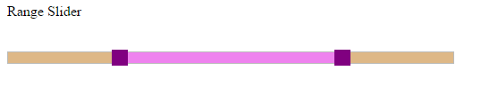
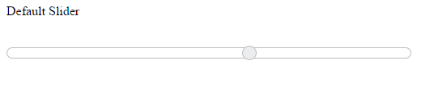

# Appearance and Styling	

**Slider** widget looks sleek and enriched with good UI appearance. It is included with both metro (flat) theme and gradient theme support. Totally 17 built-in themes are provided including six flat themes and six gradient themes, material, office-365, bootstrap, high-contrast-01, high-contrast-02. The themes include three color variations such as “Azure”, “Lime” and “Saffron”. The themes supported by the **Slider** widgets are as follows,

* flat-azure
* flat-azure-dark
* flat-lime
* flat-lime-dark
* flat-saffron
* flat-saffron-dark
* gradient-azure
* gradient-azure-dark
* gradient-lime
* gradient-lime-dark
* gradient-saffron
* gradient-saffron-dark
* high-contrast-01
* high-contrast-02
* material
* office-365
* bootstrap

In order to apply different themes, you can refer the “**ej.web.all.min.css**” file from the corresponding theme folders. This file is a combination of two style sheets “**ej.widgets.core.min.css**” and “**ej.theme.min.css**”. Instead of including “ej.web.all.min.css” file you can also refer the “ej.widgets.core.min.css” and “ej.theme.min.css” files separately. 

## CSS Class

When you want to display the **Slider** widget in a different style based on the appearance of your application, you can use this **cssClass** property to apply custom theme for the **Slider**. Specify a class name as the value for **cssClass** property. The specified class is added to the wrapper of the **Slider** widget. Now, you can easily override the styles of the **Slider** widget by accessing the styles from the root level (using the cssClass specified).

The following steps explains you on how to configure the **Slider** with custom theme using the **cssClass** property. Here, a class name “purple” is specified for the **cssClass**.



Range Slider

<ej-slider [values]="values" [sliderType]="range" width="500" [cssClass]="cssclass"></ej-slider>







Include the **cssClass** value before each style of the **Slider** widget and customize the styles as follows in slider.component.css file.





Execute the above code example to render the following output.

 

## Show Tooltip

**Slider** displays the tooltip to indicate the current value when you click on the **Slider** handle. By default, **Slider** displays the tooltip. Using the **showTooltip** option you can enable or disable the Tooltip. Data type of this property is “boolean”.

The following steps explains you on how to disable the tooltip in **Slider**.



<ej-slider id="toolTip" [value]="value" width="500" [showTooltip]="showTooltip"></ej-slider>







## Show Rounded Corner

This property is used to display the **Slider** and its handle with rounded corners. By default **showRoundedCorner** is in disabled state. Data type of this property is “boolean”.

The following steps explains you on how to set the showRoundedCorner property in **Slider**.



<ej-slider id="default" [value]="value" width="500" [showRoundedCorner]="showRoundedCorner"></ej-slider>







Execute the above code example to render the following output.

 

