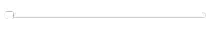
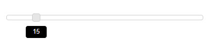
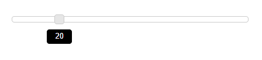

# Behavior Settings

## Height

By default, **Slider** renders with a height of 14px. You can change the **Slider** height using **height** property.You can specify the value for this property in number or string format.

## Width

By default, **Slider** widget renders with 100% width. You can customize the width of the Slider using **width** property.You can specify the value for this property in number or string format.

The following steps explains you on how to configure the **height** and **width** of the **Slider**.

In a HTML page, add a 
 element to render it as a Slider widget.



<ej-slider id='default' [height]='height' [width]='width'></ej-slider>




 



Execute the above code example to render the following output.

 

## IncrementStep

This property sets the incremental step value for the **Slider**. When the **Slider** handle slides through mouse or keyboard, it increments / decrements the value based on the step value. By default, when the slider handle is moved,the increments / decrements value is one. Using **incrementStep** property you can change the increment step value. Data type of this property is number.

The following steps explains you on how to configure the **incrementStep** property.

In a **HTML** page, add a **
** element to render it as a **Slider** widget.



<ej-slider id='BasicSlider' [incrementstep]='incrementStep'></ej-slider>




 



Execute the above code example to render the following output.

 

In the above example, value for **incrementStep** property is specified as “5” therefore, when you move the **Slider** handle, value “5” increments/decrements from the current **Slider** value.

After incrementing one value, slider value will like below.

## ReadOnly

This feature prevents you from interacting with the **Slider**. That is you can only view the **Slider** value and cannot change it.

The following steps explain you on how to enable the **readOnly** property.

In a **HTML** page, add a **
** element to render it as a **Slider** widget.



<ej-slider id='BasicSlider' [height]='height' [width]='width' [readonly]='isReadonly'>
</ej-slider>





 



After you execute the above code example, the **Slider** values cannot be changed in any ways.

