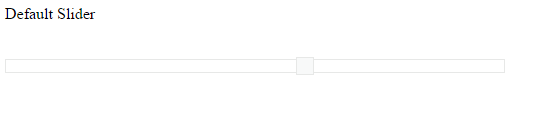

# Enable/Disable the Slider

**Slider** widget includes an option to enable/disable it. When you disable the Slider, it is displayed in a blur state and you cannot perform any operations in it.

## Enabled	

Using this **enabled** property you can enable/disable the **Slider**. Data type of this property is “boolean”.

Also you can enable/disable the **Slider** by using [enable](https://help.syncfusion.com/api/angular/ejslider#methods:enable) and [disable](https://help.syncfusion.com/api/angular/ejslider#methods:disable) methods.

The following steps explains you on how to disable the **Slider**.



   
Default Slider

   <ej-slider id="enale" [value]="value" width="500" [enabled]="enabled"></ej-slider>







Execute the above code example to render the following output.

 

