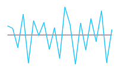

## Axis Customize 

The Sparkline axis can be collapsed using visible property in [`axisLineSetting`] and this not applicable for win-loss. You can customize [`color`], [`width`] and [`dash array`] of axis line.

 
 
<ej-sparkline id="sparklinecontainer" size.width="170px" [axisLineSettings.visible]="true" axisLineSettings.color="#ff14ae">    

</ej-sparkline>



