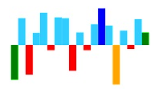

## Point Customization

You can customize points by initializing the point colors. The customization options allow you to differentiate the [`first`], [`last`], [`highest`], [`lowest`], and [`negative`] points. This customization only applicable for line, column and area type Sparkline.



<ej-sparkline id="sparklinecontainer" negativePointColor="red" highPointColor="blue" lowPointColor="orange" startPointColor="green" endPointColor="green">          
                               
</ej-sparkline>



