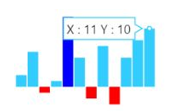
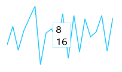

## Tooltip  

A tooltip follows the pointer movement and is used to indicate the value of a point. This feature is applicable for line, column, pie, and area Sparkline. You can customize the tooltip [`fill color`], [`border`] and [`font`].



<ej-sparkline id="sparklinecontainer" [tooltip.visible]="true">          
                               
</ej-sparkline>



## Tooltip Template   

HTML elements can be displayed in the tooltip by using the [`template`] option of the tooltip. The template option takes the value of the id attribute of the HTML element. You can use the **#point.x#** and **#point.y#** as place holders in the HTML element to display the x and y values of the corresponding point.



    

        
#point.x#

        
#point.y#

    

<ej-sparkline id="sparklinecontainer" [tooltip.visible]="true" tooltip.template="item">          
                               
</ej-sparkline>



