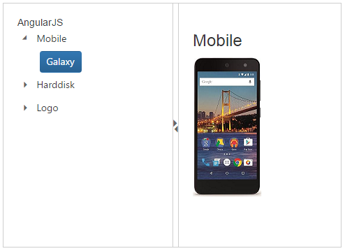

# Getting Started

This section helps to get started of the Splitter component in an Angular application.

 

## Create a Splitter

The following steps guide you to add a Splitter component.

To get start with how to use the Splitter component within Angular-2 platform, refer the basic requisites and the configurations needs to be done on the system from [here](https://help.syncfusion.com/angular-2/overview).

Create a simple Splitter by adding ej-splitter attribute for initializing an empty Splitter component on the application. 


  
    <ej-splitter id="outterSpliter" class="ang-splitter" height ="100%" width="485" [properties]="proper" [isResponsive]="true">
    </ej-splitter>



> _Note:_ _You can find the Splitter properties from the_ [API reference](https://help.syncfusion.com/api/js/ejsplitter) _document__

## Configure Splitter Panes

To configure properties for Splitter component, define properties in the component’s constructor file.



    export class AppComponent {
        proper:Array<{paneSize:string}>; 
        true:Boolean;
        constructor() {
        this.proper = [{ paneSize: "50%" }, {paneSize:"50%"}];
        this.true=true;
        }
    }



Now assign the defined variables to paneSize properties. Add required properties to the component.



    <ej-splitter id="outterSpliter" class="ang-splitter" height ="100%" width="485" [properties]="proper" [isResponsive]="true">
    </ej-splitter>



Configure the Splitter panes with images. Save the images in the corresponding location.



    

    <ej-splitter id="outterSpliter" class="ang-splitter" height ="100%" width="485" [properties]="proper" [isResponsive]="true">
    

    

    <h3 class="h3">AngularJS</h3>    
    

    

    

    

    Select any product from the tree to show the description.
    

    

    <h3>Mobile</h3>
    
    

    

    <h3>Harddisk</h3>
    
    

    

    <h3>Logo</h3>
    
    

    

    </ej-splitter>
    



## Configure Tree View 

For adding Treeview component, you have to use **ej-treeview** directive to corresponding element. You need to use **nodeSelect** event handler to perform any action while selection the node in Tree view.
Add the following code example in HTML file to configure Tree View.



    <ej-treeview  class="visibleHide" (nodeSelect)= "treeClicked($event)"  [fields]= "fields" >           
    </ej-treeview>



To configure “li” contents for Splitter component, define “li” contents in an object array and fields in the component’s constructor file.



    export class AppComponent {
        localData:Array<{}>;
        fields:Object;
        constructor() {
        this.localData=[
        { id: 1, name: "Mobile", hasChild: true, expanded: false },
        { id: "mobile", pid:1,name: "Galaxy"},
        { id: 3, name: "Harddisk", hasChild: true, expanded: false },
        { id: "harddisk", pid:3,name: "Segate"},
        { id: 5, name: "Logo", hasChild: true, expanded: false },
        { id: "logo", pid:5,name: "Amazon"},
        ];
        this.fields = { id: "id", parentId: "pid", text: "name", hasChild: "hasChild", dataSource: this.localData, expanded: "expanded" };
        }
        }
    }



## Set Actions

Add the **nodeSelect** event in component constructor’s file to set the action to view the images for “li” content of the Tree view.



    export class AppComponent {
        treeClicked(sender){        
        if (sender.currentElement.hasClass('e-item last')) {
                    var content = $('.' + sender.currentElement[0].id).html();
                    $('._content').html(content);        
        }
        }
    }



