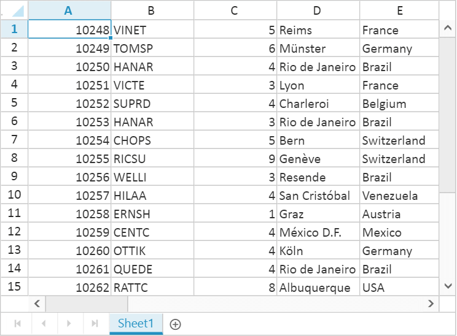
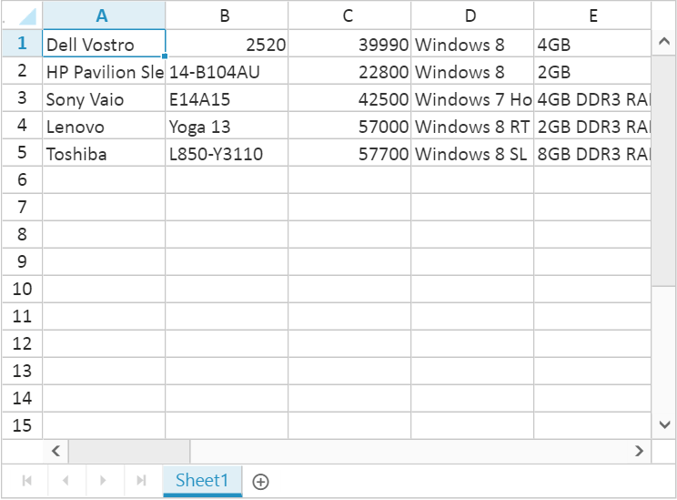
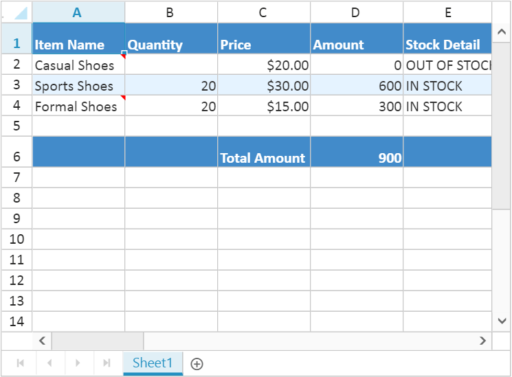
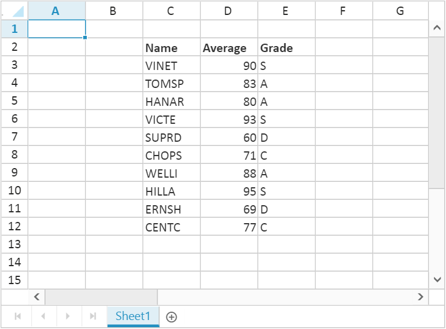
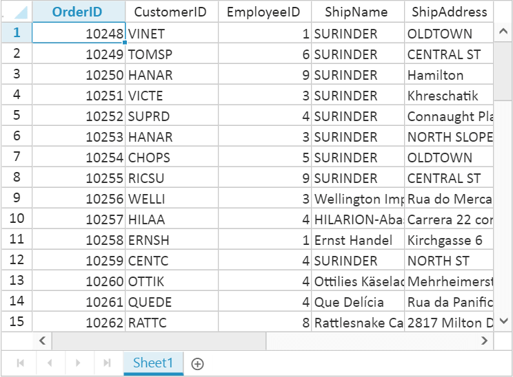

# Data Binding

Spreadsheet can be populated with external datasource using `dataSource` property. The `dataSource` property can be assigned either with the instance of `ej.DataManager` or JSON data array collection. Spreadsheet supports three different kinds of Data binding.

* Local Data
* Remote Data
* HTML Table Data

## Local Data

To bind local data to the Spreadsheet, you can assign a JSON array to the worksheet `dataSource` property. The following code illustrates how to bind local data to the Spreadsheet,



<ej-spreadsheet id="spreadsheet">
    <e-sheets>
            <e-sheet>
                 <e-rangesettings>
                    <e-rangesetting [dataSource]="spreadData"></e-rangesetting>
                 </e-rangesettings>
            </e-sheet>
    </e-sheets>
</ej-spreadsheet>



Create datasource for `Filter Data` in `app/services/spreadsheet.service.js` file. Refer the below code snippet to create datasource,



export class SpreadsheetService {   
    getFilterData(): Array<any>{
        return  [{ "OrderID": 10248, "CustomerID": "VINET", "EmployeeID": 5, "OrderDate": new Date(836418600000), "ShipName": "Vins et alcools Chevalier", "ShipCity": "Reims", "ShipAddress": "59 rue de l\u0027Abbaye", "ShipRegion": null, "ShipPostalCode": "51100", "ShipCountry": "France", "Freight": 32.3800, "Verified": true }, { "OrderID": 10249, "CustomerID": "TOMSP", "EmployeeID": 6, "OrderDate": new Date(836505000000), "ShipName": "Toms Spezialitäten", "ShipCity": "Münster", "ShipAddress": "Luisenstr. 48", "ShipRegion": null, "ShipPostalCode": "44087", "ShipCountry": "Germany", "Freight": 11.6100, "Verified": false }, { "OrderID": 10250, "CustomerID": "HANAR", "EmployeeID": 4, "OrderDate": new Date(836764200000), "ShipName": "Hanari Carnes", "ShipCity": "Rio de Janeiro", "ShipAddress": "Rua do Paço, 67", "ShipRegion": "RJ", "ShipPostalCode": "05454-876", "ShipCountry": "Brazil", "Freight": 65.8300, "Verified": true }, { "OrderID": 10251, "CustomerID": "VICTE", "EmployeeID": 3, "OrderDate": new Date(836764200000), "ShipName": "Victuailles en stock", "ShipCity": "Lyon", "ShipAddress": "2, rue du Commerce", "ShipRegion": null, "ShipPostalCode": "69004", "ShipCountry": "France", "Freight": 41.3400, "Verified": true }, { "OrderID": 10252, "CustomerID": "SUPRD", "EmployeeID": 4, "OrderDate": new Date(836850600000), "ShipName": "Suprêmes délices", "ShipCity": "Charleroi", "ShipAddress": "Boulevard Tirou, 255", "ShipRegion": null, "ShipPostalCode": "B-6000", "ShipCountry": "Belgium", "Freight": 51.3000, "Verified": true }, { "OrderID": 10253, "CustomerID": "HANAR", "EmployeeID": 3, "OrderDate": new Date(836937000000), "ShipName": "Hanari Carnes", "ShipCity": "Rio de Janeiro", "ShipAddress": "Rua do Paço, 67", "ShipRegion": "RJ", "ShipPostalCode": "05454-876", "ShipCountry": "Brazil", "Freight": 58.1700, "Verified": true }, { "OrderID": 10254, "CustomerID": "CHOPS", "EmployeeID": 5, "OrderDate": new Date(837023400000), "ShipName": "Chop-suey Chinese", "ShipCity": "Bern", "ShipAddress": "Hauptstr. 31", "ShipRegion": null, "ShipPostalCode": "3012", "ShipCountry": "Switzerland", "Freight": 22.9800, "Verified": false }, { "OrderID": 10255, "CustomerID": "RICSU", "EmployeeID": 9, "OrderDate": new Date(837109800000), "ShipName": "Richter Supermarkt", "ShipCity": "Genève", "ShipAddress": "Starenweg 5", "ShipRegion": null, "ShipPostalCode": "1204", "ShipCountry": "Switzerland", "Freight": 148.3300, "Verified": true }, { "OrderID": 10256, "CustomerID": "WELLI", "EmployeeID": 3, "OrderDate": new Date(837369000000), "ShipName": "Wellington Importadora", "ShipCity": "Resende", "ShipAddress": "Rua do Mercado, 12", "ShipRegion": "SP", "ShipPostalCode": "08737-363", "ShipCountry": "Brazil", "Freight": 13.9700, "Verified": false }, { "OrderID": 10257, "CustomerID": "HILAA", "EmployeeID": 4, "OrderDate": new Date(837455400000), "ShipName": "HILARION-Abastos", "ShipCity": "San Cristóbal", "ShipAddress": "Carrera 22 con Ave. Carlos Soublette #8-35", "ShipRegion": "Táchira", "ShipPostalCode": "5022", "ShipCountry": "Venezuela", "Freight": 81.9100, "Verified": true }, { "OrderID": 10258, "CustomerID": "ERNSH", "EmployeeID": 1, "OrderDate": new Date(837541800000), "ShipName": "Ernst Handel", "ShipCity": "Graz", "ShipAddress": "Kirchgasse 6", "ShipRegion": null, "ShipPostalCode": "8010", "ShipCountry": "Austria", "Freight": 140.5100, "Verified": true }, { "OrderID": 10259, "CustomerID": "CENTC", "EmployeeID": 4, "OrderDate": new Date(837628200000), "ShipName": "Centro comercial Moctezuma", "ShipCity": "México D.F.", "ShipAddress": "Sierras de Granada 9993", "ShipRegion": null, "ShipPostalCode": "05022", "ShipCountry": "Mexico", "Freight": 3.2500, "Verified": false }, { "OrderID": 10260, "CustomerID": "OTTIK", "EmployeeID": 4, "OrderDate": new Date(837714600000), "ShipName": "Ottilies Käseladen", "ShipCity": "Köln", "ShipAddress": "Mehrheimerstr. 369", "ShipRegion": null, "ShipPostalCode": "50739", "ShipCountry": "Germany", "Freight": 55.0900, "Verified": true }, { "OrderID": 10261, "CustomerID": "QUEDE", "EmployeeID": 4, "OrderDate": new Date(837714600000), "ShipName": "Que Delícia", "ShipCity": "Rio de Janeiro", "ShipAddress": "Rua da Panificadora, 12", "ShipRegion": "RJ", "ShipPostalCode": "02389-673", "ShipCountry": "Brazil", "Freight": 3.0500, "Verified": false }, { "OrderID": 10262, "CustomerID": "RATTC", "EmployeeID": 8, "OrderDate": new Date(837973800000), "ShipName": "Rattlesnake Canyon Grocery", "ShipCity": "Albuquerque", "ShipAddress": "2817 Milton Dr.", "ShipRegion": "NM", "ShipPostalCode": "87110", "ShipCountry": "USA", "Freight": 48.2900, "Verified": true }];
    }
}





import { Component, ViewEncapsulation } from '@angular/core';
import { SpreadsheetService } from './services/spreadsheet.service';

@Component({
  selector: 'ej-app',
  templateUrl: 'app/app.component.html',  //give the path file for spreadsheet control html file.
  providers: [SpreadsheetService]
})
export class AppComponent {
  public spreadData;
  constructor(public SpreadsheetService: SpreadsheetService) {
    this.spreadData = SpreadsheetService.getFilterData(); //Filter Data
  }
}



The following output is displayed as a result of the above code snippets.

## Remote Data

To bind remote data to the Spreadsheet, you can assign a service data as an instance of `ej.DataManager` to the worksheet `dataSource` property. The following code illustrates how to bind remote data to the Spreadsheet,



<ej-spreadsheet id="spreadsheet" [sheets] = "spreadData">
</ej-spreadsheet>





import { Component, ViewEncapsulation } from '@angular/core';

@Component({
  selector: 'ej-app',
  templateUrl: 'app/app.component.html',  //give the path file for spreadsheet control html file.
})
export class AppComponent {
  public spreadData;
  constructor() {
    this.spreadData = [{
      dataSource: ej.DataManager("http://mvc.syncfusion.com/Services/Northwnd.svc/Orders/"),
      query: ej.Query().take(50).select(["OrderID", "CustomerID", "EmployeeID", "ShipName", "ShipAddress"]),
      primaryKey: "OrderID"
    }]
  }
}



The following output is displayed as a result of the above code snippets.

### Offline Mode

To avoid sending post back request to server on every action, Spreadsheet allows user to create, update and delete data on client side. To enable this, set `offline` property of `ej.DataManager` as `true` to fetch all data from server on initial rendering of Spreadsheet and perform all operation on client side.

The following code illustrates offline data binding for Spreadsheet,



<ej-spreadsheet id="spreadsheet" [sheets] = "spreadData">
</ej-spreadsheet>





import { Component, ViewEncapsulation } from '@angular/core';

@Component({
  selector: 'ej-app',
  templateUrl: 'app/app.component.html',  //give the path file for spreadsheet control html file.
})
export class AppComponent {
  public spreadData;
  constructor() {
    this.spreadData = [{
      dataSource: ej.DataManager({
        url: "http://mvc.syncfusion.com/Services/Northwnd.svc/Orders/",
        offline: true
      }),
      query: ej.Query().select(["OrderID", "CustomerID", "EmployeeID", "ShipName", "ShipAddress"]),
      primaryKey: "OrderID"
    }]
  }
}


The following output is displayed as a result of the above code snippets.

## HTML Table Data

An HTML Table element can also be used as the data source of Spreadsheet. To use HTML Table as data source, the table element should be passed to worksheet `dataSource` property of Spreadsheet as an instance of the `ej.DataManager`. The following code illustrates how to bind HTML Table data to the Spreadsheet,



<ej-spreadsheet id="spreadsheet" [sheets] = "spreadData">
</ej-spreadsheet>





import { Component, ViewEncapsulation } from '@angular/core';

@Component({
  selector: 'ej-app',
  templateUrl: 'app/app.component.html',  //give the path file for spreadsheet control html file.
})
export class AppComponent {
  public spreadData;
  constructor() {
    this.spreadData = [{
      dataSource: ej.DataManager($("#Table1"))
    }]
  }
}



Place the table in index.html page,



<table id="Table1">
    <thead>
        <tr>
            <th>Laptop</th>
            <th>Model</th>
            <th>Price</th>
            <th>OS</th>
            <th>RAM</th>
            <th>ScreenSize</th>
        </tr>
    </thead>
    <tbody>
        <tr>
            <td>Dell Vostro</td>
            <td>2520</td>
            <td>39990</td>
            <td>Windows 8</td>
            <td>4GB</td>
            <td>15.6</td>
        </tr>
        <tr>
            <td>HP Pavilion Sleekbook</td>
            <td>14-B104AU</td>
            <td>22800</td>
            <td>Windows 8</td>
            <td>2GB</td>
            <td>14</td>
        </tr>
        <tr>
            <td>Sony Vaio</td>
            <td>E14A15</td>
            <td>42500</td>
            <td>Windows 7 Home Premium</td>
            <td>4GB DDR3 RAM</td>
            <td>14</td>
        </tr>
        <tr>
            <td>Lenovo</td>
            <td>Yoga 13</td>
            <td>57000</td>
            <td>Windows 8 RT</td>
            <td>2GB DDR3 RAM</td>
            <td>11.6</td>
        </tr>
        <tr>
            <td>Toshiba</td>
            <td>L850-Y3110</td>
            <td>57700</td>
            <td>Windows 8 SL</td>
            <td>8GB DDR3 RAM</td>
            <td>15.6</td>
        </tr>
    </tbody>
</table>


The following output is displayed as a result of the above code snippets.

## Ways to bind data in Spreadsheet

You can bind data to Spreadsheet in following ways,

* Cell binding
* Range binding
* Sheet binding

### Cell Binding

Spreadsheet can bind data for individual cells in a sheet. The data may contain value, style, format, comment and hyperlink. The individual cell properties are listed below,

<table>
    <tr>
        <th>
            Properties
        </th>
        <th>
            Description
        </th>
    </tr>
    <tr>
        <td>
            index
        </td>
        <td>
            To specify particular cell
        </td>
    </tr>
    <tr>
        <td>
            value
        </td>
        <td>
            To specify value. It may be string, integer, formula etc.
        </td>
    </tr>
    <tr>
        <td>
            style
        </td>
        <td>
            To specify style in the cell
        </td>
    </tr>
    <tr>
        <td>
            format
        </td>
        <td>
            To specify number format in the cell
        </td>
    </tr>
    <tr>
        <td>
            comment
        </td>
        <td>
            To specify comment in the cell
        </td>
    </tr>
    <tr>        
        <td>
            hyperlink
        </td>
        <td>
            To specify hyperlink in the cell
        </td>
    </tr>
</table>

The individual row properties are listed below,

<table>
    <tr>
        <th>
            Properties
        </th>
        <th>
            Description
        </th>
    </tr>
    <tr>
        <td>
            index
        </td>
        <td>
            To specify particular row
        </td>
    </tr>
    <tr>
        <td>
            height
        </td>
        <td>
            To specify height in the row
        </td>
    </tr>
</table>

You can specify particular row with `index` property and its height with `height` property in the rows' property collection. The following code illustrates cell binding in Spreadsheet,



<ej-spreadsheet id="spreadsheet" [sheets] = "spreadData">
</ej-spreadsheet>





import { Component, ViewEncapsulation } from '@angular/core';

@Component({
  selector: 'ej-app',
  templateUrl: 'app/app.component.html',  //give the path file for spreadsheet control html file.
})
export class AppComponent {
  public spreadData;
  constructor() {
    this.spreadData = [{
      rows: [{
        height: 30,
        cells: [
          { value: "Item Name", style: { "font-weight": "bold", "color": "#FFFFFF", "background-color": "#428bca" } },
          { value: "Quantity", style: { "font-weight": "bold", "color": "#FFFFFF", "background-color": "#428bca" } },
          { value: "Price", style: { "font-weight": "bold", "color": "#FFFFFF", "background-color": "#428bca" } },
          { value: "Amount", style: { "font-weight": "bold", "color": "#FFFFFF", "background-color": "#428bca" } },
          { value: "Stock Detail", style: { "font-weight": "bold", "color": "#FFFFFF", "background-color": "#428bca" } },
          { value: "Website", style: { "font-weight": "bold", "color": "#FFFFFF", "background-color": "#428bca" } }
        ]
      },
      {
        cells: [
          { value: "Casual Shoes", comment: { value: "Casual Footwears with wide variety of colors." } },
          { value: "20", index: 2, format: { type: "currency" } },
          { value: "=B2*C2" },
          { value: "OUT OF STOCK" },
          { value: "Amazon", hyperlink: { webAddr: "www.amazon.com" } }
        ]
      },
      {
        cells: [
          { value: "Sports Shoes", style: { "background-color": "#E5F3FF" } },
          { value: "20", style: { "background-color": "#E5F3FF" } },
          { value: "30", format: { type: "currency" }, style: { "background-color": "#E5F3FF" } },
          { value: "=B3*C3", style: { "background-color": "#E5F3FF" } },
          { value: "IN STOCK", style: { "background-color": "#E5F3FF" } },
          { value: "AliExpress", hyperlink: { webAddr: "www.aliexpress.com" }, style: { "background-color": "#E5F3FF" } }
        ]
      },
      {
        cells: [
          { value: "Formal Shoes", comment: { value: "Formal Footwears with wide range of sizes." } },
          { value: "20" },
          { value: "15", format: { type: "currency" } },
          { value: "=B4*C4" },
          { value: "IN STOCK" },
          { value: "Amazon", hyperlink: { webAddr: "www.amazon.com" } }
        ]
      },
      {
        height: 30,
        index: 5,
        cells: [
          { style: { "background-color": "#428bca" } },
          { style: { "background-color": "#428bca" } },
          { value: "Total Amount", index: 2, style: { "font-weight": "bold", "color": "#FFFFFF", "background-color": "#428bca" } },
          { value: "=Sum(D2:D4)", style: { "font-weight": "bold", "color": "#FFFFFF", "background-color": "#428bca" } },
          { style: { "background-color": "#428bca" } },
          { style: { "background-color": "#428bca" } }
        ]
      }]
    }];
  }
}


The following output is displayed as a result of the above code snippets.

### Range Binding

Spreadsheet can bind data for one or more range in a sheet using `rangeSettings`. The individual range properties are listed below,

<table>
    <tr>
        <th>
            Properties
        </th>
        <th>
            Description
        </th>
    </tr>
    <tr>
        <td>
            {{'`dataSource`'| markdownify }}
        </td>
        <td>
            To specify JSON or {{'`ej.DataManager`'| markdownify }}
        </td>
    </tr>
    <tr>    
        <td>
            {{'`query`'| markdownify }}
        </td>
        <td>
            To specify query for {{'`ej.DataManager`'| markdownify }}
        </td>
    </tr>
    <tr>
        <td>    
            {{'`startCell`'| markdownify }}
        </td>
        <td>
            To specify start cell of a range
        </td>
    </tr>
    <tr>
        <td>
            {{'`primarykey`'| markdownify }}
        </td>
        <td>
            To specify data source primary key
        </td>
    </tr>
    <tr>
        <td>
            {{'`showHeader`'| markdownify }}
        </td>
        <td>
            To show data source header
        </td>
    </tr>
    <tr>
        <td>
            {{'`headerStyles`'| markdownify }}
        </td>
        <td>
            To specify header styles
        </td>
    </tr>
</table>

The following code illustrates range binding in Spreadsheet



<ej-spreadsheet id="spreadsheet">
    <e-sheets>
        <e-sheet>
            <e-rangesettings>
                <e-rangesetting [dataSource]="spreadData" [startCell]="C2" [showHeader]="true" [headerStyles]="styles"></e-rangesetting>
            </e-rangesettings>
        </e-sheet>
    </e-sheets>
</ej-spreadsheet>



Create datasource for `Mark List` in `app/services/spreadsheet.service.js` file. Refer the below code snippet to create datasource,



export class SpreadsheetService {
    getMarkList(): Array<any> {
        return [
            { Name: "VINET", Average: 90, Grade: "S" },
            { Name: "TOMSP", Average: 83, Grade: "A" },
            { Name: "HANAR", Average: 80, Grade: "A" },
            { Name: "VICTE", Average: 93, Grade: "S" },
            { Name: "SUPRD", Average: 60, Grade: "D" },
            { Name: "CHOPS", Average: 71, Grade: "C" },
            { Name: "WELLI", Average: 88, Grade: "A" },
            { Name: "HILLA", Average: 95, Grade: "S" },
            { Name: "ERNSH", Average: 69, Grade: "D" },
            { Name: "CENTC", Average: 77, Grade: "C" }
        ];
    }
}





import { Component, ViewEncapsulation } from '@angular/core';
import { SpreadsheetService } from './services/spreadsheet.service';

@Component({
  selector: 'ej-app',
  templateUrl: 'app/app.component.html',  //give the path file for spreadsheet control html file.
  providers: [SpreadsheetService]
})
export class AppComponent {
  public spreadData;
  public styles;
  constructor(public SpreadsheetService: SpreadsheetService) {
    this.spreadData = SpreadsheetService.getMarkList(); //Mark List
    this.styles = { "font-weight": "bold" };
  }
}



The following output is displayed as a result of the above code snippets.

### Sheet Binding

Spreadsheet can bind data for a sheet. The individual sheet properties are listed below,

<table>
    <tr>
        <th>
            Properties
        </th>
        <th>
            Description
        </th>
    </tr>
    <tr>
        <td>
            {{'`dataSource`'| markdownify }}
        </td>
        <td>
            To specify JSON or {{'`ej.DataManager`'| markdownify }}
        </td>
    </tr>
    <tr>
        <td>
            {{'`query`'| markdownify }}
        </td>
        <td>
            To specify query for {{'`ej.DataManager`'| markdownify }}
        </td>
    </tr>
    <tr>
        <td>
            {{'`startCell`'| markdownify }}
        </td>
        <td>
            To specify start cell of a range
        </td>
    </tr>
    <tr>
        <td>
            {{'`primarykey`'| markdownify }}
        </td>
        <td>
            To specify data source primary key
        </td>
    </tr>
    <tr>
        <td>
            {{'`showHeader`'| markdownify }}
        </td>
        <td>
            To show data source header
        </td>
    </tr>
    <tr>
        <td>
            {{'`headerStyles`'| markdownify }}
        </td>
        <td>
            To specify header styles
        </td>
    </tr>
    <tr>
        <td>
            {{'`fieldAsColumnHeader`'| markdownify }}
        </td>
        <td>
            To show data source fields in column header
        </td>
    </tr>
</table>

The following code illustrates sheet binding in Spreadsheet



<ej-spreadsheet id="spreadsheet" [sheets]="spreadData">
</ej-spreadsheet>





import { Component, ViewEncapsulation } from '@angular/core';

@Component({
  selector: 'ej-app',
  templateUrl: 'app/app.component.html',  //give the path file for spreadsheet control html file.
})
export class AppComponent {
  public spreadData;
  constructor() {
    this.spreadData = [{
      dataSource: ej.DataManager("http://mvc.syncfusion.com/Services/Northwnd.svc/Orders/"),
      query: ej.Query().take(50).select(["OrderID", "CustomerID", "EmployeeID", "ShipName", "ShipAddress"]),
      fieldAsColumnHeader: true,
      primaryKey: "OrderID"
    }];
  }
}



The following output is displayed as a result of the above code snippets. 

