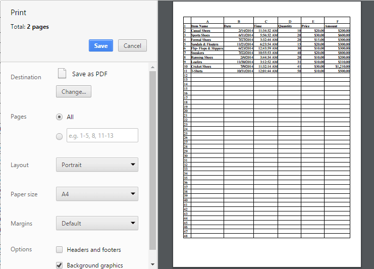
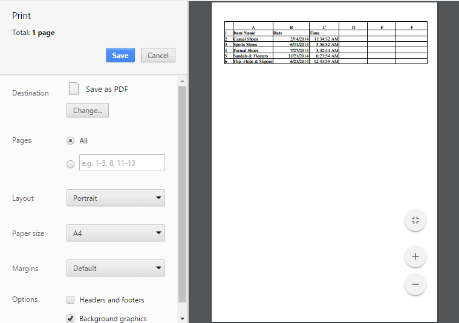

# Print

This feature is used for produce text and graphics from a computer screen or file onto a sheet of paper. You can use `allowPrinting` property in `printSettings`to enable/disable the print operation.

You have following options in printing.

* Print Sheet / Print Selected Area.
* Print with Gridlines
* Print with Headings

## Print Sheet / Print Selected Area

You can print the sheet or print the selected area by following ways,

* Using the Print button or Print Selected button under Print group of PAGE LAYOUT tab in ribbon.
* Using [`printSheet`](https://help.syncfusion.com/api/js/ejspreadsheet#methods:xlprint-printsheet "printSheet") or [`printSelection`](https://help.syncfusion.com/api/js/ejspreadsheet#methods:xlprint-printselection "printSelection") method to print the spreadsheet.

The following code example describes the above behavior.



<button id="btnPrint" (click)="printClick($event)">Print</button>
<button id="btnPrintSel" (click)="printSelClick($event)">Print Selected</button> 
  
<ej-spreadsheet id="spreadsheet" (loadComplete)= loadComplete($event)  [printSettings.allowPrinting]= "true" >
    <e-sheets>
        <e-sheet>
            <e-rangesettings>
                <e-rangesetting [dataSource]="spreadData" ></e-rangesetting>
            </e-rangesettings>
        </e-sheet>
    </e-sheets>
</ej-spreadsheet>



import {Component, ViewEncapsulation} from '@angular/core';
import {SpreadsheetService } from './services/spreadsheet.service';

@Component({
  selector: 'ej-app',
  templateUrl: 'app/app.component.html',  //give the path file for spreadsheet control html file.
  providers:[SpreadsheetService ]
})
export class AppComponent {
    public spreadData;
    constructor(public SpreadsheetService: SpreadsheetService ) {
    this.spreadData = SpreadsheetService.getDefaultData();
    }
 loadComplete(event) {
     let xlObj = $("#spreadsheet").data("ejSpreadsheet");
        if(!xlObj.isImport) {
        xlObj.setWidthToColumns([ 140, 85, 85 ]);
		xlObj.performSelection("A1:C6");
    }
}
printClick(event) {
     let xlObj = $("#spreadsheet").data("ejSpreadsheet");
        xlObj.XLPrint.printSheet();
    
}
printSelClick(event) {
     let xlObj = $("#spreadsheet").data("ejSpreadsheet");
        xlObj.XLPrint.printSelection();
}
}


The following output is displayed as a result of the above code example.

Print dialog with entire sheet in Chrome browser
{:.caption}

Print dialog with selected area print in chrome browser
{:.caption}

## Print with Gridlines

You have an option to print the spreadsheet with gridlines or without gridlines. You can do this by one of the following ways,

* Check the Gridlines option under Show group of PAGE LAYOUT tab in ribbon to print with Gridlines.
* Using `showGridlines` property to enable / disable the gridlines.

The following code example describes the above behavior.


<ej-spreadsheet id="spreadsheet" (loadComplete)= loadComplete($event)  [printSettings.allowPrinting]= "true" >
    <e-sheets>
        <e-sheet [showGridlines] = "false" >
            <e-rangesettings>
                <e-rangesetting [dataSource]="spreadData" ></e-rangesetting>
            </e-rangesettings>
        </e-sheet>
    </e-sheets>
</ej-spreadsheet>


Print dialog without gridlines in chrome browser
{:.caption}

## Print with Headings

You have an option to print the spreadsheet with headers or without headers. You can do this by one of the following ways,

* Check the Headings option under Show group of PAGE LAYOUT tab in ribbon. 
* Using `showHeadings` property to enable / disable headings.

The following code example describes the above behavior.


<ej-spreadsheet id="spreadsheet"  (loadComplete)= loadComplete($event)  [printSettings.allowPrinting]= "true" >
    <e-sheets>
        <e-sheet [showHeadings] = "false" >
            <e-rangesettings>
                <e-rangesetting [dataSource]="spreadData" ></e-rangesetting>
            </e-rangesettings>
        </e-sheet>
    </e-sheets>
</ej-spreadsheet>


Print dialog without headings in chrome browser
{:.caption}
