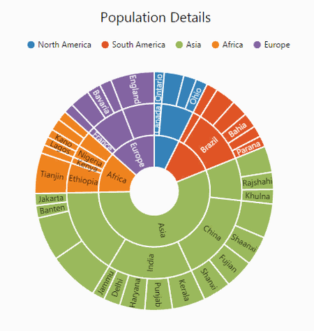
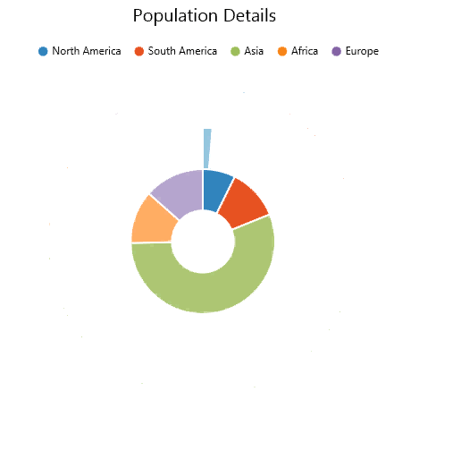

# Animation

Sunburst chart allows you to animate the chart segments. You can enable animation using **enableAnimation** property. 



<ej-sunburstchart id="sunburst"                           
                  [enableanimation]="true">
</ej-sunburstchart>



## Animation Types 
Sunburst chart provide options to animate the chart segments in different ways using **e-animationtype** property.
FadeIn – It gradually changes opacity of the chart segment.
Rotation – During an animation, control rotate from 0 to 360 angle.

### Fade In

The Fade In animation is enabled as follows 



<ej-sunburstchart id="sunburst"                           
                  [enableAnimation]="true" [enableAnimation.type]="fadeIn">
</ej-sunburstchart>



### Rotation

The following example shows how to enable rotation animation in ejSunburstChart



<ej-sunburstchart id="sunburst"                           
                  [enableAnimation]="true" [enableAnimation.type]="rotation">
</ej-sunburstchart>



[Click](http://ng2jq.syncfusion.com/#/sunburst/animation) here to view the online demo sample of  Animation in  the Sunburst Chart.
