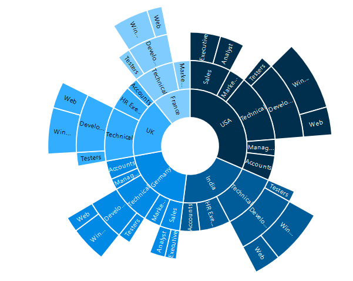

# Appearance
The appearance of the Sunburst Chart can be customized as shown below 

## Palette
The Sunburst Chart displays different segments in different colors by default. You can customize the color of each segment by providing a custom color palette of your choice by using the **[palette]** property.



<ej-sunburstchart id="sunburst"  [palette]=["#002e4d", "#005c99", "#008ae6", "#33adff", "#80ccff"]>
</ej-sunburstchart>



The Sunburst Chart rendered with palette colors

 
## Built- in Themes
The Sunburst Chart supports different themes. 
*	FlatLight
*	FlatDark
*	GradientLight
*	GradientDark
*	Azure
*	AzureDark
*	Lime
*	LimeDark
*	Saffron
*	SaffronDark
*	Gradient-Azure
*	Gradient-AzureDark
*	Gradient-lime
*	Gradient-LimeDark
*	Gradient-Saffron
*	Gradient-SaffronDark

You can set your desired theme by using the **e-theme** property. **FlatLight** is the default theme used in the Sunburst Chart.



<ej-sunburstchart id="sunburst"  theme="FlatDark">
</ej-sunburstchart>



