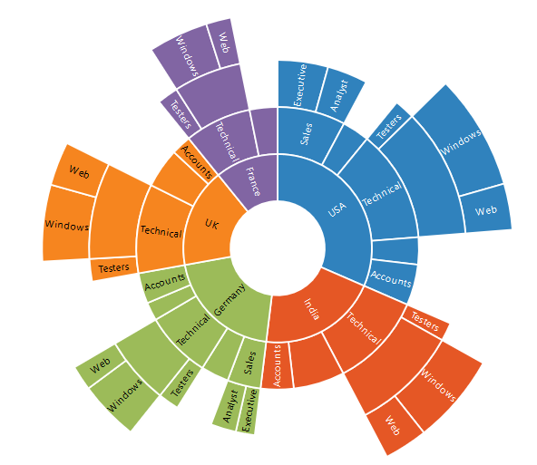
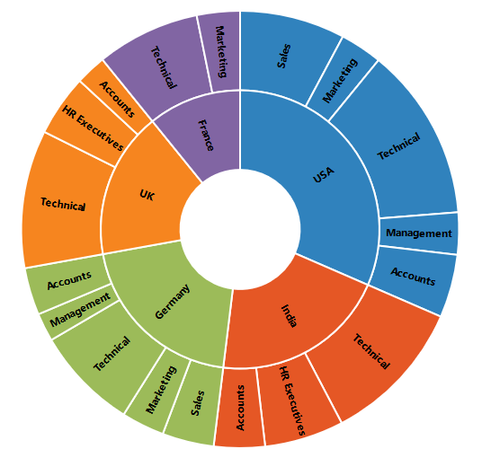

# Data Labels 

Sunburst data labels are used to display the data related to the segment. It helps to provide the information about the data points to the users.
You can enable or disable the data labels by setting the `visible` property of the data label settings to true as shown in the below code



<ej-sunburstchart  id="sunburst"  [datalabelsettings.visible]="true" >   
</ej-sunburstchart>

 

## Label Overflow mode

When you represent huge data with data labels, they may intersect each other. You can avoid this using the `labelOverflowMode` property.

The following properties are used to avoid the overlapping.
*	Trim – To trim the large data labels.
*	Hide – To hide the overlapped data labels.
The following code shows how to set Hide and Trim mode.



<ej-sunburstchart id="sunburst" [datalabelsettings.visible]="true"                    
                 [datalabelsettings.sunburstlabeloverflowmode] ="hide">
</ej-sunburstchart>

 

 



<ej-sunburstchart id="sunburst" [datalabelsettings.visible]="true"                    
                 [datalabelsettings.sunburstlabeloverflowmode] ="trim">
</ej-sunburstchart>

 

## Label Rotation Mode
You can rotate the data label by using `labelRotationMode` property. By default, the labelRotationMode is set as **angle**. 

The following code shows how to set labelRotationMode as normal and angle.



<ej-sunburstchart id="sunburst" [datalabelsettings.visible]="true"                    
                 [datalabelsettings.sunburstlabelrotationmode] ="normal">
</ej-sunburstchart>

 



<ej-sunburstchart id="sunburst" [datalabelsettings.visible]="true"                    
                 [datalabelsettings.sunburstlabelrotationmode] ="angle">
</ej-sunburstchart>



 
## Customizing the data labels
You can customize the appearance of the data point using the `font` property.



<ej-sunburstchart id="sunburst" [datalabelsettings.visible]="true"                    
                 [datalabelsettings.font] ="{ color: 'black' , font-weight : 'bold' , size : '15px'}">
</ej-sunburstchart>



## Sunburst Chart Title & Subtitle

### Title & TextAlignment

By using the title option, you can add the `title-text` as well as customize its `title-border`, `title-background` and `title-font`.

You can change the title alignment to center, far and near by using the `title-textAlignment` property of the Title.



<ej-sunburstchart id="sunburst" [title.visible]="true"                    
                 [title.font] ="{ color: 'black' , font-weight : 'bold' , size : '15px'}" [title.border]="color:'black',width:2}">
</ej-sunburstchart>



### Sub Title & TextAlignment

By using the subTitle option, you can add the `title-subTitle-text` as well as customize its `title-subTitle-border`, `title-subTitle-background` and `title-subTitle-font`.



<ej-sunburstchart id="sunburst" [title.subTitle.visible]="true"                    
                 [title.subTitle.font] ="{ color: 'black' , font-weight : 'bold' , size : '15px'}" [title.subTitle.border]="color:'black',width:2}">
</ej-sunburstchart>



