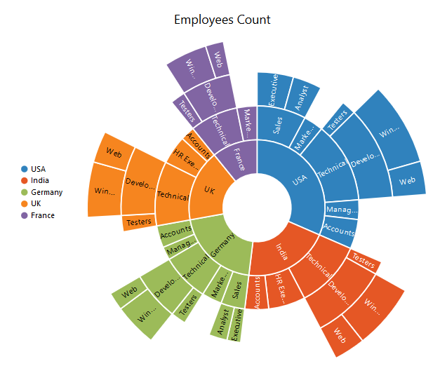

# Getting Started

Before we start with the Chart, please refer [this page](https://help.syncfusion.com/angular-2/overview)  for general information regarding integrating Syncfusion widget’s.

## Adding script reference

To render the SunburstChart control, the following list of external dependencies are needed, 

* [jQuery](http://jquery.com) - 1.7.1 and later versions
* [Angular](https://angularjs.org/) - angular latest versions

The other required internal dependencies are tabulated below,

<table>
   <tr>
      <th>
         <b>Files</b>
      </th>
      <th>
         <b>Description/Usage </b>
      </th>
   </tr>
   <tr>
      <td>
         ej.core.min.js
      </td>
      <td>
        It is referred always before using all the JS controls.
      </td>
   </tr>
   <tr>
      <td>
         ej.data.min.js
      </td>
      <td>
         Used to handle data operation and is used while binding data to the JS controls.
      </td>
   </tr>
   <tr>
      <td>
        ej.sunburstchart.min.js
      </td>
      <td>
        Sunburst Chart core script file which includes chart related scripts files.
      </td>
   </tr>
   </table>

N> Refer the `ej.web.all.min.js` (which encapsulates all the `ej` controls and frameworks in a single file) in the application instead of referring all the above specified internal dependencies. 

## Preparing HTML document

Create an HTML page and add the scripts references in the order mentioned in the following code example.



    <html>
    <head>
    <title>Angular Chart</title>

    <!-- Essential Studio for JavaScript  theme reference -->
    <link rel="stylesheet" href="http://cdn.syncfusion.com/{{ site.releaseversion }}/js/web/flat-azure/ej.web.all.min.css" />

    <!-- Angular related script references -->
    <!-- 1. Load libraries -->
         <!-- Polyfill(s) for older browsers -->
    
    
    
    

    <!-- Essential Studio for JavaScript  script references -->
    
    
    

    <!-- 2. Configure SystemJS -->
    
    

    </head>
    <!-- 3. Display the application -->
    <body>
    <ej-app>
		    

			      
Angular Syncfusion Components App

			      

		    

	  </ej-app>
    </body>
    </html>



N> Uncompressed version of library files are also available which is used for development or debugging purpose and can be generated from the custom script [here](http://csg.syncfusion.com).

## Control Initialization

* Copy SunburstChart Syncfusion Angular source component(s) from the below build location and add it in `src/ej` folder (For ex., consider the `sunburstchart` component).


(Installed Location)\Syncfusion\Essential Studio\14.3.0.49\JavaScript\assets-src\angular2\ 


N> `core.ts` file is mandatory for all Syncfusion JavaScript Angular components. The repository having the source file from Essential Studio for JavaScript v14.3.0.49.

* Create `sunburstchart` folder inside `src` folder.

* Create `sunburstchart.component.html` view file inside `src/sunburstchart` folder and render ejChart Angular component using the below code example. 


	<ej-sunburstchart id="defaultchart">
	</ej-sunburstchart>


* Create `sunburstchart.component.ts` model file inside the folder `src/sunburstchart` and create sample component using the below code example.



import { Component, ViewEncapsulation } from '@angular/core';

@Component({
  selector: 'ej-app',
  templateUrl: 'src/sunburstchart/sunburstchart.component.html'
})
export class SunburstChartComponent {

}


## Configure the routes for the Router

Before adding router configuration for above created ejChart component, we recommend you to go through the [Angular Routing](https://angular.io/docs/ts/latest/guide/router.html) configuration to get the deeper knowledge about Angular routing. 

* Now, we are going to configure the route navigation link for created chart sample in `src/app.component.html` file.



	<ul class="nav navbar-nav">
		<li><a data-toggle="collapse" data-target="#skeleton-navigation-navbar-collapse.in"
             href="#sunburstchart" [routerLink]="['/sunburstchart']">sunburstchart </a></li>
	</ul>

<main>
	<router-outlet></router-outlet>
</main>



* Import the ejSunburstChart sample component and define the route in `src/app.routes.ts` file.


import { Routes } from '@angular/router';
. . . . 
import { ChartComponent } from './sunburstchart/sunburstchart.component';

export const rootRouterConfig: Routes = [
    { path: '', redirectTo: 'home', pathMatch: 'full' },
    . . . . 
    { path: 'sunburstchart', component: SunburstChartComponent }
];


* Import and declare the Syncfusion source component and ejSunburstchart sample component into `app.module.ts` like the below code snippet.


import { NgModule, enableProdMode, ErrorHandler } from '@angular/core';
. . . . . 
import { EJ_SUNBURSTCHART_COMPONENTS } from './ej/sunburstchart.component';
import { SunburstChartComponent } from './sunburstchart/sunburstchart.component';

import { rootRouterConfig } from './app.routes';
. . . . 
@NgModule({
  imports: [BrowserModule, FormsModule, HttpModule, RouterModule.forRoot(rootRouterConfig, { useHash: true })],
  declarations: [. . . . , EJ_SUNBURSTCHART_COMPONENTS, SunburstChartComponent],
  bootstrap: [AppComponent]
})
export class AppModule { }


## Populate Data source:

The datasource for the Sunburst Chart is populated as a JSON object. For example, you can use default_DataSource of countries to generate Sunburst chart  as illustrated in the following code sample.
Create a folder service and add file data.service.ts for serving data to Sunburstchart component file. Refer the below code snippet.



export class DataService{
// DataService file containing sunburstchart data in Sunburstchartdata method
    sunburstData():Array<any>{
        return[

{ Category: "Employees", Country: "USA", JobDescription: "Sales", JobGroup: "Executive", EmployeesCount: 50 },
{ Category: "Employees", Country: "USA", JobDescription: "Sales", JobGroup: "Analyst", EmployeesCount: 40 },
{ Category: "Employees", Country: "USA", JobDescription: "Marketing", EmployeesCount: 40 },
{ Category: "Employees", Country: "USA", JobDescription: "Technical", JobGroup: "Testers", EmployeesCount: 55 },
{ Category: "Employees", Country: "USA", JobDescription: "Technical", JobGroup: "Developers", JobRole: "Windows", EmployeesCount: 175 },
{ Category: "Employees", Country: "USA", JobDescription: "Technical", JobGroup: "Developers", JobRole: "Web", EmployeesCount: 70 },
{ Category: "Employees", Country: "USA", JobDescription: "Management", EmployeesCount: 40 },
{ Category: "Employees", Country: "USA", JobDescription: "Accounts", EmployeesCount: 60 },

{ Category: "Employees", Country: "India", JobDescription: "Technical", JobGroup: "Testers", EmployeesCount: 43 },
{ Category: "Employees", Country: "India", JobDescription: "Technical", JobGroup: "Developers", JobRole: "Windows", EmployeesCount: 125 },
{ Category: "Employees", Country: "India", JobDescription: "Technical", JobGroup: "Developers", JobRole: "Web", EmployeesCount: 60 },
{ Category: "Employees", Country: "India", JobDescription: "HR Executives", EmployeesCount: 70 },
{ Category: "Employees", Country: "India", JobDescription: "Accounts", EmployeesCount: 45 },

{ Category: "Employees", Country: "Germany", JobDescription: "Sales", JobGroup: "Executive", EmployeesCount: 30 },
{ Category: "Employees", Country: "Germany", JobDescription: "Sales", JobGroup: "Analyst", EmployeesCount: 40 },
{ Category: "Employees", Country: "Germany", JobDescription: "Marketing", EmployeesCount: 50 },
{ Category: "Employees", Country: "Germany", JobDescription: "Technical", JobGroup: "Testers", EmployeesCount: 40 },
{ Category: "Employees", Country: "Germany", JobDescription: "Technical", JobGroup: "Developers", JobRole: "Windows", EmployeesCount: 65 },
{ Category: "Employees", Country: "Germany", JobDescription: "Technical", JobGroup: "Developers", JobRole: "Web", EmployeesCount: 27 },
{ Category: "Employees", Country: "Germany", JobDescription: "Management", EmployeesCount: 33 },
{ Category: "Employees", Country: "Germany", JobDescription: "Accounts", EmployeesCount: 55 },

{ Category: "Employees", Country: "UK", JobDescription: "Technical", JobGroup: "Testers", EmployeesCount: 45 },
{ Category: "Employees", Country: "UK", JobDescription: "Technical", JobGroup: "Developers", JobRole: "Windows", EmployeesCount: 96 },
{ Category: "Employees", Country: "UK", JobDescription: "Technical", JobGroup: "Developers", JobRole: "Web", EmployeesCount: 55 },
{ Category: "Employees", Country: "UK", JobDescription: "HR Executives", EmployeesCount: 60 },
{ Category: "Employees", Country: "UK", JobDescription: "Accounts", EmployeesCount: 30 },

{ Category: "Employees", Country: "France", JobDescription: "Technical", JobGroup: "Testers", EmployeesCount: 40 },
{ Category: "Employees", Country: "France", JobDescription: "Technical", JobGroup: "Developers", JobRole: "Windows", EmployeesCount: 65 },
{ Category: "Employees", Country: "France", JobDescription: "Technical", JobGroup: "Developers", JobRole: "Web", EmployeesCount: 27 },
{ Category: "Employees", Country: "France", JobDescription: "Marketing", EmployeesCount: 50 }

 ];
    }



### Initialize Sunburst Chart with data

Now, bind the default_Datasource to `datasource` property of the Sunburst Chart. The`levels`property determines the number of hierarchical levels. Each hierarchy level is formed based on the property specified in `groupMemberPath` property, and each arc segment size is calculated using `valueMemberPath`.

2. Add a <script> tag anywhere in the web page and initialize SunburstChart as illustrated in the following code.



	<ej-sunburstchart id="sunburst" [dataSource]="dataSource" valueMemberPath="EmployeesCount" [levels]="levels">
	</ej-sunburstchart>

 
 

 

import { Component, ViewEncapsulation} from '@angular/core';
import { DataService} from '../service/data.service';

@Component({
selector:"ej-app",
templateUrl:"src/sunburstchart/sunburstchart.component.html",
providers:[DataService]
})
export class SunburstChartComponent{
dataSource: any;
levels:any;
  constructor(dataService:DataService) {
    this.dataSource=dataService.sunburstData();
    this.levels=[
            { groupMemberPath: 'Country' },
            { groupMemberPath: 'JobDescription' },
            { groupMemberPath: 'JobGroup' },
            { groupMemberPath: 'JobRole' }
        ];
  }
}



## Running the application

* To run the application, execute below command.


npm start


* Browse to [http://localhost:3000](http://localhost:3000) to see the application. And navigate to chart tab. The component is rendered as like the below screenshot. You can make changes in the code found under src folder and the browser should auto-refresh itself while you save files. 

## Add Title to the Sunburst Chart

The title of the Sunburst chart is used to provide quick information to the user about the data being plotted in the Sunburst Chart. You can add it by using the `text` option of the `title` 



<ej-sunburstchart  id="sunburst"  title.text="Employees Count" >   
</ej-sunburstchart>



## Enable Legend

You can enable or disable the legend by using the `visible` option present inside the `legend`



 <ej-sunburstchart  id="sunburst"  [legend.visible]="true" >   
</ej-sunburstchart>



## Add Data Labels

The data labels are used to improve the readability of the Sunburst chart. This can be achieved by enabling the `visible` option in the `dataLabelSettings`



 <ej-sunburstchart  id="sunburst"  [dataLabelSettings.visible]="true" >   
</ej-sunburstchart>



Now the Sunburst Chart is rendered along with the specified customizations

[Click](http://ng2jq.syncfusion.com/#/sunburst/default) here to view the default sample of the  Sunburst Chart.
