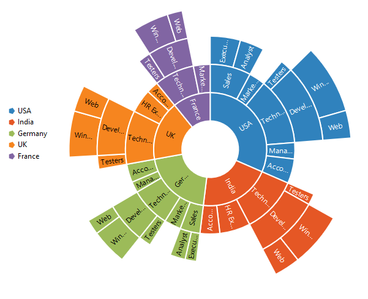
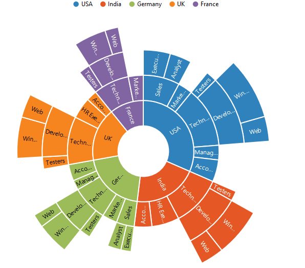
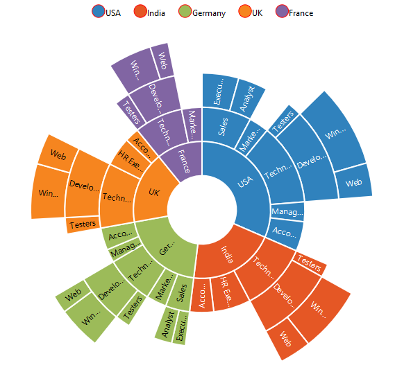
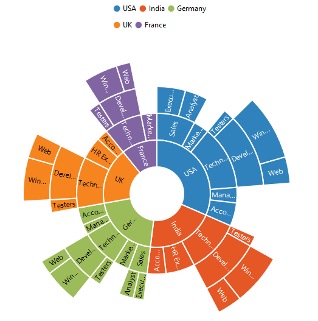
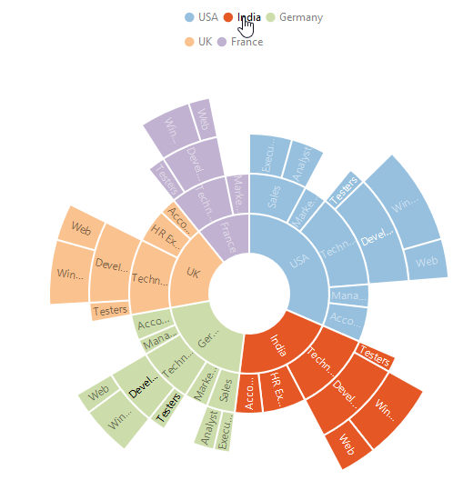

## Legend
The legend is used to represent the first level of items in the Sunburst Chart.The `legend` can be initialized using the below code snippet



<ej-sunburstchart  id="sunburst"   [legend.visible]="true" >   
</ej-sunburstchart>

 

## Legend Icon 

You can specify different shapes of legend icon by using the `legend.shape` property of the legend. By default, legend shape is **Circle**. The Sunburst chart has some predefined shapes such as:
* Circle
* Cross
* Diamond
* Pentagon
* Rectangle
* Triangle



<ej-sunburstchart  id="sunburst"   [legend.visible]="true" legend.shape="pentagon" >   
</ej-sunburstchart>



 
## Positioning the Legend

By using the `position` property, you can position the legend at left, right, top or bottom of the chart. 



<ej-sunburstchart  id="sunburst"   [legend.visible]="true" legend.position="top" >   
</ej-sunburstchart>



 
### Customization

## Legend Item Size and border
You can change the size of the legend items by using the `itemStyle.width` and `itemStyle.height` property. To change the legend item border, use `border`property of the legend .



<ej-sunburstchart  id="sunburst"   [legend.visible]="true" legend.position="top" [legend.itemStyle]="{height:13,width:13}" [legend.border]="{color:'#FF0000',width:1}" >   
</ej-sunburstchart>



## Legend Alignment

You can align the legend to the `center`, `far` or `near` based on its position by using the `legend-alignment` option.



<ej-sunburstchart  id="sunburst"   [legend.visible]="true" legend.alignment="top">   
</ej-sunburstchart>



## Legend Size

By default, legend takes 20% of the height horizontally when it was placed on the top or bottom position and 20% of the width vertically while placing on the left or right position of the chart. You can change this default legend size by using the `legend.size` property of the legend.



<ej-sunburstchart  id="sunburst"   [legend.visible]="true" legend.position="top" legend.size.height="75" legend.size.width="200" >   
</ej-sunburstchart>



 

## Legend Row and Column

You can arrange the legend items horizontally and vertically by using the `e-legend-rowCount` and `e-legend-columnCount` properties of the legend.
•	When only the rowCount is specified, the legend items are arranged according to the rowCount and number of columns may vary based on the number of legend items.
•	When only the columnCount is specified, the legend items are arranged according to the columnCount and number of rows may vary based on the number of legend items.
•	When both the properties are specified, then the one which has higher value is given preference. For example, when the rowCount is 4 and columnCount is 3, legend items are arranged in 4 rows.
•	When both the properties are specified and have the same value, the preference is given to the columnCount when it is positioned at the top/bottom position. The preference is given to the rowCount when it is positioned at the left/right position.
 


<ej-sunburstchart  id="sunburst"   [legend.visible]="true" legend.position="top" [legend.rowCount]="2"                      [legend.columnCount]="3" > 
</ej-sunburstchart>



 
## LegendInteractivity

You can select a specific category while clicking on corresponding legend item through `legend.clickAction` property. 

It has three types of action
*	ToggleSegmentSelection
*	ToggleSegmentVisibility
*	None

## Legend title

To add the title to the legend, you have to specify the `legend.title`  option.



<ej-sunburstchart  id="sunburst"   legend.title="">
</ej-sunburstchart>



## Customize the legend text

To customize the legend item text and title you can use the `legend-title-font` and `legend-title` options. You can change the legend title alignment by using the `legend-title-textAlignment` option of the legend title.



<ej-sunburstchart  id="sunburst"   [legend.title.font]="{fontFamily:'Arial',fontStyle:'Italic',size:'10px'}" legend.title.textAlignment="">
</ej-sunburstchart>



## ToggleSegmentSelection

Used to highlight specific category while clicking on legend item



<ej-sunburstchart  id="sunburst"   [legend.visible]="true" legend.clickAction="toggleSegmentSelection">
</ej-sunburstchart>



 
## Toggle Segment Visibility

Used to disable the specific category while clicking on legend item.



<ej-sunburstchart  id="sunburst"   [legend.visible]="true" legend.clickAction="toggleSegmentVisibility">
</ej-sunburstchart>



