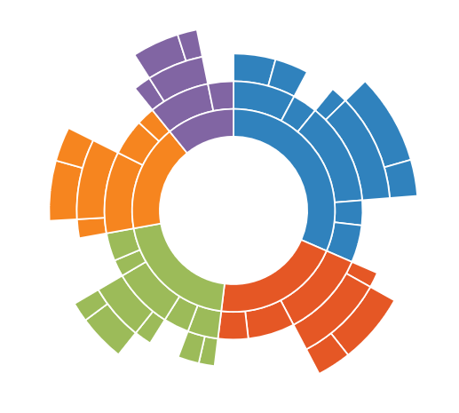
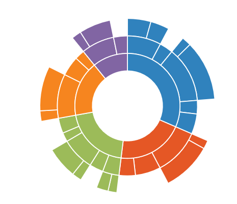

 
# Sunburst Elements

The Sunburst region represents the entire chart and all its elements. It includes all the chart elements like Legend, DataLabel, Levels etc. The major properties of the Sunburst Chart are as follows

`datasource` – Provides the data that are used to generate the chart.
`valueMemberPath`- Property based on the which the data segments are rendered in the Sunburst chart 
`legend` – displays the legend of the Sunburst Chart
`levels`- displays the hierarchical levels for the chart 
`data label`– displays the data label for the Sunburst Chart

## Start and End Angle
Start and End Angle

You can change the start and end angle of Sunburst chart using `startAngle` and `endAngle`property as shown in below code



<ej-sunburstchart  id="sunburst"   [startAngle]="-90" [endAngle]="90" >   
</ej-sunburstchart>



## Sunburst Radius

 The Radius of the Sunburst chart can be customized by using the `radius` property. The default value of radius is 1 and its value ranges between 0 and 1 



<ej-sunburstchart  id="sunburst"   [radius]="0.8" >   
</ej-sunburstchart>



;

 ## Sunburst Inner  Radius
 
 The Inner Radius of the Sunburst chart can be customized by using the `innerRadius` property. The default value of innerRadius is 0.4 and its value ranges between 0 and 1 



<ej-sunburstchart  id="sunburst"   [innerRadius]="0.5">   
</ej-sunburstchart>



;

