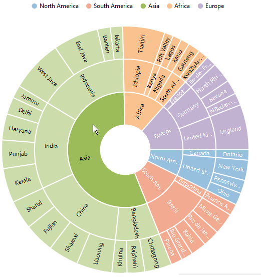
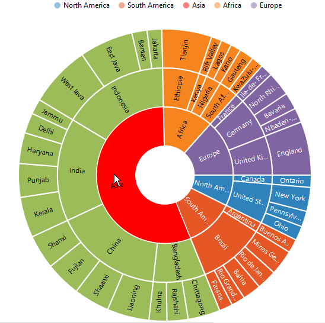
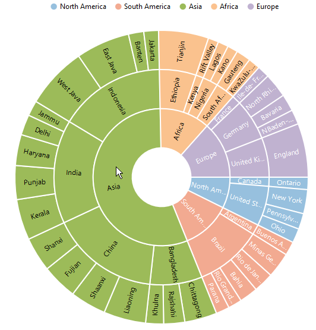
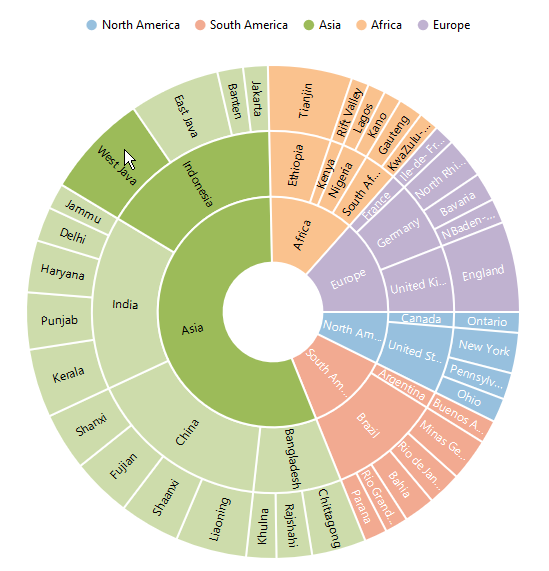
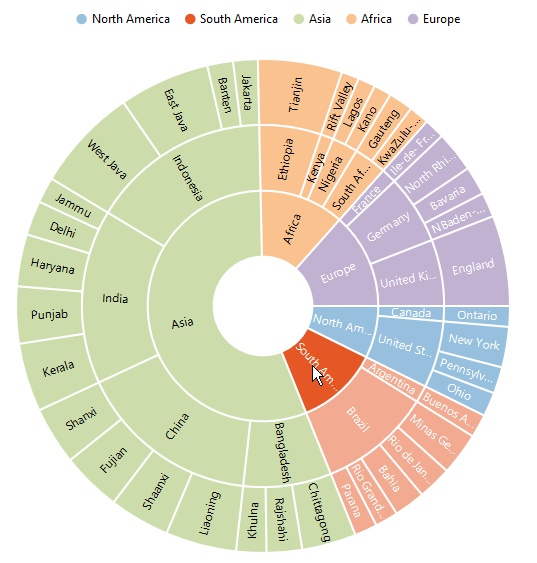
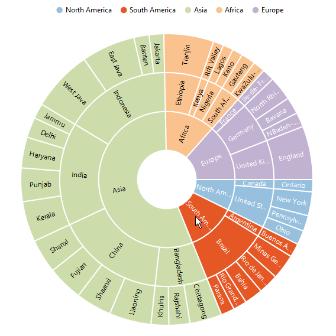

# Selection 
EjSunburstChart provides selection support for the points on mouse click. To enable the selection , set the `selectionSettings-enable` property to true in the `selectionSettings`. 



<ej-sunburstchart  id="sunburst"   [selectionSettings.enable]="true" >   
</ej-sunburstchart>



 
## Selection Display mode

 You can customize the selected  segment appearance by using color or opacity. You can choose between color or opacity using the `e-selectionsettings-type` property in the selection Settings.

*	selectionByColor – To display the selected segment appearance using color.
*	selectionByOpacity – To display the selected segment appearance using opacity.



<ej-sunburstchart  id="sunburst"   [selectionSettings.enable]="true" selectionSettings.type="color" selectionSettings.color="red" >   
</ej-sunburstchart>

 

## Selection Mode

Sunburst chart provides multiple option to represent the selected categories. You can select the segment categories by using the `e-selectionsettings-mode` property in selectionSettings
*	Child – To selection the child of selected parent.
*	All – To selection the entire categories in group.
*	Parent – To selection the parent of selected child.
*	Single - To selection single item in the category.

### Child
The following code shows how to set the selection type as child 



<ej-sunburstchart  id="sunburst"   [selectionSettings.enable]="true" selectionSettings.mode="child" >   
</ej-sunburstchart>



 
### Parent

The parent mode can be enabled by using the below code 



<ej-sunburstchart  id="sunburst"   [selectionSettings.enable]="true" selectionSettings.mode="parent" >   
</ej-sunburstchart>



 
### Point

To selection the particular segment, the point mode of the selection settings is used.



<ej-sunburstchart  id="sunburst"   [selectionSettings.enable]="true" selectionSettings.mode="point" >   
</ej-sunburstchart>

 

 
### All

The following code snippet is used for the all mode of selection settings



<ej-sunburstchart  id="sunburst"   [selectionSettings.enable]="true" selectionSettings.mode="all" >   
</ej-sunburstchart>



[Click](http://ng2jq.syncfusion.com/#/sunburst/selection) here to view the Selection sample of the  Sunburst Chart.
