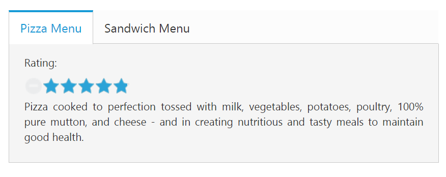

# Integration with other widgets

You can provide more customization to the **Tab** with **rating** control as content in it for describing the item rating value.

The **Essential JavaScript Rating** control provide you an intuitive rating experience that allows you to select the number of stars that represents the rating. For more information about the rating, you can refer the following link:

<http://help.syncfusion.com/js/rating/getting-started>

The following code example explains you the **rating** control creation. The input element is used to create the **rating** control. Render the input element as **rating** control using the input element **id**. The code example is placed within the content description &lt;div&gt; element to declare the **rating** control and description in the **Tab** section and it is appended with the header initialization code section &lt;div&gt; element.

Add the following **HTML** to render **Tab** with other widget.



<ej-tab id="dishtype">
	<ul>
        <li><a href="#pizza">Pizza Menu</a></li>
        <li><a href="#sandwich">Sandwich Menu</a></li>
    </ul>
    

        
Rating:

        

            <ej-rating id="pizzarating" [precision]="exact" [value]="val"></ej-rating> 
        

        
Pizza cooked to perfection tossed with milk, vegetables, potatoes, poultry, 100% pure mutton, and cheese - and in creating nutritious and tasty meals to maintain good health.

    

    

        
Rating:

        

            <ej-rating id="sandwichrating" [precision]="exact" [value]="val"></ej-rating>
        

        
Sandwich cooked to perfection tossed with bread, milk, vegetables, potatoes, poultry, 100% pure mutton, and cheese - and in creating nutritious and tasty meals to maintain good health.

    

</ej-tab>





    import {Component} from '@angular/core';
    import {ViewEncapsulation} from '@angular/core';
    @Component({
    selector: 'sd-home',
    templateUrl: 'app/components/tab/tab.component.html',    
    styleUrls: ['app/components/tab/tab.component.css'],
    encapsulation: ViewEncapsulation.None
    })
    export class TabComponent { 
        exact: any;
        val: number;
        constructor() {
            this.exact = ej.Rating.Precision.Exact;
            this.val= 4.8;
        }
    }
    


To render the **rating** controls in the first **Tab** element refer the styles mentioned in the following code example. 

Add the following styles to render **Tab** in tab.component.css file.


    
    .dishRating {
        position: absolute;
        margin: -31px 0px 0px 80px;
    }       



The following screenshot illustrates the **Tab** content with rating control. 

 