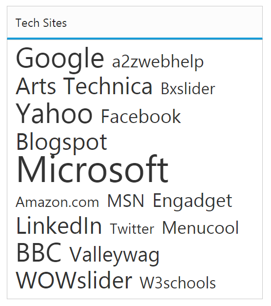
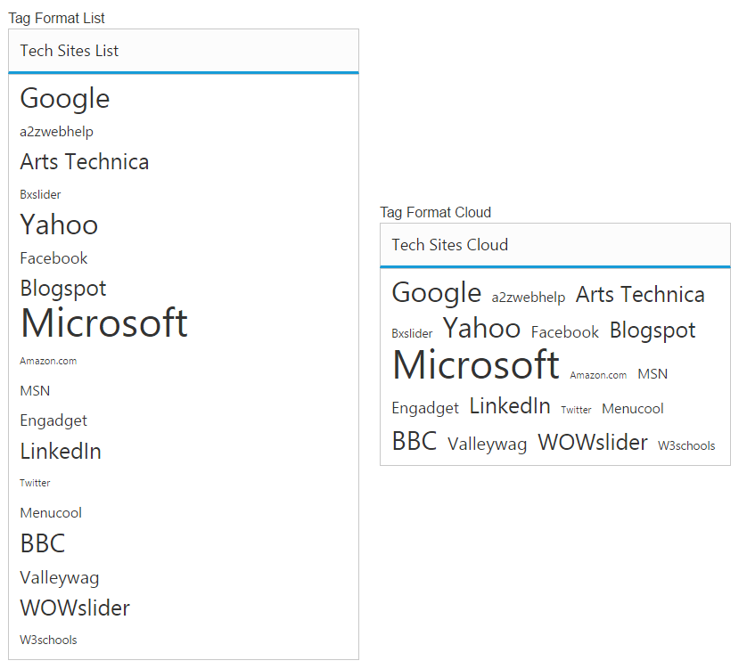
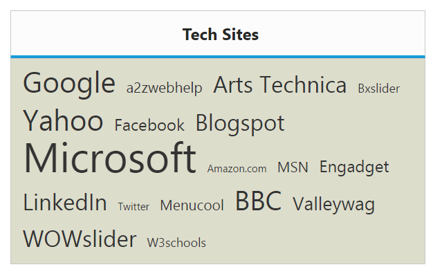

# Appearance and Styling

## Minimum and maximum Font size

The **TagCloud** content can be set to different font sizes from minimum to maximum based on its frequency values. By default, [minFontSize](https://help.syncfusion.com/api/js/ejtagcloud#members:minfontsize) is “10px” and [maxFontSize](https://help.syncfusion.com/api/js/ejtagcloud#members:maxfontsize) is “40px”, using these properties you can customize the minimum and maximum font sizes.

### Customizing font sizes of TagCloud

Refer to the following code to configure font sizes for a **TagCloud**.



<ej-tagcloud id="tag" [dataSource]="list" [titleText]="title" [minFontSize]="minSize" [maxFontSize]="maxSize"></ej-tagcloud>





import {Component} from '@angular/core';
@Component({
    selector: 'ej-app',
    templateUrl: 'app/components/TagCloud/TagCloud.component.html'
    })
export class TagCloudComponent {
    list: array;
    title: string;
    minSize: any;
    maxSize: any;
    constructor() {      
    this.list = [
    { text: "Google", url: "http://www.google.co.in", frequency: 12 },
    { text: "a2zwebhelp", url: "http://www.a2zwebhelp.com", frequency: 3 },
    { text: "Arts Technica", url: "http://arstechnica.com/", frequency: 8 },
    { text: "slider", url: "http://bxslider.com/examples", frequency: 2 },
    { text: "Yahoo", url: "http://in.yahoo.com/", frequency: 12 },
    { text: "Facebook", url: "https://www.facebook.com/", frequency: 5 },
    { text: "Blogs", url: "http://www.blogspot.com/", frequency: 8 },
    { text: "Microsoft", url: "http://www.microsoft.com/", frequency: 20 },
    { text: "Amazon.com", url: "http://www.amazon.com/", frequency: 1 },
    { text: "MSN", url: "http://www.msn.com/", frequency: 3 },
    { text: "Engadget", url: "http://www.engadget.com/", frequency: 5 },
    { text: "LinkedIn", url: "http://www.linkedIn.com/", frequency: 9 },
    { text: "Twitter", url: "http://www.Twitter.com/", frequency: 0 },
    { text: "Menu", url: "http://www.menucool.com", frequency: 3 },
    { text: "BBC", url: "http://www.bbc.co.uk/", frequency: 11 },
    { text: "Valley", url: "http://valleywag.gawker.com/", frequency: 6 },
    { text: "Slider", url: "http://wowslider.com", frequency: 9 },
    { text: "W3schools", url: "http://www.w3schools.com/", frequency: 2 }
    ];
    this.title = "Tech Sites";
    this.minSize = "20px";
    this.maxSize = "50px";
    }
}



The following screenshot illustrates the **TagCloud** control with customized font sizes.

 

## Tag format

You can set the **TagCloud** content display format using **format** property. By default format is set to cloud, that displays content in **TagCloud**. You can set the format as list to display the content in linear format.

### Defining Cloud and List format

Refer to the following code to configure format option for a **TagCloud**.



<table>
<tr>
<td>
Tag Format List 
<ej-tagcloud id="tag" [dataSource]="list" [titleText]="listTitle" [format]="Format"></ej-tagcloud>
</td>
<td>
Tag Format Cloud 
<ej-tagcloud id="tag" [dataSource]="list" [titleText]="cloudTitle" [format]="cloudFormat"></ej-tagcloud>
</td>
</tr>
</table>




import {Component} from '@angular/core';
@Component({
    selector: 'ej-app',
    templateUrl: 'app/components/TagCloud/TagCloud.component.html'
    })
export class TagCloudComponent {
    list: array;
    listTitle: string;
    cloudTitle: string;
    Format: any;
    cloudFormat: any;
    constructor() {      
    this.list = [
    { text: "Google", url: "http://www.google.co.in", frequency: 12 },
    { text: "a2zwebhelp", url: "http://www.a2zwebhelp.com", frequency: 3 },
    { text: "Arts Technica", url: "http://arstechnica.com/", frequency: 8 },
    { text: "slider", url: "http://bxslider.com/examples", frequency: 2 },
    { text: "Yahoo", url: "http://in.yahoo.com/", frequency: 12 },
    { text: "Facebook", url: "https://www.facebook.com/", frequency: 5 },
    { text: "Blogs", url: "http://www.blogspot.com/", frequency: 8 },
    { text: "Microsoft", url: "http://www.microsoft.com/", frequency: 20 },
    { text: "Amazon.com", url: "http://www.amazon.com/", frequency: 1 },
    { text: "MSN", url: "http://www.msn.com/", frequency: 3 },
    { text: "Engadget", url: "http://www.engadget.com/", frequency: 5 },
    { text: "LinkedIn", url: "http://www.linkedIn.com/", frequency: 9 },
    { text: "Twitter", url: "http://www.Twitter.com/", frequency: 0 },
    { text: "Menu", url: "http://www.menucool.com", frequency: 3 },
    { text: "BBC", url: "http://www.bbc.co.uk/", frequency: 11 },
    { text: "Valley", url: "http://valleywag.gawker.com/", frequency: 6 },
    { text: "Slider", url: "http://wowslider.com", frequency: 9 },
    { text: "W3schools", url: "http://www.w3schools.com/", frequency: 2 }
    ];
    this.listTitle = "Tech Sites List";
    this.cloudTitle = "Tech Sites Cloud";
    this.Format = ej.Format.List;
    this.cloudFormat = ej.Format.Cloud;
    }
}



The following screenshot illustrates the **TagCloud** control with customized formats.

 

## Theme

You can control the style and appearance of **TagCloud** based on CSS classes. To apply styles to the **TagCloud** control, you can refer two files, **ej.widgets.core.min.css** and **ej.theme.min.css**. When you refer **ej.widgets.all.min.css** file, it is not necessary to include the files **ej.widgets.core.min.css** and **ej.theme.min.css** in your project**,** as **ej.widgets.all.min.css** is the combination of these two. 

By default, there are 12 themes support available for **TagCloud** control namely,

* default-theme
* flat-azure-dark
* fat-lime
* flat-lime-dark
* flat-saffron
* flat-saffron-dark
* gradient-azure
* gradient-azure-dark
* gradient-lime
* gradient-lime-dark
* gradient-saffron
* gradient-saffron-dark

## CssClass

You can use the CSS class to customize the **TagCloud** appearance. Any of the CSS properties can be used to modify look and feel of tag cloud based on the requirement. Define a **CSS** class as per requirement and assign the class name to [cssClass](https://help.syncfusion.com/api/js/ejtagcloud#members:cssclass) property.

### Configure TagCloud using CSS class

Refer to the following code to configure **CSS** class for **TagCloud**.



<ej-tagcloud id="tag" [dataSource]="list" [titleText]="title" cssClass="CustomCss"></ej-tagcloud>





import {Component} from '@angular/core';
import {ViewEncapsulation} from '@angular/core'; 
@Component({
    selector: 'ej-app',
    templateUrl: 'app/components/TagCloud/TagCloud.component.html',
    styleUrls: ['app/components/TagCloud/TagCloud.component.css'],
    encapsulation: ViewEncapsulation.None
    })
export class TagCloudComponent {
    list: array;
    title: string;
    constructor() {
    this.list = [
    { text: "Google", url: "http://www.google.co.in", frequency: 12 },
    { text: "a2zwebhelp", url: "http://www.a2zwebhelp.com", frequency: 3 },
    { text: "Arts Technica", url: "http://arstechnica.com/", frequency: 8 },
    { text: "slider", url: "http://bxslider.com/examples", frequency: 2 },
    { text: "Yahoo", url: "http://in.yahoo.com/", frequency: 12 },
    { text: "Facebook", url: "https://www.facebook.com/", frequency: 5 },
    { text: "Blogs", url: "http://www.blogspot.com/", frequency: 8 },
    { text: "Microsoft", url: "http://www.microsoft.com/", frequency: 20 },
    { text: "Amazon.com", url: "http://www.amazon.com/", frequency: 1 },
    { text: "MSN", url: "http://www.msn.com/", frequency: 3 },
    { text: "Engadget", url: "http://www.engadget.com/", frequency: 5 },
    { text: "LinkedIn", url: "http://www.linkedIn.com/", frequency: 9 },
    { text: "Twitter", url: "http://www.Twitter.com/", frequency: 0 },
    { text: "Menu", url: "http://www.menucool.com", frequency: 3 },
    { text: "BBC", url: "http://www.bbc.co.uk/", frequency: 11 },
    { text: "Valley", url: "http://valleywag.gawker.com/", frequency: 6 },
    { text: "Slider", url: "http://wowslider.com", frequency: 9 },
    { text: "W3schools", url: "http://www.w3schools.com/", frequency: 2 }
    ];
    this.title = "Tech Sites";
    }
}



Add the below style in TagCloud.component.css file.



/* Customize the TagCloud div element */
.CustomCss
{
    background-color: #DDC;
    width: 400px;
}
/* Customize the TagCloud header element */        
.CustomCss .e-header.e-title {
    text-align: center;
    font-weight: bold;
}



The following screenshot illustrates the **TagCloud** with customized CSS class,

