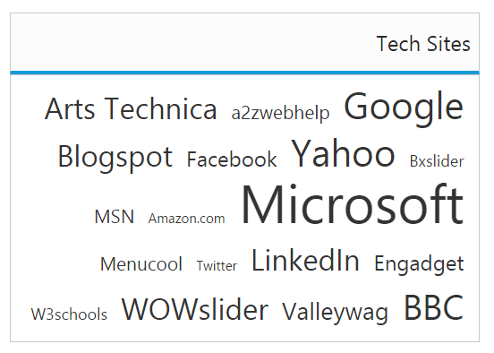

# RTL Support

This feature supports you to change the left-to-right alignment of the **TagCloud** widget to right-to-left (RTL). This displays the content from right-to-left in the widget. You can achieve this using [enableRTL](https://help.syncfusion.com/api/js/ejtagcloud#members:enablertl) property that is set false by default.

## Enabling RTL Support

The following helps you for enabling of right-to-left property in **TagCloud**.



<ej-tagcloud id="tag" [dataSource]="list" [titleText]="title" [enableRTL]="true"></ej-tagcloud>





import {Component} from '@angular/core';
@Component({
    selector: 'sd-home',
    templateUrl: 'app/components/tagcloud/tagcloud.component.html'
    })
export class TagCloudComponent {
    list: array;
    title: string;
    constructor() {
    this.list = [
    { text: "Google", url: "http://www.google.co.in", frequency: 12 },
    { text: "a2zwebhelp", url: "http://www.a2zwebhelp.com", frequency: 3 },
    { text: "Arts Technica", url: "http://arstechnica.com/", frequency: 8 },
    { text: "Bxslider", url: "http://bxslider.com/examples", frequency: 2 },
    { text: "Yahoo", url: "http://in.yahoo.com/", frequency: 12 },
    { text: "Facebook", url: "https://www.facebook.com/", frequency: 5 },
    { text: "Blogspot", url: "http://www.blogspot.com/", frequency: 8 },
    { text: "Microsoft", url: "http://www.microsoft.com/", frequency: 20 },
    { text: "Amazon.com", url: "http://www.amazon.com/", frequency: 1 },
    { text: "MSN", url: "http://www.msn.com/", frequency: 3 },
    { text: "Engadget", url: "http://www.engadget.com/", frequency: 5 },
    { text: "LinkedIn", url: "http://www.linkedIn.com/", frequency: 9 },
    { text: "Twitter", url: "http://www.Twitter.com/", frequency: 0 },
    { text: "Menucool", url: "http://www.menucool.com", frequency: 3 },
    { text: "BBC", url: "http://www.bbc.co.uk/", frequency: 11 },
    { text: "Valleywag", url: "http://valleywag.gawker.com/", frequency: 6 },
    { text: "WOWslider", url: "http://wowslider.com", frequency: 9 },
    { text: "W3schools", url: "http://www.w3schools.com/", frequency: 2 }
    ];
    this.title = "Tech Sites";
    }
}



The following screenshot illustrates the **TagCloud** control with RTL support.

