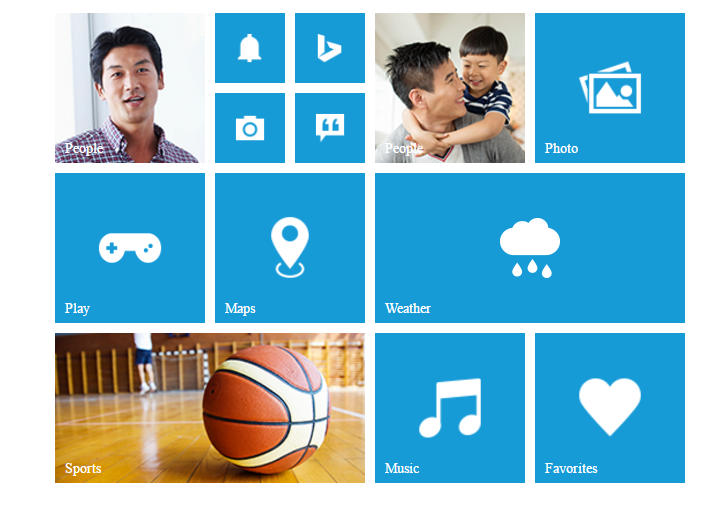

# Add Group Tiles

To make a **Tile** as grouped tile, you can use the following mentioned pre-defined classes.

<table>
<tr>
<th>
Class Name</th><th>
Explanation</th></tr>
<tr>
<td>
e-tile-group</td><td>
To group the column elements</td></tr>
<tr>
<td>
e-tile-column</td><td>
To align the tile in column manner</td></tr>
<tr>
<td>
e-tile-small-col-2</td><td>
To align the small size tiles</td></tr>
</table>

Refer to the following code example for render the Group tiles.



    

        

               <!— Add tile control here -->
        

    



To render **column** grouped tile, you need to render the number of tiles inside a **&lt;div&gt;** element with class **e-tile-column**. Then that column group element is appended to a **&lt;div&gt;** with class **e-tile-group**.     

To render **small-col-2** grouped tile, you need to render the number of tiles inside a **&lt;div&gt;** element with class **e-tile-small-col-2**. Then that **small-col-2** group element is appended to a **&lt;div&gt;** with class **e-tile-column**. Then you need to append those column inside the main group **&lt;div&gt;** element.                                                     

Refer the following code examples.


    

            

                <ej-tile id="tile1" imagePosition="fill" tileSize="medium" imageUrl='http://js.syncfusion.com/ug/web/content/tile/people_1.png' [caption]="caption1">
                </ej-tile>
                

                    <ej-tile id="tile2" imagePosition="center" tileSize="small" imageUrl='http://js.syncfusion.com/ug/web/content/tile/alerts.png'>
                    </ej-tile>
                    <ej-tile id="tile3" imagePosition="center" tileSize="small" imageUrl='http://js.syncfusion.com/ug/web/content/tile/bing.png'>
                    </ej-tile>
                    <ej-tile id="tile4" tileSize="small" imageUrl='http://js.syncfusion.com/ug/web/content/tile/camera.png'>
                    </ej-tile>
                    <ej-tile id="tile5" tileSize="small" imagePosition="center" imageUrl='http://js.syncfusion.com/ug/web/content/tile/messages.png'>
                    </ej-tile>
                

                <ej-tile id="tile6" tileSize="medium" imagePosition="center" imageUrl='http://js.syncfusion.com/ug/web/content/tile/games.png' [caption]="caption2">
                </ej-tile>
                <ej-tile id="tile7" tileSize="medium" imageUrl='http://js.syncfusion.com/ug/web/content/tile/map.png' [caption]="caption3">
                </ej-tile>
                <ej-tile id="tile8" tileSize="wide" imageUrl='http://js.syncfusion.com/ug/web/content/tile/sports.png' [caption]="caption4" imagePosition="fill">
                </ej-tile>
            

            

                <ej-tile id="tile9" tileSize="medium" imagePosition="fill" imageUrl='http://js.syncfusion.com/ug/web/content/tile/people_2.png' [caption]="caption5">
                </ej-tile>
                <ej-tile id="tile10" tileSize="medium" imagePosition="center" imageUrl='http://js.syncfusion.com/ug/web/content/tile/pictures.png' [caption]="caption6">
                </ej-tile>
                <ej-tile id="tile11" tileSize="wide" imagePosition="center" imageUrl='http://js.syncfusion.com/ug/web/content/tile/weather.png' [caption]="caption7">
                </ej-tile>
                <ej-tile id="tile12" tileSize="medium" imagePosition="center" imageUrl='http://js.syncfusion.com/ug/web/content/tile/music.png' [caption]="caption8">
                </ej-tile>
                <ej-tile id="tile13" tileSize="medium" imagePosition="center" imageUrl='http://js.syncfusion.com/ug/web/content/tile/favs.png' [caption]="caption9">
                </ej-tile>
            

        





export class DefaultComponent {
  caption1: any;
  caption2: any;
  caption3: any;
  caption4: any;
  caption5: any;
  caption6: any;
  caption7: any;
  caption8: any;
  caption9: any;
  constructor() {
    this.caption1 = { text: 'People' };
    this.caption2 = { text: 'Play' };
    this.caption3 = { text: 'Maps' };
    this.caption4 = { text: 'Sports' };
    this.caption5 = { text: 'People' };
    this.caption6 = { text: 'Photo' };
    this.caption7 = { text: 'Weather' };
    this.caption8 = { text: 'Music' };
    this.caption9 = { text: 'Favorites' };
  }
}



