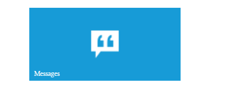
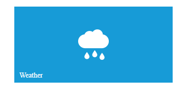

# Appearance and Customization

## TileSize Customization

To customize the Tile component size by using tileSize property. By default tile size as small. The following built-in tile sizes are supported.

1. medium
2. small
3. wide
4. large

Refer to the following code examples.

 
     <ej-tile id="tile" tileSize="wide" imagePosition="center" imageUrl='http://js.syncfusion.com/ug/web/content/tile/messages.png' [caption]="caption1">
     </ej-tile>
    
  



export class DefaultComponent {
  caption1: any;
  constructor() {
    this.caption1 = { text: 'Messages' };
  }
}

 

## Image and Position Configuration

   1) To set the image position by using the imagePosition property for Tile component. By default tile image as in center position. Get the possible [image position](https://help.syncfusion.com/api/js/ejtile#members:imageposition)

   2) The imageUrl property is used to set the background image for Tile component.

   Refer to the following code example.

    
     <ej-tile id="tile" tileSize="wide" imagePosition="right" imageUrl='http://js.syncfusion.com/ug/web/content/tile/messages.png' [caption]="caption1">
     </ej-tile>
    
     

   

   export class DefaultComponent {
      caption1: any;
      constructor() {
        this.caption1 = { text: 'Messages' };
      }
   }

 

## Applying Rounded Corner

To use [showRoundedCorner](https://help.syncfusion.com/api/js/ejtile#members:showroundedcorner) property to add the rounded borders for the Tile component. By default, showRoundedCorner property is disabled in Tile.

 
     <ej-tile id="tile" tileSize="medium" imagePosition="center" imageUrl='http://js.syncfusion.com/ug/web/content/tile/camera.png' [caption]="caption1" [showRoundedCorner]="roundedCorner">
     </ej-tile>
    
     

   

   export class DefaultComponent {
      caption1: any;
      roundedCorner: boolean;
      constructor() {
        this.caption1 = { text: 'Camera' };
        this.roundedCorner = true;
      }
   }

 

## Allow Selection

To use [Allow Selection](https://help.syncfusion.com/api/js/ejtile#members:allowSelection) property to select the Tile component. By default, selection is disabled in Tile.

 
     <ej-tile id="tile" tileSize="medium" imagePosition="center" imageUrl='http://js.syncfusion.com/ug/web/content/tile/camera.png' [caption]="caption1" [allowSelection]="allowSelection">
     </ej-tile>
    
     

   

   export class DefaultComponent {
      caption1: any;
      allowSelection: boolean;
      constructor() {
        this.caption1 = { text: 'Camera' };
        this.allowSelection = true;
      }
   }

    

## Css Class

Tile component also allows you to customize its appearance using user-defined CSS and custom skin options such as colors and backgrounds. To apply custom themes you have a property called **cssClass**. **cssClass** property sets the root class for **Tile** theme.

Using this **cssClass** you can override the existing styles under the theme style sheet. The theme style sheet applies theme-specific styles like colors and backgrounds. In the following example, the value of **cssClass** property is set as **customClass**. **customClass** is added as root class to **Tile** component at the runtime. From this root class you can customize the **Tile** component theme.

Add the following code in your **HTML** page to render the Tile.


     <ej-tile id="tile" tileSize="medium" imagePosition="center" imageUrl="http://js.syncfusion.com/ug/web/content/tile/camera.png" [caption]="caption1" [cssClass]="cssClass">
     </ej-tile>  
    




   export class DefaultComponent {
      caption1: any;
      cssClass: string;
      constructor() {
        this.caption1 = { text: 'Camera' };
        this.cssClass = "customClass";
      }
   }

 

In the following style sheet the existing theme style sheet file has been over-ridden using root class **customClass**. 

Add the following code in your style section.





