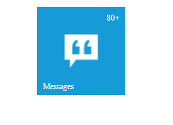

# Badge Configuration

The badge property handles badge specific functionalities like enable or disable the badge and setting badge value for Tile.

The **enabled** attribute enables or disables the badge for a Tile. The Tile renders with hidden badge when it is set as false.

The **value** attribute is used to set the badge value to a Tile. By default, the Value is set to **1** on initialization. 

The **text** attribute is used to set the text instead of number for Tile badge. 

The **maxValue** attribute is used to set the maximum badge value to a Tile. When you set the badge value greater than maxValue, it shows maximum value in badge with **plus** symbol. 

The **minValue** attribute is used to set the minimum badge value to a Tile. When you set the badge value less than minValue, it shows minimum value in badge.

The **position** attribute is used to set the position for badge text or badge value. By default, the badge value position as bottomRight.

Refer to the following code examples.



<ej-tile id="tile" tileSize="medium" imagePosition="center" imageUrl="http://js.syncfusion.com/ug/web/content/tile/messages.png" [caption]="caption1" [badge]="badge">
</ej-tile>   
    




export class AppComponent {
    caption1: any;
    badge: any;
    constructor() {
        this.caption1 = { text: 'Messages' };
        this.badge = { enabled: true, minValue: 10, maxValue: 80, value: 88, position: "topright" };
    }
}



