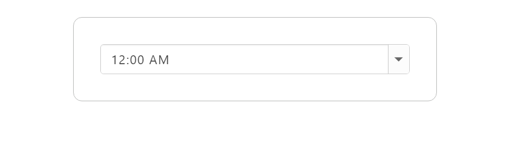
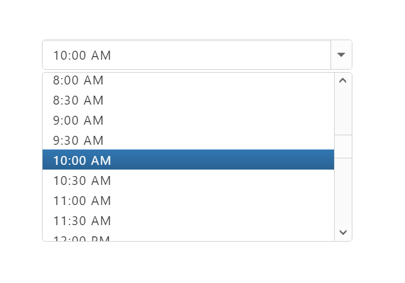
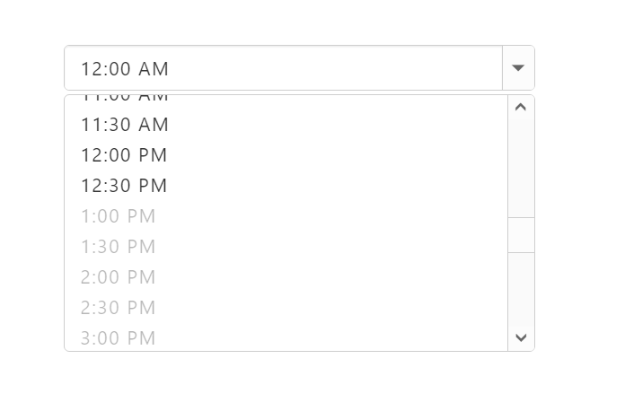

# Getting Started

This section explains you how to render and configure TimePicker component in an Angular application.

To get started with TimePicker component, refer the basic prerequisites and system configuration to be done form the given [getting started](#Getting-Started) document

Once you have cloned the sample Angular application as mentioned in getting started document, you will have an angular application named **angular2-seeds** and is now ready use our EJ components with it. 

### Adding TimePicker source file

Copy the required Angular source components file from the installed location and move it to the app/src/ej folder available inside the angular2-seeds folder.

(Installed Location)\Syncfusion\Essential Studio\{installed version}\JavaScript\assets-src\angular2\ 

> _Note:_ _core.ts file is mandatory for all Syncfusion JavaScript Angular components. The repository having the source file from Essential Studio for JavaScript v14.3.0.49._

### Adding JavaScript and CSS Reference

Create an HTML page and refer the necessary script and CSS dependency files in your application with the help of given  [Angular Getting Started Documentation.](https://help.syncfusion.com/angular-2/overview)

Example



<!DOCTYPE html>

    <head>
    <title>Angular TimePicker</title>

    <!-- Essential Studio for JavaScript  theme reference -->
    <link rel="stylesheet" href="http://cdn.syncfusion.com/14.4.0.15/js/web/flat-azure/ej.web.all.min.css" />

    <!-- Angular related script references -->
    <!-- 1. Load libraries -->
         <!-- Polyfill(s) for older browsers -->
    
    
    
    

    <!-- Essential Studio for JavaScript  script references -->
    
    
    

    <!-- 2. Configure SystemJS -->
    
    

    </head>
    <!-- 3. Display the application -->
    <body>
    <ej-app>
		    

			      
Angular Syncfusion Components App

			      

		    

	  </ej-app>
    </body>
    </html>



### Control Initialization

1. Create a folder named "TimePicker" inside app folder.

2. Create a View file and name it as "TimePicker.component" with "html" extension and add the TimePicker component in it as given below. 



<input type="text" ej-timepicker id="timepick" />

 

3. Create a Model file named "TimePicker.component" with "ts" extension inside "TimePicker" folder created in step 1.

4. Now, define the **ej-app** component and TimePicker Model class inside the Model file created in the above step.



@Component({
    selector: 'ej-app',
    templateUrl: 'app/app.component.html',
})
export class AppComponent {
}



5. To Run the application, execute the below command in the command prompt window. 



npm start



6. Browse the port where your application is hosted and navigate to TimePicker tab to see the output. 

## Configuring Properties

### Data Binding

With the above steps you have rendered a simple TimePicker component with the value set in initial rendering. 

Now, to bind the model values to the TimePicker component, define the model values in the **AppComponent** class available in TimePicker.component.ts file as given below.



<input type="text" ej-timepicker id="datepick" [{value}]=timeValue />





@Component({
    selector: 'ej-app',
    templateUrl: 'app/app.component.html',
})
export class AppComponent {
    timeValue: String;
    constructor() {
       this.timeValue = "12:00 PM";
    }
}



The following screenshot illustrates the output of above code.

### DisableTimeRanges

This property specifies the list of time range to be disabled in TimePicker control.To know more about TimePicker properties please refer the [API reference](https://help.syncfusion.com/api/js/ejtimepicker) documentation.



<input type="text" ej-timepicker id="datepick" [disableTimeRanges]="disableTimeRanges" />





@Component({
    selector: 'ej-app',
    templateUrl: 'app/app.component.html',
})
export class AppComponent {
    disableTimeRanges: Object;
    constructor() {
        this.disableTimeRanges = [{ startTime: "3:00 AM", endTime: "6:00 AM" },
                    { startTime: "1:00 PM", endTime: "3:00 PM" },
                    { startTime: "8:00 PM", endTime: "10:00 PM" }];        
    }
}



The following screenshot illustrates the output of above code.

