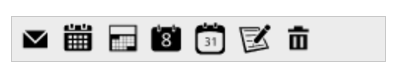
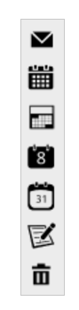

# Orientation

The **Toolbar** control supports both vertical and horizontal orientations, allowing it to fit into any scenario. The [orientation](https://help.syncfusion.com/api/js/ejtoolbar#members:orientation) property **of Toolbar** defines the orientation in which the control is rendered. Set the value to this property as **enum or string** type. It accepts the following values.

* ej.Orientation.Horizontal or "Horizontal"
* ej.Orientation.Vertical  or "Vertical"

The following section explains you on how to set orientation for the toolbar.

## Horizontal

This property sets the **Toolbar** in **horizontal** orientation. You can refer the following steps to set horizontal orientation for **Toolbar** control.

Add the following code in your **HTML** page.



<ej-toolbar id="toolbar" [dataSource]="data" [fields]="fieldsvalues" [orientation]="orientation" [width]="250"></ej-toolbar>





    import {Component,ViewEncapsulation} from '@angular/core';
    import {encapsulation} from '@angular/core'; 
    @Component({
    selector: 'sd-home',
    templateUrl: 'app/components/toolbar/toolbar.component.html',
    styleUrls: ['app/components/toolbar/toolbar.component.css'],
    encapsulation: ViewEncapsulation.None
    })
    export class ToolBarComponent {
    fieldsvalues: Object;
    data: Array<Object>;
    orientation: any;
    constructor() {
        this.data = [
        {
        iconid: "1",
        spriteCss: "mailtools movetofolder",

        }, {
        iconid: "2",
        spriteCss: "mailtools categorize",

        }, {
        iconid: "3",
        spriteCss: "mailtools flag",

        }, {
        iconid: "4",
        spriteCss: "mailtools forward",

        }, {
        iconid: "5",
        spriteCss: "mailtools newmail",

        },
        {
        iconid: "6",
        spriteCss: "mailtools reply",

        },
        {
        iconid: "7",
        spriteCss: "mailtools done",

        }
        ];
        this.fieldsvalues = { id: "iconid", spriteCssClass: "spriteCss" };
        this.orientation = ej.Orientation.Horizontal;
    }
    }



OR



<ej-toolbar id="toolbar" [dataSource]="data" [fields]="fieldsvalues" [orientation]="Horizontal" [width]="250"></ej-toolbar>



Build and run the application.

The following screenshot illustrates a **Toolbar** with horizontal orientation.

## Vertical

This property sets the **Toolbar** in **vertical** orientation. You can refer the following steps to set vertical orientation for **Toolbar** control.

Create UL-LI list of toolbar items and invoke the toolbar helper.

Add the following script in your **HTML** page.



<ej-toolbar id="toolbar" [dataSource]="data" [fields]="fieldsvalues" [orientation]="orientation" [width]="33"></ej-toolbar>





    import {Component,ViewEncapsulation} from '@angular/core';
    import {encapsulation} from '@angular/core'; 
    @Component({
    selector: 'sd-home',
    templateUrl: 'app/components/toolbar/toolbar.component.html',
    styleUrls: ['app/components/toolbar/toolbar.component.css'],
    encapsulation: ViewEncapsulation.None
    })
    export class ToolBarComponent {
    fieldsvalues: Object;
    data: Array<Object>;
    orientation: any;
    constructor() {
        this.data = [
        {
        iconid: "1",
        spriteCss: "mailtools movetofolder",

        }, {
        iconid: "2",
        spriteCss: "mailtools categorize",

        }, {
        iconid: "3",
        spriteCss: "mailtools flag",

        }, {
        iconid: "4",
        spriteCss: "mailtools forward",

        }, {
        iconid: "5",
        spriteCss: "mailtools newmail",

        },
        {
        iconid: "6",
        spriteCss: "mailtools reply",

        },
        {
        iconid: "7",
        spriteCss: "mailtools done",

        }
        ];
        this.fieldsvalues = { id: "iconid", spriteCssClass: "spriteCss" };
        this.orientation = ej.Orientation.Vertical;
    }
    }



OR


  
<ej-toolbar id="toolbar" [dataSource]="data" [fields]="fieldsvalues" [orientation]="Vertical" [width]="33"></ej-toolbar>



Build and run the application.

The following screenshot illustrates a **Toolbar** with vertical orientation.

