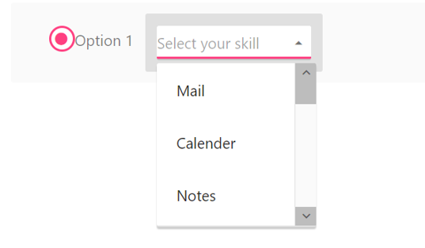

# Template Support

Template allows you to insert custom controls inside the toolbar items. Also you can design simple drop down buttons listing the items and radio button inside the **Toolbar**.

Set the list for **DropDown control** inside a list tag and define this tag as a **Toolbar** item. You can use all simple controls as a **Toolbar** item. To add RadioButton and DropDownList to **Toolbar**, use the following code example.



<ej-toolbar>
 <ul>
      <li>
         

            <input ej-radiobutton text="Option" name="Option" value="option" />
         

         
      </li>
      <li id="Dropdown" title="Dropdown Control">
         <input id="Select" ej-dropdownlist [dataSource]="datasource"  [fields]="fieldsvalues"  width=240 />
        
      </li>
   </ul>
   </ej-toolbar>





import { Component } from '@angular/core';

@Component({
    selector: 'ej-app',
    templateUrl: './orientation.component.html',
})
export class OrientationComponent {
  datasource: Array<Object> = [];	
  fieldsvalues: Object;
  constructor() {
    this.datasource = [
      { id: 1, text: 'Mail' },
      { id: 2, text: 'Calender' },
      { id: 3, text: 'Notes' },
      { id: 4, text: 'Contacts' },
    ],
    this.fieldsvalues = { dataSource: this.datasource,text: 'text'};
  }
}



##Through Items API:



<ej-toolbar [Items]="items" (create)=onCreate($event)>
</ej-toolbar>





import { Component } from '@angular/core';

@Component({
    selector: 'ej-app',
    templateUrl: './orientation.component.html',
})
export class OrientationComponent {
    items: Array<Object> = [];
    list:  Array<Object> = [];
    constructor() {	
    this.list = [    
      { id: 1, text: 'Mail' },
      { id: 2, text: 'Calender' },
      { id: 3, text: 'Notes' },
      { id: 4, text: 'Contacts' },
        ];
    }
    items=[
           {id:"item1",group:"group1",template:"<input type='radio' id='Radio1' name='radio'>Option 1</input>"},
		   {id: "item2",group:"group2",template:"<input type='text' id='dropdown1' />"}
	],
    onCreate(args){	
	$("#Radio1").ejRadioButton({size:"medium"});
    $('#dropdown1').ejDropDownList({
    dataSource: this.list,
    fields: { text: "text" },
    watermarkText: "Select your skill",        
    });
	}
}



##Through template field in dataSource API:



<ej-toolbar [dataSource]="items" [fields]="fieldsvalues" (create)=onloading($event)>
</ej-toolbar>





import { Component } from '@angular/core';

@Component({
    selector: 'ej-app',
    templateUrl: './orientation.component.html',
})
export class OrientationComponent {
    items: Array<Object> = [];
    list:  Array<Object> = [];
    fieldsvalues: Object;
    constructor() {	
    this.list = [    
      { id: 1, text: 'Mail' },
      { id: 2, text: 'Calender' },
      { id: 3, text: 'Notes' },
      { id: 4, text: 'Contacts' },
        ];
    this.fieldsvalues = { id: "id",tooltipText:"title",group:"group",template:"template"};
    }
    items=[
           {id:"item1",group:"group1",title:"radio",template:"<input type='radio' id='Radio1' name='radio'>Option 1</input>"},
		   {id: "item2",group:"group2",title:"dropdown",template:"<input type='text' id='dropdown1'/>"},
	],
    onCreate(args){	
	$("#Radio1").ejRadioButton({size:"medium"});
    $('#dropdown1').ejDropDownList({
    dataSource: this.list,
    fields: { text: "text" },
    watermarkText: "Select your skill",        
    });
	}
}



The following screenshot displays a Toolbar with embedded controls.

