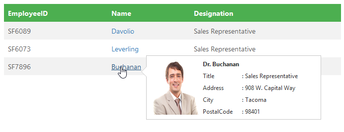
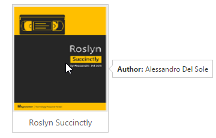

# How To

## Use AJAX to generate the Tooltip’s content

Use jQuery’s built-in AJAX functionality to retrieve remote content and set the content to the Tooltip as follows.

Define three employee’s JSON Array as given below(an array of 3 employees records)



[
    {
        "EmployeeID": 1,
        "LastName": "Davolio",
        "Title": "Sales Representative",
        "TitleOfCourtesy": "Dr.",
        "Address": "507 - 20th Ave. E.Apt. 2A",
        "City": "Seattle",
        "Region": "WA",
        "PostalCode": "98122"
        
    },
    {
        "EmployeeID": 2,
        "LastName": "Buchanan",
        "Title": "Sales Representative",
        "TitleOfCourtesy": "Dr.",
        "Address": "908 W. Capital Way",
        "City": "Tacoma",
        "Region": "WA",
        "PostalCode": "98401"
        
    },
    {
        "EmployeeID": 3,
        "LastName": "Leverling",
        "Title": "Sales Representative",
        "TitleOfCourtesy": "Dr.",
        "Address": "722 Moss Bay Blvd.",
        "City": "Kirkland",
        "Region": "WA",
        "PostalCode": "98033"
        
    }
]



Render the employees table and create the tooltip. Once the tooltip created, the data will be fetched using AJAX method as follows.



<ej-tooltip id="details" trigger="hover" content="" width="350px" height="150px" [position]="tooltipposition" target=".e-info" (beforeOpen)= onOpen($event) >
    <table id="details">
        <tr>
            <th>EmployeeID</th>
            <th>Name</th>
            <th>Designation</th>
        </tr>
        <tr>
            <td>SF6089</td>
            <td><a href="#" class="e-info" title="Davolio">Davolio</a></td>
            <td>Software Engineer</td>
        </tr>
        <tr>
            <td>SF6073</td>
            <td> <a href="#" class="e-info" title="Leverling">Leverling </a> </td>
            <td>Tester</td>
        </tr>
        <tr>
            <td>SF6073</td>
            <td> <a href="#" class="e-info" title="Suyama"> Suyama </a> </td>
            <td>Content Writer</td>
        </tr>
        <tr>
            <td>SF7896</td>
            <td> <a href="#" class="e-info" title="Buchanan"> Buchanan </a> </td>
            <td>Graphics Designer</td>
        </tr>
    </table>
</ej-tooltip>





import {Component} from '@angular/core';
import { ViewEncapsulation } from '@angular/core';
@Component({
    selector: 'ej-app',
    templateUrl: './Tooltip.component.html',
    styleUrls: ['./Tooltip.component.css'],
    encapsulation: ViewEncapsulation.None
})
export class TooltipComponent {
    tooltipposition: any;

    constructor() {       
        this.tooltipposition = {
            target : {horizontal :"right", vertical :"bottom"},
            stem :{horizontal:"left", vertical:"top"}
        };
    }
	onOpen(args) {
	   var target = $("#details").data("ejTooltip");
        var proxy = args;var i=0, content;
		
        $.ajax({
            dataType: "json",
            url: "tooltipData.js",
            success: function (result) {
                var employee = [
                    { photo: "http://js.syncfusion.com/demos/web/content/images/grid/Employees/2.png" },
                    { photo: "http://js.syncfusion.com/demos/web/content/images/grid/Employees/4.png" },
                    { photo: "http://js.syncfusion.com/demos/web/content/images/grid/Employees/8.png" },
                    { photo: "http://js.syncfusion.com/demos/web/content/images/grid/Employees/3.png" },
                    { photo: "http://js.syncfusion.com/demos/web/content/images/grid/Employees/1.png" },
                    { photo: "http://js.syncfusion.com/demos/web/content/images/grid/Employees/6.png" },
                ];
                for (i = 0; i < result.length ; i++) {
                    if (result[i].LastName == $(proxy.event.target).attr("data-content"))
                        content = '
 
<table> <tr> <th> ' + result[i].TitleOfCourtesy + ' ' + result[i].LastName + '</th> </tr> <tr> <td> Title </td> <td>&nbsp;&nbsp;: ' + result[i].Title + '</td> </tr> <tr><td> Address</td><td>&nbsp;&nbsp;: ' + result[i].Address + '</td> </tr><tr> <td> City </td> <td>&nbsp;&nbsp;: ' + result[i].City + '</td> </tr> <tr> <td> PostalCode </td> <td>&nbsp;&nbsp;: ' + result[i].PostalCode + '</td> </tr> </table>

';
                }
                target.setModel({ content: content });
            }
        });
        target.show(args.event.target);
        args.cancel = true;
    }
}



Defines the style for the tooltip layout and table as follows in the stylesheet and mentioned in template.



    


## Integration with the Slider control

Tooltip can also be integrated with various other jQuery plugin. Tooltip shows the slider value above the handle.

Render the slider control and finds its handle to render the Tooltip as follows



<ej-slider width="100%" height=16 value=100 [showTooltip]="showTooltip" [minValue]="minValue" [maxValue]="maxValue" [incrementStep]="step" (change)="onSlide($event)" (slide)="onSlide($event)" (stop)="onStop($event)"></ej-slider>

 
        Loan Amount
    
    
        100$ 
    
    

    





import {Component} from '@angular/core';
import { ViewEncapsulation } from '@angular/core';
@Component({
    selector: 'ej-app',
    templateUrl: './Tooltip.component.html',
    styleUrls: ['./Tooltip.component.css'],
    encapsulation: ViewEncapsulation.None
})
export class TooltipComponent {
    minValue:any;
	showTooltip:boolean;
	maxValue: int;
    step: int;
    constructor() {
        this.step=10;
		this.minValue=10;
		this.maxValue=1000;
		this.showTooltip=false;
    }
}



Once the handler in the slider, start its sliding the below function will be triggered



function onSlide(args) {
    
    this.wrapper.prev().children('span.value').html(args.value);
    var target = "#" + args.id, value = args.value.toString();
    if(args.id == "loanSlider")
        value =  "$ " +value;
    var tipWidth = (value < 10) ? "13px" : (10 <= value >= 100) ? "25px" : "auto";
    var tipObj = $($("div" + target).find(".e-handle")).data("ejTooltip");
    tipObj.setModel({content : value, width : tipWidth});
    tipObj.show($("div" + target).find(".e-handle"));
} 



Once the sliding is stopped, the Tooltip will be shown for the particular period of time then it will be closed. 



function onStop(args){
    setTimeout( function(){ 
        var target = "#" + args.id;
        var tipObj = $($("div" + target).find(".e-handle")).data("ejTooltip");
        tipObj.hide();
    }, 1000);
}
        


## Tip(arrow) customization

Styling the Tip's background and border colors is done using "cssClass" API of Tooltip. Change the size of the tip using the property name called "Tip" and CSS as follows.



          <ej-tooltip [content]="content" [width]="width" [tip]="tip" [position]="position">
		</ej-tooltip>
        
Delphi Succinctly

      





import {Component} from '@angular/core';
import { ViewEncapsulation } from '@angular/core';
@Component({
    selector: 'ej-app',
    templateUrl: './Tooltip.component.html',
    styleUrls: ['./Tooltip.component.css'],
    encapsulation: ViewEncapsulation.None
})
export class TooltipComponent {
    content: string;
	width: string;
	tip: any;
	position: any;

    constructor() {       
        this.content = "Learn the fundamentals of Delphi to build a variety of solutions for many devices and platforms";
		this.width = "270px";
		this.tip={
                size : { width : 25, height : 12}
            };
        this.position={
                stem: {	horizontal: "left", vertical: "center" },
                target: { horizontal : "right", vertical : "center"}
            };
    }
}



Defines the style for the tip as follow as


    

    


## Initialize Tooltip for the target element

Tooltips are also useful for form elements, to show some additional information in the context of each field.

Rather than using multiple Tooltips, a single Tooltip can be used to show the information of each and every field of the form/table element. This can be achieved using “target” API. Target property Specifies a selector for elements, within the container, for which the Tooltip will be displayed.

The example below demonstrates how to create a Tooltip for multiple targets element. 



<ej-tooltip id="details" trigger="click" width="175px" height="30px" [position]="tooltipposition" target=".form-control" (beforeOpen)= onOpen($event) role="form">
    <fieldset>
        

            <label for="name">User Name:</label>
            <input class="form-control" type="text" id="name" name="firstname" title="Please enter your name">
        

        

            <label for="email">Email Address:</label>
            <input class="form-control" id="email" type="text" name="email" title="Enter a valid email address">
        

        

            <label for="pwd">Password:</label>
            <input class="form-control" id="pwd" type="password" name="pwd" title="Be at least 8 characters length">
        

        

            <label for="Cpwd">Confirm Password:</label>
            <input class="form-control" type="password" id="Cpwd" name="Cpwd" title="Re-enter your password">
        

        <input id="sample" type="submit" value="Submit">
        <input id="clear" type="reset" value="Reset">
    </fieldset>
</ej-tooltip>





import { Component } from '@angular/core';
import { ViewEncapsulation } from '@angular/core';

@Component({
    selector: 'ej-app',
    templateUrl: './form.component.html',
    styleUrls: ['./tooltip.component.css'],
    encapsulation: ViewEncapsulation.None
})
export class FormComponent {
    tooltipposition: Object;
    constructor() {
        this.tooltipposition = { stem: { horizontal: 'left', vertical: 'center' }, target: { horizontal: 'right', vertical: 'center' } };
    }
    onOpen(event) {
        let target = jQuery('#details').data('ejTooltip');
        let currentElement = event.event.currentTarget, content = jQuery(currentElement).attr('data-content');
    }
}



## Interact with the Tooltip

Give users, the possibility to interact with the tooltip. If the tooltip is interactive and activated by a hover event, set the amount of time (milliseconds)allowed for a user to hover off of the tooltip activator on to the tooltip itself – keeping the tooltip from closing using “autoCloseTimeout”  property.

Using this property, Links can be provided in Tooltip content where user can navigate to some other page. This is handy for situations where you need to grab the user attention.



          <ej-tooltip [content]="content" [width]="width" [closeMode]="closeMode" [autoCloseTimeout]="autoCloseTimeout">TypeScript lets you write <a id="test"><u> JavaScript</u> </a>the way you really want to.
		</ej-tooltip>





import { Component } from '@angular/core';
import { ViewEncapsulation } from '@angular/core';

@Component({
    selector: 'ej-app',
    templateUrl: './form.component.html',
    styleUrls: ['./tooltip.component.css'],
    encapsulation: ViewEncapsulation.None
})
export class FormComponent {
    content: string;
	width: string;
	closeMode: string;
	autoCloseTimeout: int;

    constructor() {       
        this.content = "Learn the fundamentals of Delphi to build a variety of solutions for many devices and platforms";
		this.width = "270px";
		this.closeMode="auto";
        this.autoCloseTimeout= 2000;
    }
}

