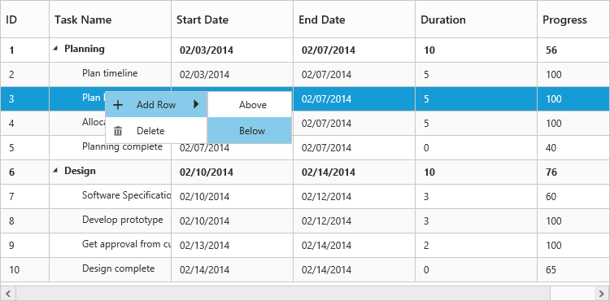
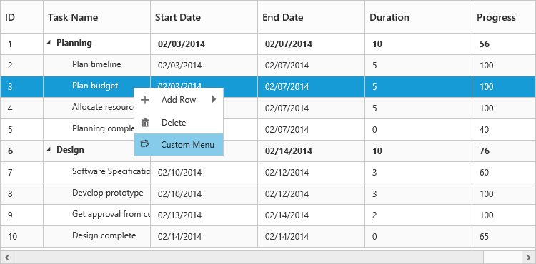

# Context Menu

**Context menu** in TreeGrid control is used to manipulate (add, edit and delete) the tree grid rows. In TreeGrid, context menu can be enabled with [`contextMenuSettings`](/api/js/ejtreegrid#contextmenusettingsspan-classtype-signature-type-objectobjectspan "contextMenuSettings") property. The `contextMenuSettings` property contains two inner properties [`showContextMenu`](/api/js/ejtreegrid#contextmenusettingsshowcontextmenuspan-classtype-signature-type-booleanbooleanspan "contextMenuSettings.showContextMenu") and [`contextMenuItems`](/api/js/ejtreegrid#contextmenusettingscontextmenuitemsspan-classtype-signature-type-arrayarrayspan "contextMenuSettings.contextMenuItems").

The `showContextMenu` property is used to **enable or disable** the context menu, default value for this property is `false`.

The `contextMenuItems` property is used to add the menu items to context menu, this property renders `Add` and `Delete` options by default when the menu items are not provided.



<ej-treegrid id="TreeGridControl" [editSettings]="editSettings" [contextMenuSettings]="contextMenuSettings"
    //...>
</ej-treegrid>





import {Component} from '@angular/core';

@Component({
    selector: 'ej-app',
    templateUrl: 'app/app.component.html'
})
export class AppComponent {
    public editSettings: any;
    public contextMenuSettings: any;

    constructor() {
        //...
        this.editSettings = {
            allowEditing: true,
            editMode: "rowEditing"
        }
        this.contextMenuSettings = {
            showContextMenu: true
            contextMenuItems: ["add", "edit", "delete"]
        }
    }
}



The following screenshot displays the Context menu in TreeGrid control.

### ContextMenu Customization

Context menu can be customized by adding a new custom menu item to it. In TreeGrid, context menu can be customized using [`contextMenuOpen`](/api/js/ejtreegrid#contextmenuopen "contextMenuOpen") client side event. This event is triggered when the context menu is rendered with mouse right click action. The following properties are available in the event,

* headerText: Display text for menu item.
* menuId: provides ID field for the created DOM element for custom menu item
* iconPath: Image location for menu item.
* eventHandler: Client side event for menu item click.



<ej-treegrid id="TreeGridControl" [contextMenuSettings]="contextMenuSettings" (contextMenuOpen)="contextMenuOpen($event)"
    //...>
</ej-treegrid>





import {Component} from '@angular/core';

@Component({
    selector: 'ej-app',
    templateUrl: 'app/app.component.html'
})
export class AppComponent {
    public contextMenuSettings: any;

    constructor() {
        //...
        this.contextMenuSettings = {
            showContextMenu: true
            contextMenuItems: ["add", "edit", "delete"]
        }
    }
    contextMenuOpen(sender) {
        sender.contextMenuItems.push({
            headerText: "Custom Menu",
            menuId: "customMenu",
            iconPath: "url(.../images/custommenu.png)",
            eventHandler: customMenuClick,
        });
    }
    customMenuClick(args) {
        // ...
    }
}



The following screenshot displays the customization of Context menu in TreeGrid control.

