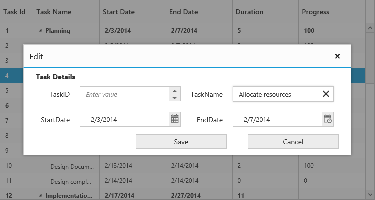
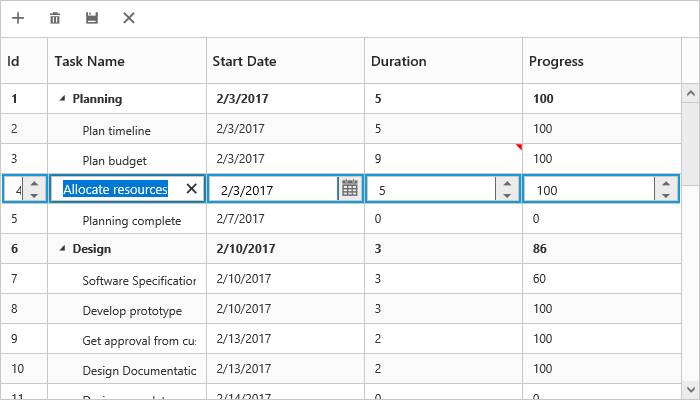

# Editing

## Editing Modes

TreeGrid provides support to add, edit and delete the records and the following are the types of editing modes available, 

* Cell Editing
* Row Editing
* Dialog Editing
* Batch Editing

You can enable editing in TreeGrid by enabling the property `EditSettings.AllowEditing`.

## Cell Editing

Update the record through editing a cell by setting editMode as `cellEditing`

The following code example shows you how to enable `cellEditing` in TreeGrid control.



<ej-treegrid id="TreeGridControl" [editSettings]="editSettings"
    //...>
</ej-treegrid>





import {Component} from '@angular/core';

@Component({
    selector: 'ej-app',
    templateUrl: 'app/app.component.html'
})
export class AppComponent {
    public editSettings: any;

    constructor() {
        //...
        this.editSettings = {
            allowEditing: true,
            editMode: "cellEditing"

        }
    }
}



The output of the TreeGrid with `cellEditing` is as follows.

## Row Editing

It is possible to make the entire row to editable state and to update a record by setting editMode as rowEditing.

The following code example shows you how to enable rowEditing in TreeGrid control.



<ej-treegrid id="TreeGridControl" [editSettings]="editSettings"
    //...>
</ej-treegrid>





import {Component} from '@angular/core';

@Component({
    selector: 'ej-app',
    templateUrl: 'app/app.component.html'
})
export class AppComponent {
    public editSettings: any;

    constructor() {
        //...
        this.editSettings = {
            allowEditing: true,
            editMode: "rowEditing"
        }
    }
}



The following output is displayed as a result of the above code example.

## Dialog Editing

Set editMode as dialogEditing to edit/add a record using dialog.

The following code example shows you how to enable `dialogEditing` in TreeGrid control.



<ej-treegrid id="TreeGridControl" [editSettings]="editSettings"
    //...>
</ej-treegrid>





import {Component} from '@angular/core';

@Component({
    selector: 'ej-app',
    templateUrl: 'app/app.component.html'
})
export class AppComponent {
    public editSettings: any;

    constructor() {
        //...
        this.editSettings = {
            allowEditing: true,
            editMode: "dialogEditing"

        }
    }
}



The output of the TreeGrid with `dialogEditing` is as follows.

### Dialog Template

You can edit any of the fields pertaining to a single record of data and apply it to a template so that the same format is applied to all the other records that you may edit later.
Using this template support, you can edit/add the fields that are not bound to TreeGrid columns.
To edit/add the records using dialog template form, set `editMode` as `dialogEditing` and specify the template id to `dialogEditorTemplateID` property of `editSettings`.

N> 1. `value` attribute is used to bind the corresponding field value while editing.
N> 2. `name` attribute is used to get the changed field values while saving the edited record.
N> 3.  `id` attribute must to be set in the format of ( TreeGrid control id + field name).

The following code example describes the above behavior.

Write the below code in index.html file.







<ej-treegrid id="TreeGridControl" [editSettings]="editSettings"
    //...>
</ej-treegrid>





import {Component} from '@angular/core';

@Component({
    selector: 'ej-app',
    templateUrl: 'app/app.component.html'
})
export class AppComponent {
    public editSettings: any;

    constructor() {
        //...
        this.editSettings = {
            allowEditing: true,
            editMode: "dialogEditing",
            dialogEditorTemplateID: "#template"

        }
    }
}



The following output is displayed as a result of the above code example.

### Using methods to open dialog

It is possible to open the add dialog dynamically with a custom using the method showAddDialog

And similarly you can open the edit dialog dynamically using the method showEditDialog(index), with the index of the row to be edited as parameter.


<button id="buttonon" (click)="add($event, item)">Show Add Dialog</button>
<button id="buttonoff" (click)="edit($event, item)">Show Edit Dialog</button>
<ej-treegrid>
//...
</ej-treegrid>





import {Component} from '@angular/core';

@Component({
    selector: 'ej-app',
    templateUrl: 'app/app.component.html',
})
export class AppComponent {
    constructor() {
        //...
    }
    public add(event, item) {
        treeGridObj = $("# TreeGridContainer ").data("ejTreeGrid");
        treeGridObj.showAddDialog();
    }
    public edit(event, item) {
        treeGridObj = $("# TreeGridContainer ").data("ejTreeGrid ");
        treeGridObj.showEditDialog(3);
    }
}



### Batch Editing

The batch editing support in the tree grid is used to save all added, edited, and deleted changes to the database with a single action. This can be enabled by setting the [`editMode`](https://help.syncfusion.com/api/angular/ejtreegrid#members:editsettings-editmode) property to `batchEditing`. The following code example shows how to enable the batchEditing in the tree grid control.



<ej-treegrid id="TreeGridControl"
    [editSettings]= "editSettings">
</ej-treegrid>





export class AppComponent {
    public editSettings: any;
    constructor() {
        this.editSettings = {editMode : ej.TreeGrid.EditMode.BatchEditing};
    }
}



The output of a tree grid with `batchEditing` is as follows.

In batch editing, the edit mode can be changed to **cell** or **row** or **dialog** with the [`batchEditSettings.editMode`](https://help.syncfusion.com/api/angular/ejtreegrid#members:editsettings-batcheditsettings-editmode) property. The following code snippet shows how to set the editMode to row in the [`batchEditSettings`](https://help.syncfusion.com/api/angular/ejtreegrid#members:editsettings-batcheditsettings) property.



<ej-treegrid id="TreeGridControl"
    [editSettings]= "editSettings">
</ej-treegrid>





export class AppComponent {
    public editSettings: any;
    constructor() {
        this.editSettings = {batchEditSettings:{editMode : ej.TreeGrid.BatchEditMode.Row}};
    }
}



The output of a tree grid with `batchEditSettings` and `editMode` set as `row` is as follows.

N> After modifying all changes in the tree grid, click the save button in the toolbar. The [`actionComplete`](https://help.syncfusion.com/api/angular/ejtreegrid#events:actioncomplete) event will be triggered with updated records in the `batchChanges` argument with `requestType` argument as `batchSave`. Using this event, you can update all the modified records to the database.

## Cell Edit Template

Edit template is used to create custom editor for editing the column values. It can be created by using `editTemplate` property of `columns`.

The following are the functions available for edit template,

* `create` - It is used to create the control at time of initialize.
* `read` - It is used to read the input value at time of save.
* `write` - It is used to assign the value to control at time of editing.

The following code example describes edit template behavior



<ej-treegrid id="TreeGridControl" [editSettings]="editSettings" [columns]="columns"
    //...>
</ej-treegrid>





import {Component} from '@angular/core';

@Component({
    selector: 'ej-app',
    templateUrl: 'app/app.component.html'
})
export class AppComponent {
    public editSettings: any;
    public autocompleteData: any;
    public columns: any;
    constructor() {
        //...
        this.columns = [{
            field: "taskName",
            headerText: "Task Name",
            editTemplate: {
                create: create,
                write: write,
                read: read,
            }
        }];
        this.editSettings = {
            allowAdding: true,
            allowEditing: true,
            allowDeleting: true
        }
        this.autocompleteData = ["Planning", "Plan Timeline", "Plan Budget", "Allocate Resources", "Planning Complete"];
    }

    create() {
        return "<input>";
    }

    write(args) {
        args.element.ejAutocomplete({
            width: "100%",
            dataSource: this.autocompleteData,
            enableDistinct: true,
            value: args.rowdata !== undefined ? args.rowdata["taskName"] : ""
        });
    }

    read(args) {
        args.ejAutocomplete('suggestionList').css('display', 'none');
        return args.ejAutocomplete("getValue");
    }
}



The output of the TreeGrid width editTemplate as follows

