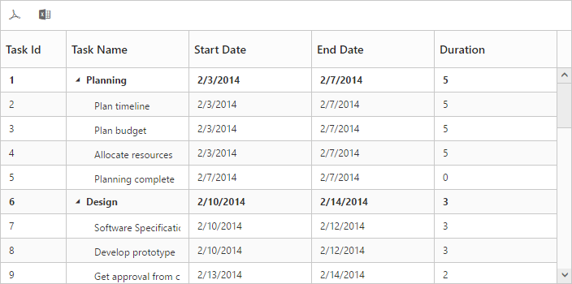

# Export

TreeGrid provides support to export the contents in PDF and excel. To export the contents, the `ExcelExport` and `PdfExport` toolbar items must be included in the [toolbarSettings.toolbarItems](https://help.syncfusion.com/api/js/ejtreegrid#members:toolbarsettings-toolbaritems) property. And you need to call the `export` method with the export mapper as parameter in the toolbar button click action. 
The below code snippet explains the above behavior,

The below code snippet explains the above behavior,



<ej-treegrid id="TreeGridControl" [toolbarSettings]="toolbarSettings" (toolbarClick)="toolbarClick($event)"
    //...>
</ej-treegrid>





import {Component} from '@angular/core';

@Component({
    selector: 'ej-app',
    templateUrl: 'app/app.component.html'
})
export class AppComponent {
    public toolbarSettings: any;

    constructor() {
        //...
        this.toolbarSettings = {
            showToolbar: true,
            toolbarItems: [
                ej.TreeGrid.ToolbarItems.PdfExport,
                ej.TreeGrid.ToolbarItems.ExcelExport
            ]
        }
    }
    toolbarClick(sender) {
        var id = $(sender.currentTarget).attr("id");
        var treeGridObj = $("# TreeGridContainer ").data("ejTreeGrid");
        treeGridObj.exportGrid = this["export"];
        if (id == "TreeGridContainer_pdfExport") {
            treeGridObj.exportGrid(window.baseurl + 'api/TreeGrid/PdfExport', "", false);
            sender.cancel = true;
        }
        if (id == "TreeGridContainer_excelExport") {
            treeGridObj.exportGrid(window.baseurl + 'api/TreeGrid/ExcelExport', "", false);
            sender.cancel = true;
        }
    }
}



The below screen shot shows Gantt with excel and PDF exporting enabled

## Server Configuration
TreeGrid data can be converted to PDF and excel file formats in server side only, through EJ’s helper functions in .NET. 
To use TreeGrid pdf export in projects, it is required to create a server with any of the following web services. 

* Web API
* WCF Service
* ASP.NET MVC Controller Action
* ASP.NET WebMethod

Following code snippet demonstrate exporting with Web API controller.



public class TreeGridController : ApiController
    {
        [System.Web.Http.ActionName("PdfExport")]
        [AcceptVerbs("Post")]
        public void PdfExport()
        {
            string treeGridModel = HttpContext.Current.Request.Params["TreeGridModel"];
            TreeGridProperties treeGridProperty = ConvertGridObject(treeGridModel);
            PdfExport exp = new PdfExport();
            TaskDetailsCollection taskCollection = new TaskDetailsCollection();
            IEnumerable<TaskDetails> data = taskCollection.GetDataSource();
            TreeGridExportSettings settings = new TreeGridExportSettings();
            settings.Theme = ExportTheme.FlatAzure;
            exp.Export(treeGridProperty, data, settings, "Export");
        }

        [System.Web.Http.ActionName("ExcelExport")]
        public void ExcelExport()
        {
            string treeGridModel = HttpContext.Current.Request.Params["TreeGridModel"];
            TreeGridProperties treeGridProperty = ConvertGridObject(treeGridModel);
            ExcelExport exp = new ExcelExport();
            TaskDetailsCollection taskCollection = new TaskDetailsCollection();
            IEnumerable<TaskDetails> data = taskCollection.GetDataSource();
            exp.Export(treeGridProperty, data, "ExcelExport.xlsx", ExcelVersion.Excel2010, new TreeGridExportSettings() { Theme = ExportTheme.FlatAzure });
        }

        private TreeGridProperties ConvertGridObject(string treeGridProperty)
        {
            JavaScriptSerializer serializer = new JavaScriptSerializer();
            IEnumerable div = (IEnumerable)serializer.Deserialize(treeGridProperty, typeof(IEnumerable));
            TreeGridProperties treeGridProp = new TreeGridProperties();
            foreach (KeyValuePair<string, object> dataSource in div)
            {
                var property = treeGridProp.GetType().GetProperty(dataSource.Key, BindingFlags.Instance | BindingFlags.Public | BindingFlags.IgnoreCase);
                if (property != null)
                {
                    Type type = property.PropertyType;
                    string serialize = serializer.Serialize(dataSource.Value);
                    object value = serializer.Deserialize(serialize, type);
                    property.SetValue(treeGridProp, value, null);
                }
            }
            return treeGridProp;
        }
    }



## Server dependencies
Export Helper functions are available in the Assembly Syncfusion.EJ.Export, which is available in the Essential Studio & Essential JavaScript builds. The list of assemblies needed for TreeGrid Export as follows

* Syncfusion.EJ
* Syncfusion.EJ.Export
* Syncfusion.Linq.Base
* Syncfusion.Compression.Base
* Syncfusion.XlsIO.Base
* Syncfusion.PDF.Base

## Export Theme
The TreeGrid export supports the below themes, 

* flat-azure
* flat-azure-dark
* flat-lime
* flat-lime-dark
* flat-saffron
* flat-saffron-dark
* gradient-azure
* gradient-azure-dark
* gradient-lime
* gradient-lime-dark
* gradient-saffron
* gradient-saffron-dark
* bootstrap-theme
* high-contrast
* material
* office-365

The desired theme should be passed as a parameter to the Export method and the code snippet for this as follows



[System.Web.Http.ActionName("ExcelExport")]
[AcceptVerbs("POST")]
public void ExcelExport()
{
  string treeGridModel = HttpContext.Current.Request.Params["TreeGridModel"];
  TreeGridProperties treeGridProperty = ConvertGridObject(treeGridModel);
  ExcelExport exp = new ExcelExport();
  TaskDetailsCollection taskCollection = new TaskDetailsCollection();
  IEnumerable<TaskDetails> data = taskCollection.GetDataSource();
  exp.Export(gridProperty, data, "ExcelExport.xlsx", ExcelVersion.Excel2010, new TreeGridExportSettings() { Theme = ExportTheme.FlatAzure });
} 

