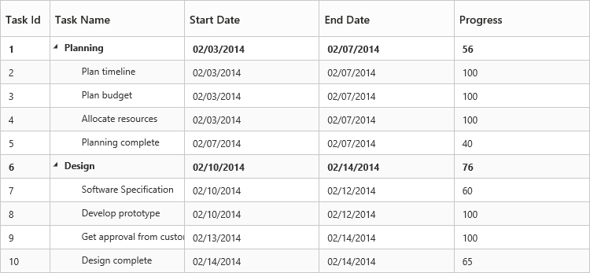
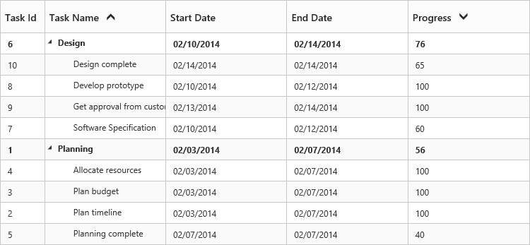
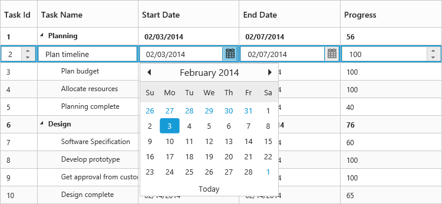

# Getting Started
This section helps to understand the getting started of the Angular TreeGrid with the step-by-step instructions.

## Create your first TreeGrid in Angular

## Getting started with SystemJS

To quick start with Syncfusion JavaScript Angular components run the below commands to clone the repository for [SystemJS starter](https://github.com/syncfusion/angular2-seeds/tree/systemjs) and installing required dependency packages.


 > git clone https://github.com/syncfusion/angular2-seeds/ -b systemjs

 > cd angular2-seeds

 > npm install

 
The below steps describes to add component with above cloned seed application.

## Syncfusion JavaScript components source configuration and sample creation

* Copy required Syncfusion Angular source component(s) from the below build location and add it in `src/ej` folder (For ex., consider the `TreeGrid` component).


(Installed Location)\Syncfusion\Essential Studio\{{ site.releaseversion }}\JavaScript\assets-src\angular2\ 


N> `core.ts` file is mandatory for all Syncfusion JavaScript Angular components. The repository having the source file from Essential Studio for JavaScript v{{ site.releaseversion }}.

* Create `TreeGrid` folder inside `src` folder.

* Create `TreeGrid.component.html` view file inside `src/TreeGrid` folder and render ejTreeGrid Angular component using the below code example. 



<ej-treegrid id="TreeGridControl" [dataSource]="treeGridData" childMapping="subtasks" [treeColumnIndex]=treeColumnIndex sizeSettings.height="400px"
    sizeSettings.width="100%">
    <e-treegrid-columns>
        <e-treegrid-column field="taskID" headerText="Task ID"></e-treegrid-column>
        <e-treegrid-column field="taskName" headerText="TaskName"></e-treegrid-column>
        <e-treegrid-column field="startDate" headerText="Start Date"></e-treegrid-column>
        <e-treegrid-column field="endDate" headerText="End Date"></e-treegrid-column>
        <e-treegrid-column field="duration" headerText="Duration"></e-treegrid-column>
        <e-treegrid-column field="progress" headerText="Progress"></e-treegrid-column>
    </e-treegrid-columns>
</ej-treegrid>



* Create `TreeGrid.component.ts` model file inside the folder `src/TreeGrid` and create sample component using the below code example.



import { Component } from '@angular/core';

@Component({
  selector: 'ej-app',
  templateUrl: 'app/components/treeGrid/treeGrid.component.html',
  styleUrls: ['app/components/treeGrid/treeGrid.component.css'], 
})

export class DefaultComponent {

    this.treeGridData =  [{
         taskID: 1,
         taskName: "Planning",
         startDate: "02/03/2014",
         endDate: "02/07/2014",
         progress: 100,
         duration: 5,
         subtasks: [
             { taskID: 2, taskName: "Plan timeline", startDate: "02/03/2014", endDate: "02/07/2014", duration: 5, progress: 100 },
             { taskID: 3, taskName: "Plan budget", startDate: "02/03/2014", endDate: "02/07/2014", duration: 5 },
             { taskID: 4, taskName: "Allocate resources", startDate: "02/03/2014", endDate: "02/07/2014", duration: 5, progress: 100 },
             { taskID: 5, taskName: "Planning complete", startDate: "02/07/2014", endDate: "02/07/2014", duration: 0, progress: 0 }
         ]
     }]  
  public treeColumnIndex = 1;
}



## Configure the routes for the Router

Before adding router configuration for above created ejTreeGrid component, we recommend you to go through the [Angular Routing](https://angular.io/docs/ts/latest/guide/router.html) configuration to get the deeper knowledge about Angular routing. 

* Now, we are going to configure the route navigation link for created TreeGrid sample in `src/app.component.html` file.



	<ul class="nav navbar-nav">
		. . . .
		<li><a data-toggle="collapse" data-target="#skeleton-navigation-navbar-collapse.in" href="#treegrid" [routerLink]="['/treegrid']">TreeGrid </a></li>
	</ul>

<main>
	<router-outlet></router-outlet>
</main>


* Import the ejTreeGrid sample component and define the route in `src/app.routes.ts` file.


import { Routes } from '@angular/router';
. . . . 
import { TreeGridComponent } from './treeGrid/treeGrid.component';

export const rootRouterConfig: Routes = [
    { path: '', redirectTo: 'home', pathMatch: 'full' },
    . . . . 
    { path: 'treeGrid', component: TreeGridComponent }
];


* Import and declare the Syncfusion source component and ejTreeGrid sample component into `app.module.ts` like the below code snippet.



import { NgModule, enableProdMode, ErrorHandler } from '@angular/core';
. . . . . 
import { EJ_TREEGRID_COMPONENTS } from './ej/treeGrid.component';
import { TreeGridComponent } from './treeGrid/treeGrid.component';

import { rootRouterConfig } from './app.routes';
. . . . 
@NgModule({
  imports: [BrowserModule, FormsModule, HttpModule, RouterModule.forRoot(rootRouterConfig, { useHash: true })],
  declarations: [. . . . , EJ_TREEGRID_COMPONENTS,TreeGridComponent],
  bootstrap: [AppComponent]
})
export class AppModule { }


A TreeGrid Control is created as shown in the following screen shot.

### Enable Sorting

The TreeGrid control has sorting functionality, to arrange the data in ascending or descending order based on a particular column.

#### Multicolumn Sorting

Enable the multicolumn sorting in TreeGrid by setting [`allowMultiSorting`](http://help.syncfusion.com/js/api/ejtreegrid#allowmultisorting "allowMultiSorting") as `true`. You can sort multiple columns in TreeGrid, by selecting the desired column header while holding the `Ctrl` key.



<ej-treegrid id="TreeGridControl" 
    [allowSorting]="true"
    [allowMultiSorting]="true">
</ej-treegrid>



### Enable Editing

You can enable Editing in TreeGrid by using the [`editSettings`](http://help.syncfusion.com/js/api/ejtreegrid#editsettings "editSettings") property as follows.



<ej-treegrid id="TreeGridControl" 
    [editSettings]="editSettings"
   >
</ej-treegrid>





import { Component } from '@angular/core';

@Component({
  selector: 'ej-app',
  templateUrl: 'app/components/treeGrid/treeGrid.component.html',
  styleUrls: ['app/components/treeGrid/treeGrid.component.css'], 
})

export class DefaultComponent {
     this.editSettings = {
            allowAdding: true,
            allowEditing: true,
            allowDeleting: true,
            editMode: 'cellEditing',
            rowPosition: 'belowSelectedRow'
        };
}



And also, the following editors are provided for editing support in TreeGrid control.

* string
* boolean
* numeric
* dropdown
* datepicker
* dateTimePicker

You can set the editor type for a particular column as follows.



<ej-treegrid id="TreeGridControl">
    <e-treegrid-columns>
        <e-treegrid-column field="taskID" headerText="Task ID" editType="numericedit"></e-treegrid-column>
        <e-treegrid-column field="taskName" headerText="TaskName" editType="stringedit"></e-treegrid-column>
        <e-treegrid-column field="startDate" headerText="Start Date" editType="datepicker"></e-treegrid-column>
        <e-treegrid-column field="endDate" headerText="End Date" editTyp="datepicker"></e-treegrid-column>
        <e-treegrid-column field="duration" headerText="Duration" editType="numericedit"></e-treegrid-column>
        <e-treegrid-column field="progress" headerText="Progress" editType="numericedit"></e-treegrid-column>
    </e-treegrid-columns>
</ej-treegrid>



The output of the DateTimePicker editor in TreeGrid control is as follows.

## Running the application

* To run the application, execute below command.


npm start


* Browse to [http://localhost:3000](http://localhost:3000) to see the application. And navigate to TreeGrid tab. The component is rendered as like the below screenshot. You can make changes in the code found under src folder and the browser should auto-refresh itself while you save files. 
